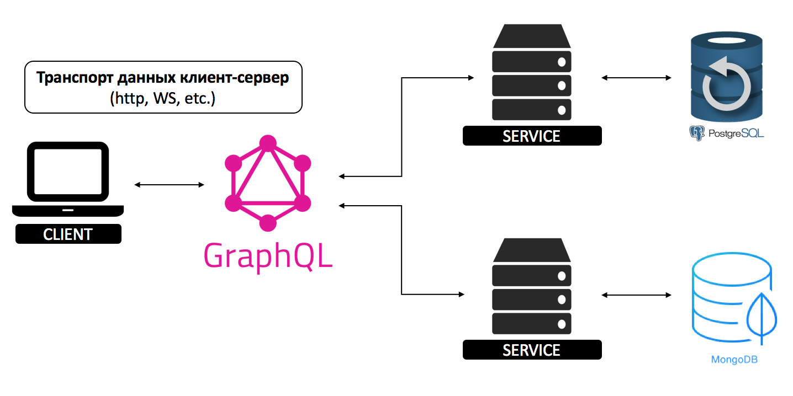
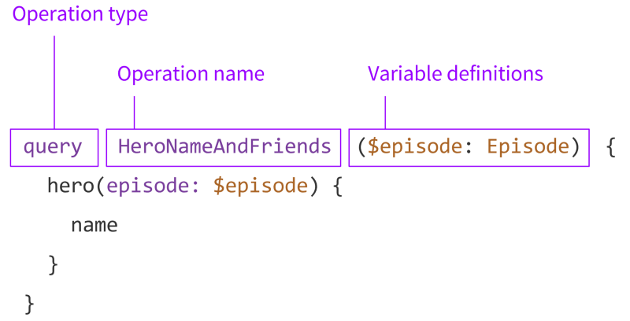

# GraphQL

- [Описание](#описание)
- [Кто использует](#кто-использует)
- [Сравнение GraphQL и REST API](#сравнение-graphql-и-rest-api)
- [Недостатки](#недостатки)
- [Структура запросов](#структура-запросов)
- [Полезные ссылки](#полезные-ссылки)

## Описание

**GraphQL** — язык запросов с открытым исходным кодом, разработанный Facebook. Он создавался как более эффективная альтернатива REST для разработки и использования программных интерфейсов приложений.



**GraphQL обладает множеством достоинств, например:**

- Вы получаете информацию именно в том объеме, в котором запрашиваете. В отличие от REST, ответ на запрос не будет содержать ненужных данных
- Вам будет необходима всего одна конечная точка, никаких дополнительных версий для единственного API
- GraphQL — сильно типизированный язык, что позволяет предварительно оценить корректность запроса в рамках системы типов этого синтаксиса, до исполнения. Это позволяет разрабатывать более мощные API

**GraphQL имеет 3 основные характеристики:**

- Позволяет клиенту точно указать, какие данные ему нужны
- Облегчает агрегацию данных из нескольких источников
- Использует систему типов для описания данных


## Кто использует

- GitHub
- Shopify
- Twitter
- Coursera
- Yelp
- Wordpress
- The New York Times
- Samsara


## Сравнение GraphQL и REST API

- **Зависимость от протокола передачи данных.** GraphQL не зависит от протокола передачи данных, может использовать любой (HTTP, WS, SSH, CLI). REST базируется на http протоколе, и зависит от него.
- **Единая точка входа (Entry point).** В GraphQL для работы с данными мы всегда обращаемся к единой точке входа — GraphQL серверу. Изменяя структуру, поля, параметры запроса мы работаем с разными данными. В REST API каждый путь (route) представляет собой отдельную точку входа.
- **Возможность возвращать разные форматы данных.**  GraphQL может возвращать только JSON формат. REST в данном случае более гибкий — может возвращать данные в различных форматах — JSON, XML и т.д., это зависит от заголовков HTTP запроса, и от самой имплементации API.
- **Декларация, документация, инструменты разработки.** GraphQL дает возможность написания документации непосредственно в коде (inline documentation). REST не имеет подобной функциональности, но есть возможность ее реализовать используя SWAGGER.
- **Возможность формировать структуру и объем данных на клиенте.** Это одна из основных фичей GraphQL, формат и структура данных определяется на стороне клиента. В REST формат и структура данных жестко определены на сервере.
- **Передача аргументов в запрос.** За счет того что GraphQL — это единая точка входа то в GraphQL, мы имеем возможность передать аргументы на любой уровень вложенности. В REST каждый путь представлен как отдельная точка входа, в таком случае передать аргументы можно только для всего запроса.


## Недостатки

### Сложность запросов GraphQL

Иногда GraphQL используют неправильно, пытаюсь заменить им базу данных на стороне сервера. Когда на стороне сервера запрос необходимо разрешить данными, обычно найдется не зависящая от GraphQL реализация, обеспечивающая доступ к базе данных. GraphQL в данном случае индифферентен. Более того, GraphQL не устраняет никаких узких мест с производительностью, когда вам требуется обращаться в одном запросе сразу ко множеству полей (авторы, статьи, комментарии). Независимо от того, в какой архитектуре совершался запрос — RESTful или GraphQL, вам все равно придется извлекать из источника различные поля.

Таким образом, у нас возникнет проблема, если клиент пошлет много запросов сразу ко множеству вложенных полей. Зачастую разработчики клиентской части не знают, сколько различных запросов к базе данных приходится обрабатывать в серверном приложении, если начинаются массовые обращения к данным. Именно на такие случаи нужен механизм (например, максимальная глубина запросов, взвешивание сложности запросов, избегание рекурсии, постоянные запросы), чтобы предотвратить поток слишком дорогостоящих запросов со стороны клиента.

### Ограничение скорости в GraphQL

Другая проблема — ограничение скорости. Тогда как в REST сравнительно просто сказать _"допускается не более чем столько запросов в день"_, сложно сформулировать подобную инструкцию для отдельных операций GraphQL, так как здесь бывают не только "затратные" и "незатратные" операции, но и множество промежуточных градаций. Именно для таких случаев компании, предоставляющие публичные API GraphQL предлагают собственные расчеты по ограничению скорости, зачастую сводимые к вышеупомянутым максимальным значениям глубины запросов и взвешиванию сложности запросов.

### Кэширование GraphQL

При работе с GraphQL реализация упрощенного кэша оказывается гораздо сложнее, чем в REST. Работая с REST, мы обращаемся к ресурсам по URL и, следовательно, можем организовать кэширование на уровне ресурсов, так как URL ресурса может служить его идентификатором. В GraphQL это усложняется, так как все запросы могут получаться разными, даже притом, что все оперируют одним и тем же объектом. В одном запросе вы можете затребовать имя автора, а в следующем — не только имя автора, но и адрес его электронной почты. Именно для таких случаев вам понадобится более сложный кэш на уровне полей, а реализовать его не так-то просто. Однако, большинство библиотек, построенных поверх GraphQL, предлагают такие механизмы кэширования.


## Структура запросов

GraphQL API построен на трех основных строительных блоках: на **схеме** (schema), **запросах** (queries) и **распознавателях** (resolvers).



### Запросы (Queries)

Когда вы о чем-то просите GraphQL, вы выполняете **запрос**. Это выглядит примерно так:

```
query {
    stuff
}
```

Мы объявляем новый запрос при помощи ключевого слова `query`, также спрашивая про поле `stuff`. Самое замечательное в запросах GraphQL является то, что они поддерживают вложенные поля, так что мы можем пойти на один уровень глубже:

```
query {
    stuff {
        eggs
        shirt
        pizza
    }
}
```

Как можно заметить, клиенту при формировании запроса не нужно знать откуда поступают данные. Он просто спрашивает о них, а сервер GraphQL заботится об остальном.

Также стоит отметить, что поля запроса могут быть **массивами**. Например вот общий шаблон запроса списка сообщений:

```
query {
    posts { # это массив
        title
        body
        author { # мы может пойти глубже
            name
            avatarUrl
            profileUrl
        }
    }
}
```

Поля запроса также могут содержать аргументы. Например, если необходимо отобразить конкретный пост, можно добавить аргумент `id` к полю `post`:

```
query {
    post(id: "123foo") {
        title
        body
        author {
            name
            avatarUrl
            profileUrl
        }
    }
}
```

Наконец, если нужно сделать аргумент `id` динамическим, можно определить **переменную**, а затем использовать ее в запросе (обратите внимание, также мы сделали запрос **именованным**):

```
query getMyPost($id: String) {
    post(id: $id) {
        title
        body
        author {
            name
            avatarUrl
            profileUrl
        }
    }
}
```

### Распознаватели (resolvers)

Сервер GraphQL не может знать что делать с входящим запросом, если ему не объяснить при помощи **распознавателя** (**resolver**).

Используя распознаватель GraphQL понимает, как и где получить данные, соответствующие запрашиваемому полю. К примеру, распознаватель для поля **запись** может выглядеть вот так:

```
Query: {
    post(root, args) {
        return Posts.find({ id: args.id });
    }
}
```

Мы помещаем наш распознаватель в раздел `Query` потому что мы хотим получать `запись` (`post`) в корне ответа. Но также мы можем создать распознаватели для подполей, как например для поля `author`:

```
Query: {
    post(root, args) {
        return Posts.find({ id: args.id });
    }
},
Post: {
    author(post) {
        return Users.find({ id: post.authorId})
    }
}
```

Обратите внимание что ваши распознаватели не ограничены в количестве возвращаемых объектов. К примеру, вы захотите добавить поле `commentsCount` к объекту `Post`:

```
Post: {
    author(post) {
        return Users.find({ id: post.authorId})
    },
    commentsCount(post) {
        return Comments.find({ postId: post.id}).count()
    }
}
```

Ключевое понятие здесь то, что **схема запроса GraphQL и структура базы данных никак не связаны**. Другими словами, в базе данных может не существовать полей `author` или `commentsCount`, но мы можем "симулировать" их благодаря силе распознавателей.

Как было показано выше, вы можете писать любой код внутри распознавателя. Так что вы можете _изменять_  содержимое базы данных; такие распознаватели называют  **изменяющими**  (**mutation**).

### Схема

Для создания схем в GraphQL используется собственный язык Schema Definition Language (SDL). SDL обладает интуитивно понятным синтаксисом и универсален для любой используемой технологии.


## Полезные ссылки

- [Документация](https://graphql.org/learn/)
- [GraphQL API Explorer](https://developer.github.com/early-access/graphql/explorer/)
- [Что же такое этот GraphQL?](https://habr.com/ru/post/326986/)
- [GraphQL — новый взгляд на API](https://habr.com/ru/post/343872/)
- [Основы языка запросов GraphQL и практические примеры с Vue](https://webformyself.com/osnovy-yazyka-zaprosov-graphql-i-prakticheskie-primery-s-vue/)
- [GraphQL basics and practical examples with Vue](https://medium.com/@lachlanmiller_52885/graphql-basics-and-practical-examples-with-vue-6b649b9685e0)
- [GraphQL with Django — a tutorial that works](https://medium.com/@alhajee2009/graphql-with-django-a-tutorial-that-works-2812be163a26)
- [Example on how to use GraphQL with Django](https://gearheart.io/blog/how-to-use-graphql-with-django-with-example/)