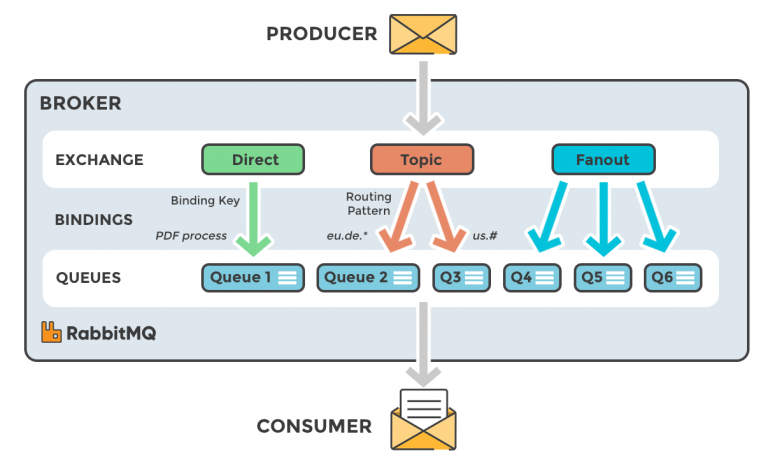
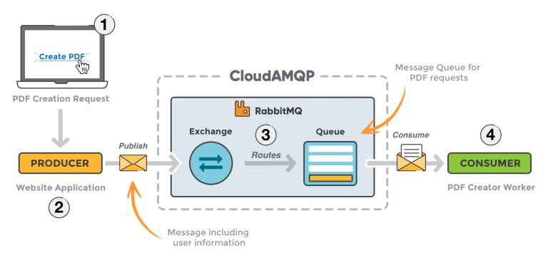

# RabbitMQ

- [Описание](#описание)
- [Определения](#определения)
- [Поток сообщений](#поток-сообщений)
- [Типы обработчиков сообщений](#типы-обработчиков-сообщений)
- [Пример](#пример)
- [Установка](#установка)
- [Полезные ссылки](#полезные-ссылки)

## Описание

**RabbitMQ** — это приложение для работы с очередями сообщений (**message-queueing**), еще его называют брокер сообщений (**message broker**) или менеджер очередей (**queue manager**). Простыми словами это программное обеспечение в котором могут быть определены очереди к которому могут подключатся различные приложения и передавать/получать сообщения.

Сообщение может включать в себя любую информацию. Например, у нас есть информация о процессе/задаче которую должно начать другое приложение (или же другой сервер) или же это может быть простым текстовым сообщением. Менеджер очередей – приложение которое сохраняет сообщение до тех пор пока другое приложение (сервер), которому адресовано сообщение, не подключиться и не заберет (получит) сообщение из очереди. Затем проложение-получатель обработает сообщение нужным ему образом.

RabbitMQ может выступать как прослойка между несколькими сервисами (приложениями, серверами). Может использоваться для уменьшения нагрузки и ускорение отклика веб-приложения, поскольку задачи которые обычно занимают довольно много времени, могут быть делегированы третьей стороне, единственной задачей которой является их выполнение.

Базовая архитектура очереди сообщений довольно таки простая — клиентское приложение (Producer) создает сообщение и доставляет его в очередь сообщений. Другое приложение (Consumer) получатель подключается к очереди и подписывается на сообщение которые должно обработать. Ваше приложение может быть как поставщиком сообщений, так и получателем или же и тем и другим одновременно. Сообщения размещенные в очереди сохраняются до тех пор, пока получатель не получит их.


## Определения

- **Producer** — приложение, которое посылает сообщение
- **Consumer** — приложение, которое получает сообщение
- **Queue** — буфер, который хранит сообщения
- **Message** — информация, которая была отправлена от Producer к Consumer через RabbitMQ
- **Connection** — TCP соединение между приложениями и менеджером очередей
- **Channel** — виртуальное соединение внутри соединения. Когда вы публикуете или получаете сообщения через очередь – это все делается в канале
- **Exchange** — получает сообщение от поставщика и отправляет его в очередь. Зависит от типа
- **Binding** — связь между очередью и обработчиком сообщений
- **Routing key** — ключ, на который смотрит обработчик и решает в какую очередь перенаправить сообщение
- **AMQP** (**A**dvanced **M**essage **Q**ueuing **P**rotocol) — протокол, используемый для обмена сообщениями в RabbitMQ
- **Users** — возможность подключится к брокеру сообщений с помощью имени пользователя и пароля. Каждый пользователь может иметь права доступа, такие как чтение, запись управление привилегиями. Пользователи так же могут иметь привилегии на определенный виртуальных хост
- **Vhost, virtual host** — способ разделения приложений используя один и тот же экземпляр RabbitMQ. У разных пользователей могут быть разные права доступа к различным виртуальным хостам и очередям, так же обработчики сообщений могут существовать только в одном


## Поток сообщений


1. Поставщик публикует сообщение в обработчик. Когда создаем обработчик мы определяем его тип
2. Обработчик получает сообщение и отвечает за его перенаправление. Обработчик берет различные атрибуты, такие как, ключ роутинга, зависимость на тип обмена и другие
3. Создается связь между обработчиком и очередью
4. Сообщение остается в очереди до тех пор, пока не будет обработано получателем
5. Получатель обрабатывает сообщение


## Типы обработчиков сообщений



- **Direct** — тип пересылает сообщение в нужную очередь, базируясь на ключе маршрутизации
- **Fanout** — тип перенаправляет сообщения во все связанные очереди
- **Topic** — делает соответствие между ключом маршрутизации и шаблоном маршрутизации указаных в привязке
- **Headers** — использует атрибуты заголовка сообщения для маршрутизации


## Пример



Рассмотрим сценарий, когда веб приложение позволяет пользователям загружать информацию на сайт. Сайт будет обрабатывать эту информацию, генерировать PDF и отправлять обратно пользователю на электронную почту. Обработка информации, генерация PDF и отправка email займет несколько секунд и это покажет как можно использовать очереди сообщений.

Когда пользователь введет информацию в веб интерфейс, приложение создаст задание на генерацию PDF и вся информация в сообщении и сообщение пользователя будут помещены в очередь, определенную в RabbitMQ.

Получатель может взять сообщение из очереди и начать обрабатывать в тоже время, когда поставщик добавляет новые сообщения в очередь. Получателем может быть совершенно другой сервер нежели поставщик, или же они могут находиться на одном и том же. Запрос может быть создан на одном языке программирования и обработан другим – они "общаются" только через сообщения, которые посылают один другому. Исходя из этого, приложения будут иметь низкую связь между отправителем и получателем.

1. Пользователь посылает запрос на создание PDF
2. Приложение (Producer) посылает сообщение в RabbitMQ, включая в запрос информацию (например, имя и электронная почта)
3. Обработчик принимает сообщения от приложения поставщика и направляет его в нужную очередь сообщений
4. Воркер обработки PDF (Consumer) получает задание начать генерацию PDF


## Установка

```bash
# Установка RabbitMQ
sudo apt-get install rabbitmq-server
 
# Добавление пользователя
sudo rabbitmqctl add_vhost vhost1
sudo rabbitmqctl add_user user1 pass
sudo rabbitmqctl set_permissions -p vhost1 user1 ".*" ".*" ".*"
 
# Запуск сервера
sudo systemctl enable rabbitmq-server
sudo systemctl start rabbitmq-server
 
# Очистка очереди
sudo rabbitmq-plugins enable rabbitmq_management
sudo wget http://localhost:15672/cli/rabbitmqadmin /etc/rabbitmq/rabbitmqadmin
sudo chmod +x /etc/rabbitmq/rabbitmqadmin
sudo /etc/rabbitmq/rabbitmqadmin list queues name
sudo /etc/rabbitmq/rabbitmqadmin purge queue name=queue1
```


## Полезные ссылки

- [Оригинал статьи](https://thewebland.net/development/devops/what-is-rabbitmq/)
- [Документация](https://www.rabbitmq.com/getstarted.html)
- [Использование RabbitMQ в Celery](https://docs.celeryproject.org/en/latest/getting-started/brokers/rabbitmq.html)