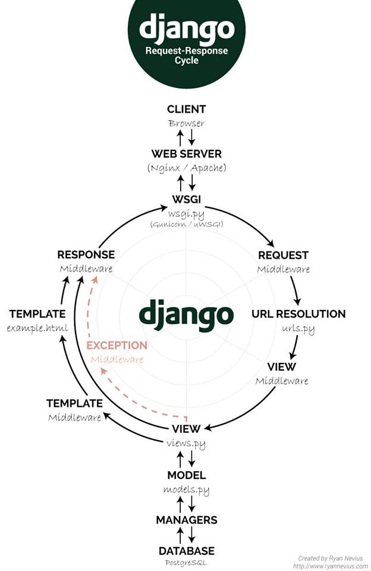

# Django

- [Описание](#описание)
- [Возможности](#возможности)
- [Кто использует](#кто-использует)
- [Архитектура](#архитектура)
- [Установка](#установка)
- [Основные команды](#основные-команды)
- [Django REST Framework (DRF)](#django-rest-framework-drf)
- [Полезные ссылки](#полезные-ссылки)


## Описание

**Django** — свободный фреймворк для веб-приложений на языке Python, использующий шаблон проектирования MVC. Проект поддерживается организацией Django Software Foundation.

Сайт на Django строится из одного или нескольких приложений, которые рекомендуется делать отчуждаемыми и подключаемыми. Это одно из существенных архитектурных отличий этого фреймворка от некоторых других (например, Ruby on Rails). Один из основных принципов фреймворка — DRY (Don't repeat yourself).

Также, в отличие от других фреймворков, обработчики URL в Django конфигурируются явно при помощи регулярных выражений.

Для работы с базой данных Django использует собственный ORM, в котором модель данных описывается классами Python, и по ней генерируется схема базы данных.


## Возможности

- ORM, API доступа к БД с поддержкой транзакций[14]
- Встроенный интерфейс администратора, с уже имеющимися переводами на многие языки
- Диспетчер URL на основе регулярных выражений
- Расширяемая система шаблонов с тегами и наследованием
- Система кеширования
- Интернационализация
- Подключаемая архитектура приложений, которые можно устанавливать на любые Django-сайты
- "Generic views" — шаблоны функций контроллеров
- Авторизация и аутентификация, подключение внешних модулей аутентификации: LDAP, OpenID и т.д.
- Система фильтров ("middleware") для построения дополнительных обработчиков запросов, как например включенные в дистрибутив фильтры для кеширования, сжатия, нормализации URL и поддержки анонимных сессий
- Библиотека для работы с формами (наследование, построение форм по существующей модели БД)
- Встроенная автоматическая документация по тегам шаблонов и моделям данных, доступная через административное приложение

Некоторые компоненты фреймворка между собой связаны слабо, поэтому их можно достаточно просто заменять на аналогичные. Например, вместо встроенных шаблонов можно использовать **Mako** или **Jinja**. В то же время заменять ряд компонентов (например, ORM) довольно сложно.


## Кто использует

- Instagram
- Disqus
- Mozilla
- The Washington Times
- Pinterest
- YouTube
- Google


## Архитектура

Архитектура Django похожа на «Модель-Представление-Контроллер» (MVC). Контроллер классической модели MVC примерно соответствует уровню, который в Django называется Представление (View), а презентационная логика Представления реализуется в Django уровнем Шаблонов (Template). Из-за этого уровневую архитектуру Django часто называют «Модель-Шаблон-Представление» (MTV).


Первоначальная разработка Django как средства для работы новостных ресурсов достаточно сильно отразилась на его архитектуре: он предоставляет ряд средств, которые помогают в быстрой разработке веб-сайтов информационного характера. Так, например, разработчику не требуется создавать контроллеры и страницы для административной части сайта, в Django есть встроенное приложение для управления содержимым, которое можно включить в любой сайт, сделанный на Django, и которое может управлять сразу несколькими сайтами на одном сервере. Административное приложение позволяет создавать, изменять и удалять любые объекты наполнения сайта, протоколируя все совершенные действия, и предоставляет интерфейс для управления пользователями и группами (с пообъектным назначением прав).

В дистрибутив Django также включены приложения для системы комментариев, синдикации RSS и Atom, "статических страниц" (которыми можно управлять без необходимости писать контроллеры и представления), перенаправления URL и другое.




## Установка

```bash
sudo pip3 install django
sudo pip3 install djangorestframework
```


## Основные команды

```bash
# Создать новый проект (генерирует структуру)
django-admin startproject myproject
# Запустить тестовый сервер (на http://127.0.0.1:8000)
python manage.py runserver
# Запустить тестовый сервер доступный извне (не злоупотреблять)
python manage.py runserver 0.0.0.0:80
# Создать приложение в текущем проекте
django-admin startapp myapp
# Сгенерировать файлы с сообщениями подлежащими локализации
django-admin makemessages
# Скомпилировать файлы локализации
django-admin compilemessages
# Создать файлы миграций для БД
python manage.py makemigrations
# Просмотр sql-кода, сгенерированного в миграции 0001 приложения app
python manage.py sqlmigrate app 0001
# Запустить окно командной строки
python manage.py shell
# Прогнать тесты (для прогона будет создана чистая БД)
python manage.py test
# Управление детализацией вывода при тестах (2 - макс, 0 - мин)
python manage.py test --verbosity=2
# Создать пользователя-администратора
python manage.py createsuperuser
```


## Django REST Framework (DRF)

**Django Rest Framework (DRF)** — это библиотека, которая работает со стандартными моделями Django для создания гибкого и мощного API для проекта. API DRF состоит из 3-х слоев:

- **Сериализатор (Serializers)** — преобразует информацию, хранящуюся в базе данных и определенную с помощью моделей Django, в формат, который легко и эффективно передается через API
- **Представление (ViewSet)** — определяет функции (чтение, создание, обновление, удаление), которые будут доступны через API
- **Маршрутизатор (Routers)** — определяет URL-адреса, которые будут предоставлять доступ к каждому виду

### Сериализаторы (Serializers)

Модели Django интуитивно представляют данные, хранящиеся в базе, но API должен передавать информацию в менее сложной структуре. Хотя данные будут представлены как экземпляры классов Model, их необходимо перевести в формат JSON для передачи через API.

Сериализатор DRF производит это преобразование. Когда пользователь передает информацию (например, создание нового экземпляра) через API, сериализатор берет данные, проверяет их и преобразует в нечто, что Django может сложить в экземпляр модели. Аналогичным образом, когда пользователь обращается к информации через API, соответствующие экземпляры передаются в сериализатор, который преобразовывает их в формат, который может быть легко передан пользователю как JSON.

Наиболее распространенной формой, которую принимает сериализатор DRF, является тот, который привязан непосредственно к модели Django:

```python
class ThingSerializer(serializers.ModelSerializer):
	 class Meta:
		 model = Thing
		 fields = ('name',)
```

Настройки `fields` позволяют точно указать, какие поля доступны этому сериализатору. В качестве альтернативы, может быть установлен `exclude` вместо `fields`, которое будет включать все поля модели, кроме тех, которые указаны в `exclude`.

### Представления (ViewSets)

Сериализатор анализирует информацию в обоих направлениях (чтение и запись), тогда как ViewSet — это тот код, в котором определены доступные операции. Наиболее распространенным ViewSet является **ModelViewSet**, который имеет следующие встроенные операции:

- Создание экземпляра: `create()`
- Получение / чтение экземпляра: `retrieve()`
- Обновление экземпляра (все или только выбранные поля): `update()` или `partial_update()`
- Уничтожение / Удаление экземпляра: `destroy()`
- Список экземпляров (с разбивкой по страницам по умолчанию): `list()`

Каждая из этих функций может быть переопределена, если требуется другое поведение, но стандартная функциональность работает с минимальным кодом, а именно:

```python
class ThingViewSet(viewsets.ModelViewSet):
    queryset = Thing.objects.all()
```

Если необходимы дополнительные настройки, можно использовать общие представления, вместо ModelViewSet или даже отдельные пользовательские представления.

### Маршрутизаторы (Routers)

И наконец, маршрутизаторы: они предоставляют верхний уровень API. Чтобы избежать создания бесконечных URL-адресов вида: "списки", "детали" и "изменить", маршрутизаторы DRF объединяют все URL-адреса, необходимые для данного вида в одну строку для каждого ViewSet, например:

```python
router = routers.DefaultRouter()
router.register(r'thing', main_api.ThingViewSet)
```

Затем все ViewSet, которые зарегистрированны в маршрутизаторе, можно добавить к обычным `url_patterns`:

```python
url_patterns += url(r'^', include(router.urls))
```

Теперь через API можно получить данные точно так же, как и любые другие обычные страницы Django.


## Полезные ссылки

- [Оригинал статьи](https://ru.wikipedia.org/wiki/Django)
- [Документация Django](https://docs.djangoproject.com/en/2.2/)
- [Документация Django REST Framework](https://www.django-rest-framework.org/)
- [Django Cheat Sheet](https://github.com/lucrae/django-cheat-sheet)
- [Django + Python3 + Nginx + Gunicorn + DO](https://djbook.ru/examples/62/)
- [Tango with Django](https://www.tangowithdjango.com/book17/)
- [Курс "Web-технологии"](https://stepik.org/course/154/)
- Документирование
	- [Django documentation example](https://github.com/agonzalezro/django-documentation-example)
	- [The Django admin documentation generator](https://docs.djangoproject.com/en/2.0/ref/contrib/admin/admindocs/)
	- [Generating Code Documentation with Pycco](https://realpython.com/generating-code-documentation-with-pycco/)