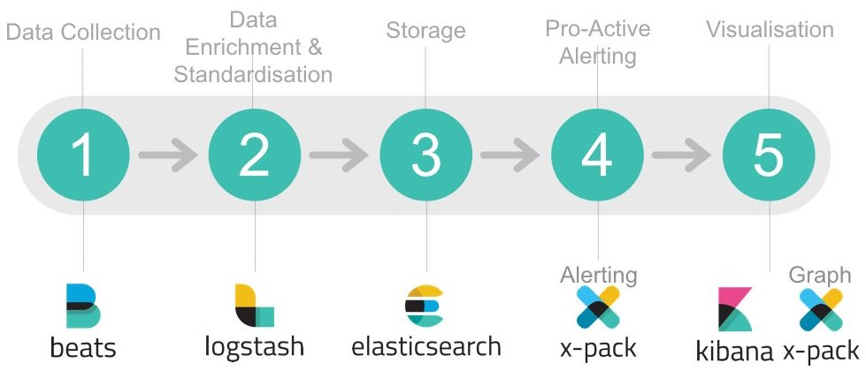

# Elasticsearch

- [Описание](#описание)
- [Установка](#установка)
  - [Установка как сервис](#установка-как-сервис)
  - [Установка с помощью Docker](#установка-с-помощью-docker)
  - [Пример конфигурации](#пример-конфигурации)
- [Удаление](#удаление)
- [Резервное копирование](#резервное-копирование)
- [Команды](#команды)
  - [Индексы](#индексы)
  - [Записи](#записи)
  - [Поиск слов](#поиск-слов)
  - [Поиск фразы](#поиск-фразы)
  - [Управление оценкой поиска](#управление-оценкой-поиска)
- [Полезные ссылки](#полезные-ссылки)

## Описание

**Elasticsearch** — тиражируемая свободная программная поисковая система. Написана на Java, распространяется по лицензии Apache, в основе использует библиотеку **Lucene** (так же как и вторая по популярности поисковая система — Solr), официальные клиенты доступны на Java, .NET (C#), Python, Groovy и ряде других языков.

Разрабатывается компанией Elastic вместе со связанными проектами — механизмом сбора данных и анализа журналов **Logstash** и платформой аналитики и визуализации **Kibana**; эти три продукта предназначены для использования в качестве интегрированного решения, называемого «Elastic Stack».



Среди крупных сайтов, использующих Elasticsearch, отмечаются Wikimedia, StumbleUpon, Quora, Foursquare, SoundCloud, GitHub, Netflix. Amazon, IBM, Qbox.

Обеспечивает горизонтально масштабируемый поиск, поддерживает многопоточность. Поисковые индексы можно разделить на сегменты, каждый сегмент может иметь несколько реплик, на каждом узле может быть размещено несколько сегментов, притом каждый узел действует как координатор для делегирования операций правильному сегменту, перебалансировка и маршрутизация выполняются автоматически. Связанные данные часто хранятся в одном и том же индексе, который состоит из одного или нескольких первичных сегментов и, возможно, нескольких реплик. После создания индекса количество первичных сегментов нельзя изменить.

Все функции Lucene системы доступны через прикладные интерфейсы на JSON и Java.

Другая особенность — так называемый «шлюз», обеспечивающая долгосрочное сохранение индекса; например, индекс может быть восстановлен из шлюза в случае сбоя сервера. Система поддерживает запросы GET в реальном времени. Система не поддерживает распределённые транзакции.


## Установка

### Установка как сервис

```bash
# Java
sudo add-apt-repository -y ppa:webupd8team/java
sudo apt-get update
sudo apt-get -y install oracle-java8-installer
# Elasticsearch
wget -qO - https://packages.elastic.co/GPG-KEY-elasticsearch | sudo apt-key add -
echo "deb http://packages.elastic.co/elasticsearch/7.x/debian stable main" | sudo tee -a /etc/apt/sources.list.d/elasticsearch-7.x.list
echo "deb https://artifacts.elastic.co/packages/7.x/apt stable main" | sudo tee -a /etc/apt/sources.list.d/elastic-7.x.list
sudo apt-get update
sudo apt-get -y install elasticsearch

# Изменить хост - добавить строку "network.host: localhost"
sudo vi /etc/elasticsearch/elasticsearch.yml

# Запуск
sudo update-rc.d elasticsearch defaults 95 10
sudo service elasticsearch start
```

### Установка с помощью Docker

Файл `docker-compose.yml`:

```yml
version: '2'

volumes:
  elasticsearch_data: {}

services:
  elasticsearch:
    image: elasticsearch:7.1.0
    ports:
      - 9200:9200
    volumes:
      - elasticsearch_data:/usr/share/elasticsearch/data
      - ./elasticsearch/elasticsearch.yml:/usr/share/elasticsearch/config/elasticsearch.yml:ro
    restart: always
```

### Пример конфигурации

Файл `elasticsearch.yml`:

```yml
cluster.name: "docker-cluster"
network.host: 0.0.0.0
discovery.type: single-node
```


## Удаление

```bash
sudo apt-get --purge autoremove elasticsearch
sudo rm -rf /var/lib/elasticsearch/
sudo rm -rf /etc/elasticsearch
```


## Резервное копирование

```bash
sudo npm install elasticdump -g
# сохранить в JSON
sudo elasticdump --input=http://127.0.0.1:9200/* --output=/data/index.json --type=data
# Упаковать в архив
sudo bash -c 'sudo elasticdump --input=http://127.0.0.1:9200/* --output=$ | gzip > /data/index.gz'
```


## Команды

### Индексы

Список всех индексов (БД)

```
GET /_cat/indices
```

Информация об индексе

```
GET /my_index
```

Создание индекса (маппинг)

```
PUT /my_index 
{
  "mappings": {
    "_doc": { 
      "properties": { 
        "title":    { "type": "text"  }, 
        "name":     { "type": "text"  }, 
        "age":      { "type": "integer" },  
        "created":  {
          "type":   "date", 
          "format": "strict_date_optional_time||epoch_millis"
        }
      }
    }
  }
}
```

Удаление индекса

```
DELETE /my_index
```

### Записи

Создание уникальной записи

```
PUT /my_index/_doc/1/_create
{
  "title": "Hello world", 
  "category":"Main", 
  "author":{
    "first_name": "John",
    "last_name": "Doe"
  }
}
```

Добавление/обновление записи

```
PUT /my_index/_doc/2
{
  "title": "Hello awesome world ", 
  "category":"Main", 
  "author":{
    "first_name": "John",
    "last_name": "Doe"
  }
}
```

Удаление записи

```
DELETE /my_index/_doc/2
```

Поиск всех записей

```
GET /my_index/_search
```

### Поиск слов

Поиск слов по полю `title`

```
GET /my_index/_search
{
  "query": {
    "match": {
      "title": "hello"
    }
  }
}
```

Поиск слов ("любое из слов", порядок не важен) по полю `title`

```
GET /my_index/_search
{
  "query": {
    "match": {
      "title": "world hello"
    }
  }
}
```

Поиск слов ("все слова из запроса", порядок не важен) по полю `title`

```
GET /my_index/_search
{
  "query": {
    "match": {
      "title":{
        "query": "world awesome",
        "operator": "and"
      }
    }
  }
}
```

Поиск слов ("минимум 2 слова из запроса", порядок не важен) по полю `title`

```
GET localhost:9200/my_index/_search
{
  "query": {
    "match": {
      "title":{
        "query": "world awesome hello",
        "minimum_should_match": 2
      }
    }
  }
}
```

Поиск через GET параметры по полю `title`

```
/my_index/_search?q=title:(world AND awesome)
```

### Поиск фразы

Поиск фразы ("все слова из запроса", порядок важен) по полю `title`

```
GET /my_index/_search
{
  "query": {
    "match_phrase": {
      "title":{
        "query": "hello world"
      }
    }
  }
}
```

Поиск фразы ("все слова из запроса", порядок важен, допустимо одно слово между словами запросами) по полю `title`

```
GET /my_index/_search
{
  "query": {
    "match_phrase": {
      "title":{
        "query": "hello world",
        "slop": 1
      }
    }
  }
}
```

Поиск фразы через GET параметры по полю `title`

```
/my_index/_search?q=title:"hello world"~1
```

### Поиск по дате

Поиск по дате, в поле publish_date

```
GET /my_index/_search
{
  "query": {
    "range": {
      "publish_date":{
        "gte": "2019-01-01",
        "lt": "2019-02-01"
      }
    }
  }
}
```

### Управление оценкой поиска

- **must** — запрос должен быть в результатах поиска и влияет на оценку `_score`
- **must_not** — запроса не должно быть в результатах поиска
- **should** — запрос не обязательно должен быть в результатах поиска, наличие запроса влияет на оценку `_score`
- **filter** — запрос должен быть в результатах поиска, но не влияет на оценку `_score`

Структура

```
GET /my_index/_search
{
  "query": {
    "bool": {
      "must":[
        {}
      ],
      "must_not":[
        {}
      ],
      "should":[
        {}
      ],
      "filter":[
        {}
      ]
    }
  }
}
```

Поиск `title` включающий `hello`, но не включающий `awesome`

```
GET /my_index/_search
{
  "query": {
    "bool": {
      "must":{
        "match": {
          "title": "hello"
        }
      },
      "must_not":{
        "match": {
          "title": "awesome"
        }
      }
    }
  }
}
```

Поиск `title` включающий `hello` + повышенный `_score` для включающих `awesome`

```
GET /my_index/_search
{
  "query": {
    "bool": {
      "must":{
        "match": {
          "title": "hello"
        }
      },
      "should":{
        "match": {"title": "awesome"}
      }
    }
  }
}
```

Обратите внимание, что при таком запросе

```
GET /my_index/_search
{
  "query": {
    "bool": {
      "must":{
        "match": {
          "title": "hello"
        }
      },
      "should":[
        {"match": {"title": "awesome"}},
        {"match": {"title": "world"}}
      ]
    }
  }
}
```

к набору

```
Hello world
Hello awesome world
Hello something world
```

`Hello awesome world` будет иметь наименьший `_score`


## Полезные ссылки

- [Документация](https://www.elastic.co/guide/en/elasticsearch/reference/current/index.html)
- [Преобразование SQL в запросы ElasticSearch](https://www.toolsbuzz.com/query-converter)
- [Установка стека ELK в Ubuntu](https://www.8host.com/blog/ustanovka-steka-elk-v-ubuntu-16-04/)
- [Шпаргалка по Elasticsearch](https://www.it-rem.ru/shpargalka-elasticsearch-ustanovka-cherez-docker-osnovnye-komandy.html)