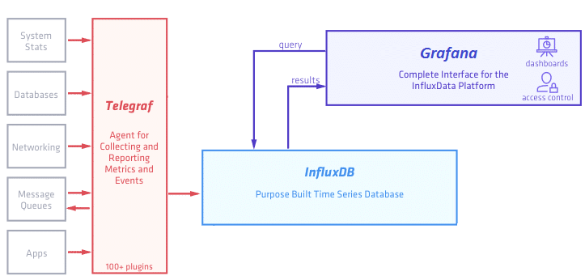

# Grafana

- [Описание](#описание)
- [Термины](#термины)
- [Установка](#установка)
- [Полезные ссылки](#полезные-ссылки)

## Описание

**Grafana** — платформа с открытым исходным кодом для визуализации, мониторинга и анализа данных. Grafana позволяет пользователям создавать дашборды с панелями, каждая из которых отображает определенные показатели в течение установленного периода времени. Каждый дашборд универсален, поэтому его можно настроить для конкретного проекта или с учетом любых потребностей разработки и/или бизнеса.

В качестве источника данных для Grafana можно использовать как множество различных сложных движков баз данных, включая **Graphite**, **ElasticSearch**, **InfluxDB**, **Prometheus**, так и более простых, например **MySQL**.




## Термины

**Панель** — базовый элемент визуализации выбранных показателей. Grafana поддерживает панели с графиками, единичными статусами, таблицами, тепловыми картами кликов и произвольным текстом, а также интеграцию с официальными и созданными сообществом плагинами (например, карта мира или часы) и приложениями, которые также можно визуализировать. Можно настроить стиль и формат каждой панели; все панели можно перетаскивать на новое место, перестраивать и изменять их размер.

**Дашборд** — набор отдельных панелей, размещенных в сетке с набором переменных (например, имя сервера, приложения и датчика). Изменяя переменные, можно переключать данные, отображаемые на дашборде (например, данные с двух отдельных серверов). Все дашборды можно настраивать, а также секционировать и фрагментировать представленные в них данные в соответствии с потребностями пользователя. В проекте Grafana участвует большое сообщество разработчиков кода и пользователей, поэтому существует большой выбор готовых дашбордов для разных типов данных и источников.

В дашбордах можно использовать **аннотации** для отображения определенных событий на разных панелях. Аннотации добавляются настраиваемыми запросами в Elasticsearch; на графике аннотация отображается вертикальной красной линией. При наведении курсора на аннотацию можно получить описание события и теги, например, для отслеживания ответа сервера с кодом ошибки 5xx или перезапуска системы. Благодаря этому можно легко сопоставить время, конкретное событие и его последствия в приложении и исследовать поведение системы.


## Установка

Установка как сервис:

```bash
# Установка
sudo add-apt-repository "deb https://packages.grafana.com/oss/deb stable main"
sudo apt-get update
sudo apt-get install grafana

# Сменить порт - добавить строку "http_port = 5961"
# Сменить корень сайта - добавить строку "root_url = %(protocol)s://%(domain)s/grafana/"
sudo vi /etc/grafana/grafana.ini

# Запуск сервиса
sudo service grafana-server start
```

Установка с помощью Docker — файл `docker-compose.yml`:

```yml
version: '2'

volumes:
  grafana_data: {}

services:
  grafana:
    image: grafana/grafana:6.2.0
    ports:
      - 3000:3000
    volumes:
      - grafana_data:/var/lib/grafana
    restart: always
```

Учетная запись по умолчанию:

- Логин: `admin`
- Пароль: `admin`


## Полезные ссылки

- [Документация](https://grafana.com/docs/)
- [Grafana: создание dashboard](https://rtfm.co.ua/grafana-sozdanie-dashboard/)
- [Grafana как еще один инструмент мониторинга](https://habr.com/ru/company/southbridge/blog/431122/)