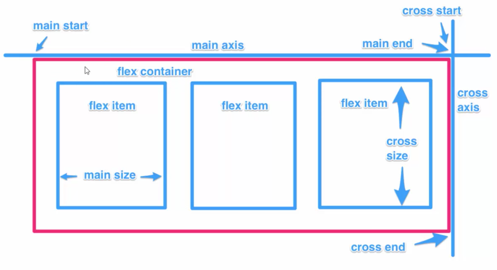
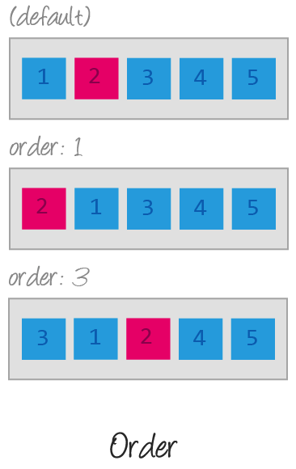
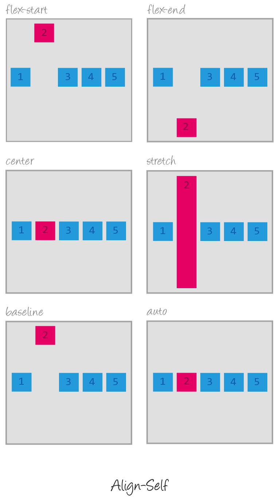

# CSS

- [Описание](#описание)
- [Flexbox](#flexbox)
- [Полезные ссылки](#полезные-ссылки)

## Описание

**CSS** (**C**ascading **S**tyle **S**heets, каскадные таблицы стилей) — используется для описания внешнего вида документа, написанного языком разметки. Обычно CSS-стили используются для создания и изменения стиля элементов веб-страниц и пользовательских интерфейсов, написанных на языках HTML и XHTML, но также могут быть применены к любому виду XML-документа, в том числе XML, SVG и XUL.

Каскадные таблицы стилей описывают правила форматирования элементов с помощью свойств и допустимых значений этих свойств. Для каждого элемента можно использовать ограниченный набор свойств, остальные свойства не будут оказывать на него никакого влияния.

Объявление стиля состоит из двух частей: элемента веб-страницы — селектора, и команды форматирования — блока объявления. Селектор сообщает браузеру, какой именно элемент форматировать, а в блоке объявления (код в фигурных скобках) перечисляются форматирующие команды — свойства и их значения.

## Flexbox

## Полезные ссылки

- [Справочник CSS](http://htmlbook.ru/css)
- [CSS3 Cheat Sheet](files/css3_cheatsheet.pdf)