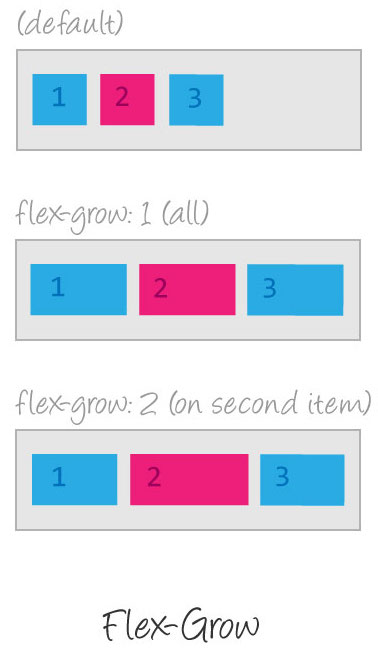
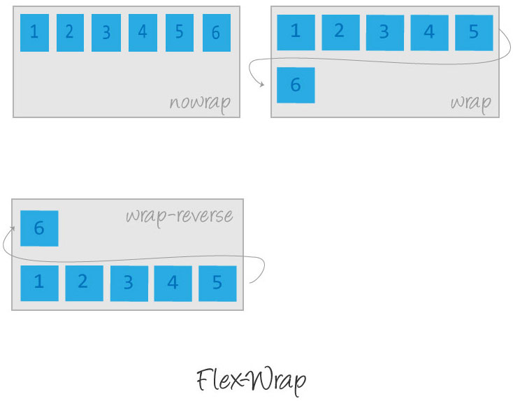
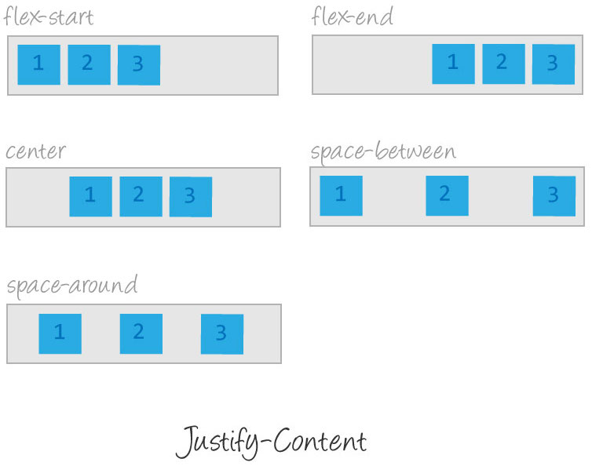
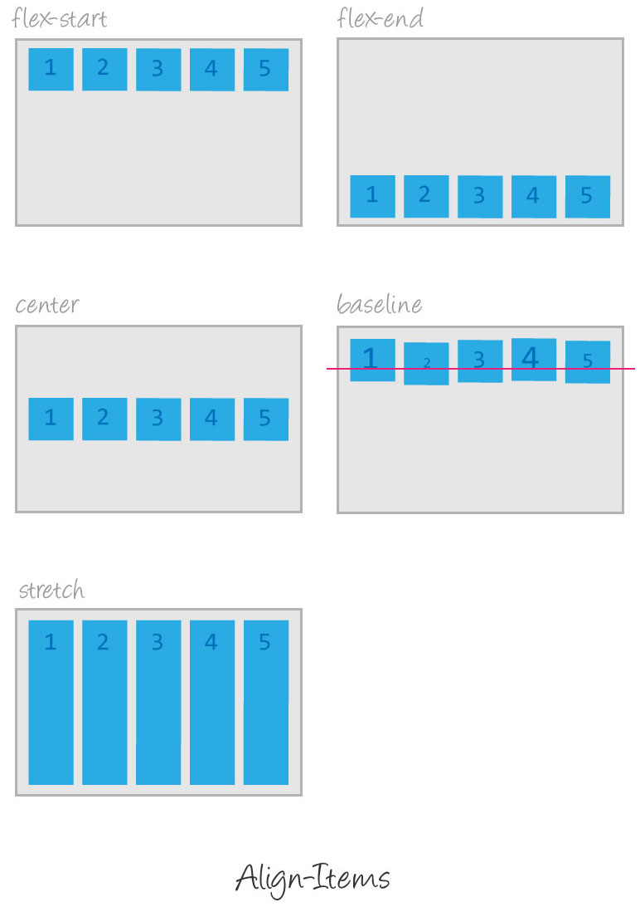
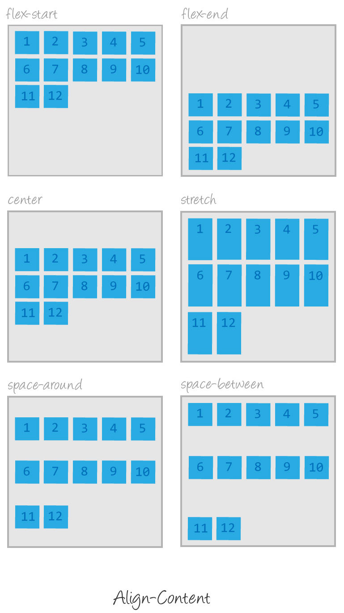

# CSS

- [Описание](#описание)
- [История создания и развития CSS](#история-создания-и-развития-css)
- [Flexbox](#flexbox)
- [Полезные ссылки](#полезные-ссылки)

## Описание

**CSS** (**C**ascading **S**tyle **S**heets, каскадные таблицы стилей) — используется для описания внешнего вида документа, написанного языком разметки. Обычно CSS-стили используются для создания и изменения стиля элементов веб-страниц и пользовательских интерфейсов, написанных на языках HTML и XHTML, но также могут быть применены к любому виду XML-документа, в том числе XML, SVG и XUL.

Каскадные таблицы стилей описывают правила форматирования элементов с помощью свойств и допустимых значений этих свойств. Для каждого элемента можно использовать ограниченный набор свойств, остальные свойства не будут оказывать на него никакого влияния.

Объявление стиля состоит из двух частей: элемента веб-страницы — селектора, и команды форматирования — блока объявления. Селектор сообщает браузеру, какой именно элемент форматировать, а в блоке объявления (код в фигурных скобках) перечисляются форматирующие команды — свойства и их значения.

## История создания и развития CSS

### Уровень 1 (CSS1)

Рекомендация W3C, принята 17 декабря 1996 года, откорректирована 11 января 1999 года. Среди возможностей, предоставляемых этой рекомендацией:

- **Параметры шрифтов**. Возможности по заданию гарнитуры и размера шрифта, а также его стиля — обычного, курсивного или полужирного
- **Цвета**. Спецификация позволяет определять цвета текста, фона, рамок и других элементов страницы
- **Атрибуты текста**. Возможность задавать межсимвольный интервал, расстояние между словами и высоту строки (то есть межстрочные отступы)
- **Выравнивание** для текста, изображений, таблиц и других элементов
- Свойства блоков, такие как **высота**, **ширина**, **внутренние (padding)** и **внешние (margin) отступы** и **рамки**. Также в спецификацию входили ограниченные средства по позиционированию элементов, такие как **float** и **clear**

### Уровень 2 (CSS2)

Рекомендация W3C, принята 12 мая 1998 года. Основана на CSS1 с сохранением обратной совместимости за несколькими исключениями. Добавление к функциональности:

- **Блочная вёрстка**. Появились относительное, абсолютное и фиксированное позиционирование. Позволяет управлять размещением элементов по странице без табличной вёрстки
- **Типы носителей**. Позволяет устанавливать разные стили для разных носителей (например монитор, принтер, КПК)
- **Звуковые таблицы стилей**. Определяет голос, громкость и т. д. для звуковых носителей (например для слепых посетителей сайта)
- **Страничные носители**. Позволяет, например, установить разные стили для элементов на чётных и нечётных страницах при печати
- **Расширенный механизм селекторов**
- **Указатели**
- **Генерируемое содержимое**. Позволяет добавлять содержимое, которого нет в исходном документе, до или после нужного элемента

### Уровень 2, ревизия 1 (CSS2.1)

Рекомендация W3C, принята 7 июня 2011 года. CSS2.1 основана на CSS2. Кроме исправления ошибок, в новой ревизии изменены некоторые части спецификации, а некоторые и вовсе удалены.

### Уровень 3 (CSS3)

Самая масштабная редакция по сравнению с CSS1, CSS2 и CSS2.1. Главной особенностью CSS3 является возможность создавать **анимированные элементы** без использования JS, поддержка линейных и радиальных **градиентов**, **теней**, **сглаживания** и прочее.

В отличие от предыдущих версий спецификация разбита на модули, разработка и развитие которых идёт независимо. CSS3 основан на CSS2.1, дополняет существующие свойства и значения и добавляет новые.

Нововведения, начиная с малых, вроде **закругленных углов блоков**, заканчивая **трансформацией** (**анимацией**) и, возможно, введением **переменных**.

### Уровень 4 (CSS4)

Разрабатывается W3C с 29 сентября 2011 года. Модули CSS4 построены на основе CSS3 и дополняют их новыми свойствами и значениями. Все они существуют пока в виде черновиков (working draft).

Например:

- CSS Cascading and Inheritance Level 4
- Selectors Level 4
- CSS Image Values and Replaced Content Module Level 4
- CSS Backgrounds and Borders Module Level 4
- CSS Color Module Level 4
- Media Queries Level 4
- CSS Pseudo-Elements Module Level 4
- CSS Text Module Level 4

## Flexbox

## Полезные ссылки

- [Справочник CSS](http://htmlbook.ru/css)
- [CSS3 Cheat Sheet](files/css3_cheatsheet.pdf)