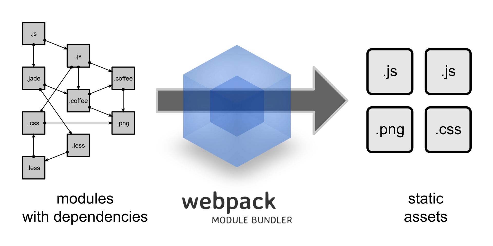

# Webpack

- [Описание](#описание)
- [Возможности](#возможности)
- [Установка](#установка)
- [Настройка](#настройка)
- [Плагины](#плагины)
- [Режимы](#режимы)
- [Слежение за изменениями](#слежение-за-изменениями)
- [Полезные ссылки](#полезные-ссылки)

## Описание

**Webpack** — статический модульный сборщик для приложений на JavaScript. Основная цель состоит в том, чтобы собрать все JavaScript и CSS файлы в любое нужное количество пакетов (bundles), а также убедиться, что в собранном пакете есть все файлы проекта подключены в правильном порядке.

Webpack в настоящее время является самым популярным инструментом не только из-за большого числа разработчиков, активно поддерживающих его, но и из-за количества дополнительных функциональных возможностей, доступных для него, таких как загрузчики (loaders) и плагины. С их помощью можно легко запускать различные процессы до и после того, как Webpack собрал файлы. Это позволяет легко построить статический конвейер активов (assets).



Webpack не ограничивается одним лишь frontend'ом, его также успешно применяют в backend разработке на Node.js.

У Webpack есть предшественники, у которых он перенял многие идеи. Основное различие заключается в том, что те инструменты известны как **task runners**, в то время как Webpack ничто иное, как сборщик модулей.


## Возможности

- Перевод файлов из ES6 в ES5 (babel)
- Перевод `.less` или `.scss` файлов в обычный `.css`
- Минифицирование файлов (уменьшает размер файла)
- Удаление всех комментариев из всех файлов (для дальнейшего уменьшения размера файла)
- Добавление всех пользовательских шрифтов и иконок в выходной файл (чтобы они были доступны сразу, без задержки, связанной с дополнительными HTTP запросами)
- Размещение всего кода в один `.js` файл, а всех библиотек в другие `.js` файлы (чтобы их можно было кэшировать в браузере, так как вряд ли они когда-нибудь изменятся в стабильном проекте)
- Сборка всех `.css` в один файл
- Автоматическое изменение версии выходного файла (чтобы избежать проблем с кэшированием браузера при изменении содержимого)
- Автоматическая вставка файлов как теги `<link>` или `<script>` в `.html` файл (не нужно вручную менять теги каждый раз, когда изменяются версии файлов)


## Установка

```bash
# NPM
npm i webpack webpack-cli --save-dev
# Yarn
yarn add webpack webpack-cli -D
```


## Настройка

По умолчанию, Webpack (начиная с 4-й версии) не требует никакой настройки, если соблюдаются следующие правила:

- Точкой входа приложения является `./src/index.js`
- Вывод (output) размещается в `./dist/main.js`
- Webpack работает в `production` режиме

Конфигурационный файл Webpack `webpack.config.js` хранится в корневой директории проекта.

### Точка входа (entrypoint)

По умолчанию, точкой входа является `./src/index.js`. Нижеприведенный пример использует файл `./index.js` в качестве входной точки.

```js
module.exports = {
    /*...*/
    entry: './index.js'
    /*...*/
}
```

### Вывод (output)

По умолчанию, вывод размещается в `./dist/main.js`. В нижеприведенном примере, результат работы в Webpack генерируется в файле `app.js`:

```js
module.exports = {
    /*...*/
    output: {
        path: path.resolve(__dirname, 'dist'),
        filename: 'app.js'
    }
    /*...*/
}
```

С помощью Webpack можно использовать оператор `import` или `require` в JavaScript коде для того, чтобы подключать файлы любого типа (например, CSS).

### Загрузчики (loaders)

В Webpack **загрузчики** являются аналогами **задач** (tasks) в Grunt и Gulp. Они принимают содержимое файлов, а затем преобразуют его необходимым образом и включают результат преобразования в общую сборку. Они могут компилировать TypeScript, загружать компоненты Vue.js и многое другое.

Например, в своем коде вы можете использовать:

```js
import 'style.css';
```

указав конфигурацию данного загрузчика в файле `webpack.config.js`:

```js
module.exports = {
    /*...*/
    module: {
        rules: [
            {
                test: /\.css$/,
                use: 'css-loader'
            }
        ]
    }
    /*...*/
}
```

Регулярное выражение применяет данный загрузчик только к CSS файлам.

У загрузчика есть параметры:

```js
module.exports = {
    /*...*/
    module: {
        rules: [
            {
                test: /\.css$/,
                use: [{
                    loader: 'css-loader',
                    options: {
                        modules: true
                    }
                }]
            }
        ]
    }
    /*...*/
}
```

Для одной и той же задачи может потребоваться несколько загрузчиков:

```js
module.exports = {
    /*...*/
    module: {
        rules: [
            {
                 test: /\.css$/,
                 use: [
                     'style-loader',
                     'css-loader',
                 ]
            }
        ]
    }
    /*...*/
}
```

В этом примере `css-loader` интерпретирует директиву `import 'style.css'` в CSS. Затем `style-loader` внедряет этот CSS в DOM, используя тег `<style>`. Порядок выполнения перевернут (последнее выполняется первым).

Самым часто используемым загрузчиком является **Babel** — он используется для транспиляции современного JavaScript в ES5:

```js
module.exports = {
    /*...*/
    module: {
        rules: [
            {
                test: /\.js$/,
                exclude: /(node_modules|bower_components)/,
                use: {
                    loader: 'babel-loader',
                    options: {
                        presets: ['@babel/preset-env']
                    }
                }
            }
        ]
    }
    /*...*/
}
```


## Плагины

**Плагины** — почти то же самое, что и загрузчики, но гораздо функциональнее. Они могут сделать то, что не могут загрузчики. Ко всему прочему, Webpack построен на системе плагинов, которые вы используете в своем файле конфигурации.

Плагин `HTMLWebpackPlugin` автоматически создает HTML-файл с уже подключенным скриптом:

```js
module.exports = {
    /*...*/
    plugins: [
        new HTMLWebpackPlugin()
    ]
    /*...*/
}
```

Еще один полезный плагин — `CleanWebpackPlugin`, который можно использовать перед перегенерацией файлов, чтобы очистить папку `dist/` и получить аккуратный файл с конфигурацией.

```js
module.exports = {
    /*...*/
    plugins: [
        new CleanWebpackPlugin(['dist'])
    ]
    /*...*/
}
```


## Режимы

Режимы (появившиеся в 4-й версии Webpack) настраивают среду, в которой будет работать Webpack. Режим может быть настроен на `development` или `production` (по умолчанию стоит `production`).

```js
module.exports = {
    entry: './index.js',
    mode: 'development',
    output: {
        path: path.resolve(__dirname, 'dist'),
        filename: 'app.js'
    }
}
```

Режим `development`:

- Менее оптимизирован, чем `production`
- Работает быстрее
- Не удаляет комментарии
- Предоставляет более подробные сообщения об ошибках и способы их решения
- Сильно облегчает отладку

Режим `production` работает медленнее, чем `development`, так как ему нужно создать более оптимизированный бандл. Полученный JavaScript файл меньше по размеру, поскольку многое из режима `development` в нем отсутствует.


## Слежение за изменениями

Webpack может автоматически перестраивать бандл, когда в приложении происходят изменения. Для этого необходимо добавить скрипт:

```json
"scripts": {
    "watch": "webpack --watch"
}
```

и запустить `npm run watch` или `yarn watch`.

Одной из приятных особенностей `watch mode` (режима просмотра) является то, что бандл изменяется только в том случае, если в сборке нет ошибок. Если ошибки присутствуют, `watch` продолжит следить за изменениями и будет пытаться перестраивать бандл.


## Полезные ссылки

- [Оригинал статьи](https://medium.com/nuances-of-programming/%D0%B2%D0%B2%D0%B5%D0%B4%D0%B5%D0%BD%D0%B8%D0%B5-%D0%B2-webpack-%D0%B4%D0%BB%D1%8F-%D0%BD%D0%BE%D0%B2%D0%B8%D1%87%D0%BA%D0%BE%D0%B2-6cafbf562386)
- [Документация](https://webpack.js.org/concepts/)
- [Webpack на практике: с нуля до создания автотестов](https://tproger.ru/translations/webpack-from-zero-to-hero/)