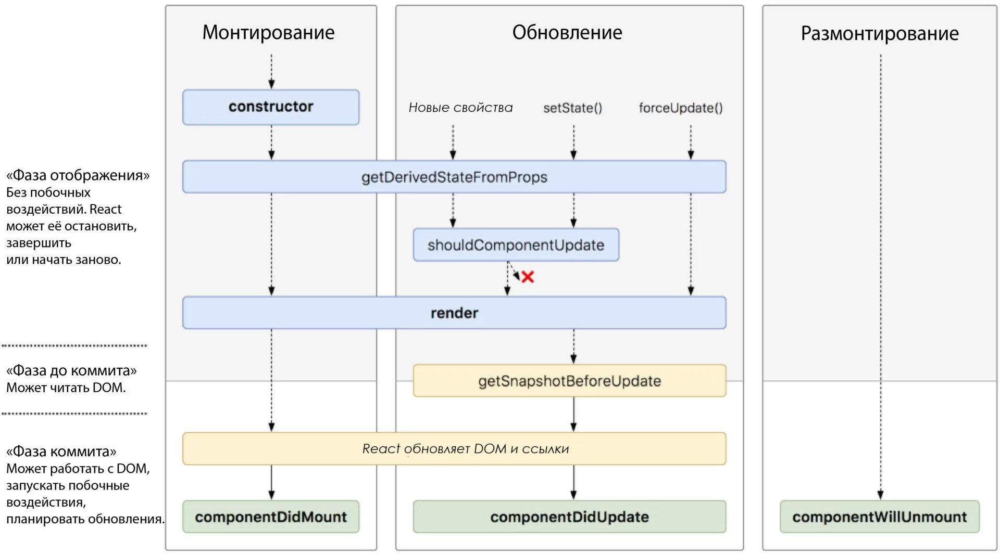

# React

- [Описание](#описание)
- [Кто использует](#кто-использует)
- [Установка](#установка)
- [Использование](#использование)
- [Жизненный цикл компонента](#жизненный-цикл-компонента)
- [Особенности](#особенности)
- [Пример кода](#пример-кода)
- [Redux](#redux)
- [Полезные ссылки](#полезные-ссылки)

## Описание

**React** (иногда **React.js**) — JavaScript-библиотека с открытым исходным кодом для разработки пользовательских интерфейсов. React разрабатывается и поддерживается Facebook, Instagram и сообществом отдельных разработчиков и корпораций.

React может использоваться для разработки одностраничных и мобильных приложений. Его цель — предоставить высокую скорость, простоту и масштабируемость. В качестве библиотеки для разработки пользовательских интерфейсов React часто используется с другими библиотеками, такими как **Redux** и **ReactRouter**.


## Кто использует

- Facebook
- Instagram
- Netflix
- New York Times
- Yahoo! Mail
- WhatsApp
- Dropbox


## Установка

```bash
# Установка пакета
sudo npm install -g create-react-app
```


## Использование

```bash
# Генерация приложения
npm init react-app project_name
cd project_name
# Запуск для разработки
npm start
# Сборка проекта
npm run build
```


## Жизненный цикл компонента



- `componentWillMount` — компонент будет примонтирован. В данный момент у нас нет возможности посмотреть DOM элементы
- `componentDidMount` — компонент примонтировался. В данный момент у нас есть возможность использовать `refs`, а следовательно это то самое место, где мы хотели бы указать установку фокуса. Так же, таймауты, ajax-запросы и взаимодействие с другими библиотеками стоит обрабатывать именно здесь
- `componentWillReceiveProps` — компонент получает новые `props`. Этод метод не вызывается в момент первого render'a
- `shouldComponentUpdate` — должен ли компонент обновиться? На самом деле, обычно React сам отлично разбирается. Но иногда ручное управление позволяет существенно ускорить работу в "узких местах". С этим методом нужно работать очень аккуратно
- `componentWillUpdate` — вызывается прямо перед `render`, когда новые `props` и `state` получены. В этом методе нельзя вызывать `setState`
- `componentDidUpdate` — вызывается сразу после `render`. Не вызывается в момент первого render'а компонента
- `componentWillUnmount` — вызывается сразу перед тем, как компонент будет удален из DOM


## Особенности

### Однонаправленная передача данных

Свойства передаются от родительских компонентов к дочерним. Компоненты получают свойства как множество неизменяемых (immutable) значений, поэтому компонент не может напрямую изменять свойства, но может вызывать изменения через callback функции. Такой механизм называют "свойства вниз, события наверх".

### Виртуальный DOM

React использует виртуальный DOM (virtual DOM). React создает кэш структуру в памяти, что позволяет вычислять разницу между предыдущим и текущим состояниями интерфейса для оптимального обновления DOM браузера. Таким образом программист может работать со страницей, считая, что она обновляется вся, но библиотека самостоятельно решает, какие компоненты страницы необходимо обновить.

### JSX

**JSX** (**J**ava**S**cript **X**ML) — расширение синтаксиса JavaScript, которое позволяет использовать похожий на HTML синтаксис для описания структуры интерфейса. Как правило, компоненты написаны с использованием JSX, но также есть возможность использования обычного JavaScript. JSX напоминает другой язык, созданный в компании Facebook для расширения PHP, XHP .

### Методы жизненного цикла

Методы жизненного цикла позволяют разработчику запускать код на разных стадиях жизненного цикла компонента.

### Не только отрисовка HTML в браузере

React используется не только для отрисовки HTML в браузере. Например, Facebook имеет динамические графики, которые отрисовываются в теги `<canvas>`. Netflix и PayPal используют изоморфные загрузки для отрисовки идентичного HTML на сервере и клиенте.


## Пример кода

```html
<div id="myReactApp"></div>

<script type="text/babel">
    class Greeter extends React.Component {
        render() {
            return <h1>{this.props.greeting}</h1>
        }
    }
    ReactDOM.render(<Greeter greeting="Hello World!" />,
                    document.getElementById('myReactApp'));
</script>
```

Класс `Greeter` — это React компонент, который принимает свойство `greeting`. Метод `ReactDOM.render` отрисовывает экземпляр класса (компонента) `Greeter` с свойством `greeting` равным `'Hello World'` и вставляет отрисованный компонент в DOM-элемент с идентификатором `myReactApp` как вложенный элемент.

При отображении в веб-браузере результат будет:

```html
<div id="myReactApp">
    <h1>Hello World!</h1>
</div>
```


## Redux

**Redux** — предсказуемый контейнер состояния для JavaScript приложений. Он позволяет вам создавать приложения, которые ведут себя одинаково в различных окружениях (клиент, сервер и нативные приложения), а также просто тестируются. Кроме того, это обеспечивает большие возможности по отладке, например редактирование кода в реальном времени в сочетание с time traveling.

Несколько советов о том, когда имеет смысл использовать Redux:

- У вас есть обоснованные объемы данных, меняющихся со временем
- Вам нужен один источник информации для вашего состояния
- Вы приходите к выводу, что сохранять все ваше состояние в компоненте верхнего уровня уже недостаточно

### Установка

```bash
npm install --save redux react-redux
```

### Основные принципы

Все состояние вашего приложения сохранено в объекте внутри одного **хранилища (store)**. Единственный способ изменить дерево состояния — это вызвать **действие (action)**, объект описывающий то, что случилось. Чтобы указать, каким образом действия преобразовывают дерево состояния, вы пишете чистые "редюсеры".

Если вы пришли из Flux, есть одно важное различие, которое вы должны понимать. Redux не имеет Диспетчера (Dispatcher) или поддержки множества хранилищ. Вместо этого есть только одно хранилище с одной корневой функцией-редюсером. Когда приложение разрастется, вместо добавления хранилищ, корневой редюсер разделяется на более мелкие редюсеры, которые независимо друг от друга обслуживают разные части дерева состояния. Это аналогично тому, что в React приложении есть только один корневой компонент, состоящий из множества мелких компонентов.

Эта архитектура может показаться излишней для счетчика приложения, но красота этого шаблона в том, что она хорошо масштабируется для больших и сложных приложений. Она также предоставляет очень мощные инструменты для разработчиков, позволяющих проследить каждую мутацию к действию, вызвавшему его. Вы можете записывать пользовательские сессии и воспроизводить их просто переигрывая каждое действие.


## Полезные ссылки

- [Оригинал статьи](https://ru.wikipedia.org/wiki/React)
- [Документация](https://ru.reactjs.org/docs/getting-started.html)
- [Валидация форм в ReactJS](https://medium.com/@kanby/валидация-форм-в-reactjs-56341da641d0)
- Руководства
	- [React.js для начинающих. Пацианский М.](https://legacy.gitbook.com/book/maxfarseer/react-course-ru-v2/details)
	- [Основы Redux. Пацианский М.](https://legacy.gitbook.com/book/maxfarseer/redux-course-ru-v2/details)
	- [https://learn-reactjs.ru/basics/state-and-lifecycle](https://learn-reactjs.ru/basics/state-and-lifecycle)
	- [React. Полное руководство](https://learn-reactjs.ru/home)
	- [Руководство по React](https://metanit.com/web/react/) (+ Webpack, Redux/Flux)
- Тестирование
	- [Writing Tests](https://github.com/reactjs/redux/blob/master/docs/recipes/WritingTests.md)
	- [Redux Testing Step by Step: A Simple Methodology for Testing Business Logic](https://hackernoon.com/redux-testing-step-by-step-a-simple-methodology-for-testing-business-logic-8901670756ce)
	- [react-boilerplate testing](https://github.com/react-boilerplate/react-boilerplate/tree/master/docs/testing)
- Django + React
	- [SPA на Django + React.js](https://djbook.ru/examples/75/)
	- [Creating websites using React and Django REST Framework](https://hackernoon.com/creating-websites-using-react-and-django-rest-framework-b14c066087c7)
	- [Modern Django: Part 1: Setting up Django and React](http://v1k45.com/blog/modern-django-part-1-setting-up-django-and-react/)
- Django + React + Server-Side Rendering (SSR)
	- [ReactJS : Server side rendering with router v4 & redux](https://crypt.codemancers.com/posts/2017-06-03-reactjs-server-side-rendering-with-router-v4-and-redux/)
	- [Что взять за основу React приложения](https://habrahabr.ru/post/323458/) (сравнение серверов)
	- [https://github.com/justinjung04/universal-boilerplate](https://github.com/justinjung04/universal-boilerplate) (шаблон настроенного приложения)