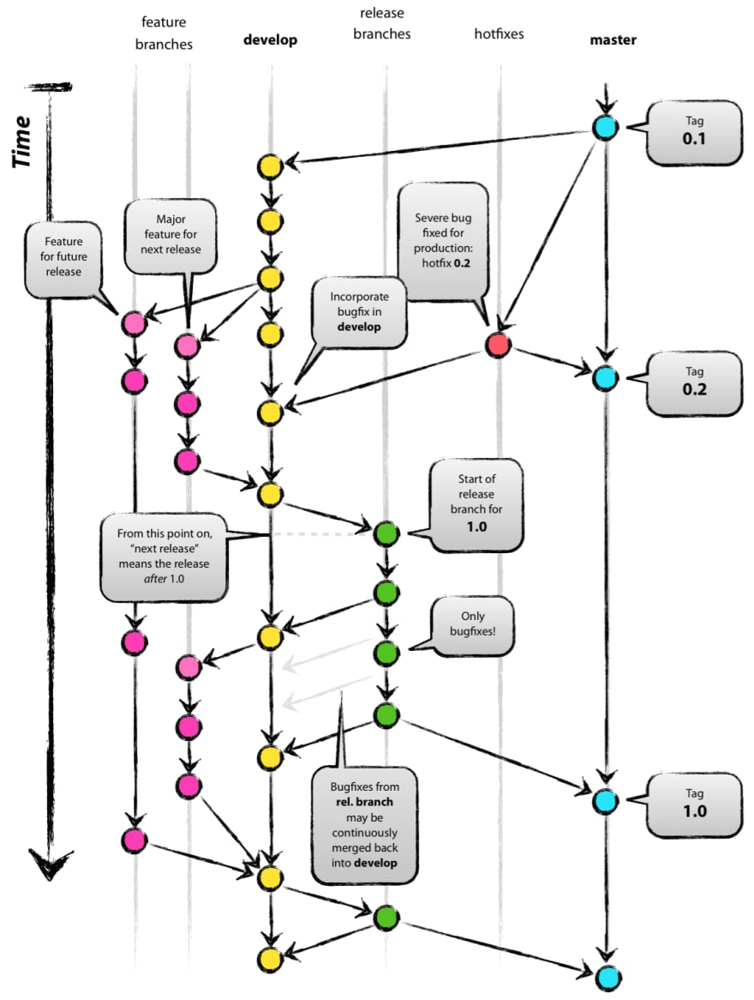

# Git

- [Общее](#общее)
- [Понимание Git](#понимание-git)
- [Указатели](#указатели)
- [Указание неотслеживаемых файлов](#указание-неотслеживаемых-файлов)
- [Настройки](#настройки)
- [Консольные команды](#консольные-команды)
- [Примеры различных ситуаций](#примеры-различных-ситуаций)
- [Git Flow](#git-flow)
- [GitHub Flow](#github-flow)
- [Полезные ссылки](#полезные-ссылки)

## Общее

**Git** — распределенная система контроля версий, которая дает возможность разработчикам отслеживать изменения в файлах и работать совместно с другими разработчиками. Она была разработана в 2005 году Линусом Торвальдсом, создателем Linux, для того, чтобы другие разработчики могли вносить свой вклад в ядро Linux. Git известен своей скоростью, простым дизайном, поддержкой нелинейной разработки, полной децентрализацией и возможностью эффективно работать с большими проектами.

Git стоит отдельно от других СКВ из-за подхода к работе с данными. Большинство других систем хранят информацию в виде списка изменений в файлах. Вместо этого, подход Git к хранению данных больше похож на набор снимков миниатюрной файловой системы. Каждый раз, когда вы сохраняете состояние своего проекта в Git, система запоминает, как выглядит каждый файл в этот момент, и сохраняет ссылку на этот снимок.

Преимущества Git:

- **Бесплатный и open-source**. Это значит, что его можно бесплатно скачать и вносить любые изменения в исходный код
- **Небольшой и быстрый**. Он выполняет все операции локально, что увеличивает его скорость. Кроме того, Git локально сохраняет весь репозиторий в небольшой файл без потери качества данных
- **Резервное копирование**. Git эффективен в хранении бэкапов, поэтому известно мало случаев, когда кто-то терял данные при использовании Git
- **Простое ветвление**. В других СКВ создание веток— утомительная и трудоемкая задача, так как весь код копируется в новую ветку. В Git управление ветками реализовано гораздо проще и эффективнее


## Понимание Git

Ключ к пониманию концепции git — знание о «трех деревьях»:

- **Рабочая директория** — файловая система проекта (те файлы, с которыми вы работаете).
- **Индекс** — список отслеживаемых git-ом файлов и директорий, промежуточное хранилище изменений (редактирование, удаление отслеживаемых файлов).
- **Директория `.git/`** — все данные контроля версий этого проекта (вся история разработки: коммиты, ветки, теги и пр.).

Коммит — «сохранение» (хранит набор изменений, сделанный в рабочей директории с момента предыдущего коммита). Коммит неизменен, его нельзя отредактировать.

У всех коммитов (кроме самого первого) есть один или более родительских коммитов, поскольку коммиты хранят изменения от предыдущих состояний.


## Указатели

- `HEAD` — указатель на текущий коммит или на текущую ветку (то есть, в любом случае, на коммит). Указывает на родителя коммита, который будет создан следующим
- `ORIG_HEAD` — указатель на коммит, с которого вы только что переместили `HEAD` (командой `git reset ...`, например)
- Ветка (`master`, `develop` etc.) — указатель на коммит. При добавлении коммита, указатель ветки перемещается с родительского коммита на новый
- Теги — простые указатели на коммиты. Не перемещаются


## Указание неотслеживаемых файлов

Файлы и директории, которые не нужно включать в репозиторий, указываются в файле `.gitignore`. Обычно это устанавливаемые зависимости (`node_modules/`, `bower_components/`), готовая сборка `build/` или `dist/` и подобные, создаваемые при установке или запуске. Каждый файл или директория указываются с новой строки, возможно использование шаблонов.


## Настройки

Перед началом работы нужно выполнить некоторые настройки:

```bash
# Включить преобразование окончаний строк из CRLF в LF (для Windows)
git config --global core.autocrlf true
# указать имя, которым будут подписаны коммиты
git config --global user.name "Your Name"
# Указать электропочту, которая будет в описании коммитера
git config --global user.email "e@w.com"
```


## Консольные команды

### Создать / клонировать репозиторий

```bash
# Создать новый проект в текущей директории
git init
# Создать новый проект в указанной директории
git init folder-name
# Клонировать удаленный репозиторий в директорию dir1
git clone https://github.com:nicothin/web-design.git dir1
```

### Просмотр изменений

```bash
# Показать состояние репозитория (отслеживаемые, измененные, новые файлы и пр.)
git status
# Сравнить рабочую директорию и индекс (неотслеживаемые файлы ИГНОРИРУЮТСЯ)
git diff
# Сравнить файл из рабочей директории и индекс
git diff index.html
# Сравнить индекс и коммит с HEAD
git diff --staged
# Посмотреть что сделано в ветке feature по сравнению с веткой master
git diff master feature
```

### Добавление изменений в индекс

```bash
# Добавить в индекс все новые, измененные, удаленные файлы из текущей директории и ее поддиректорий
git add .
# Добавить в индекс указанный файл (был изменен, был удален или это новый файл)
git add text.txt
```

### Удаление изменений из индекса

```bash
# Убрать из индекса все добавленные в него изменения (в рабочей директории все изменения сохранятся), антипод git add
git reset
# Убрать из индекса изменения указанного файла (в рабочей директории изменения сохранятся)
git reset readme.txt
```

### Отмена изменений

```bash
# ОПАСНО: отменить изменения в файле, вернуть состояние файла, имеющееся в индексе
git checkout text.txt
# ОПАСНО: отменить изменения; вернуть то, что в коммите, на который указывает HEAD (незакомиченные изменения удалены из индекса и из рабочей директории, неотслеживаемые файлы останутся на месте)
git reset --hard
# Удалить неотслеживаемые файлы и директории
git clean -df
```

### Коммиты

```bash
# Зафиксировать в коммите проиндексированные изменения (закоммитить), добавить сообщение
git commit -m "Name of commit"
# Проиндексировать отслеживаемые файлы (ТОЛЬКО отслеживаемые, но НЕ новые файлы) и закоммитить, добавить сообщение
git commit -a -m "Name of commit"
```

### Отмена коммитов и перемещение по истории

Все коммиты, которые уже были отправлены в удаленный репозиторий, должны отменяться новыми коммитами (`git revert`), дабы избежать проблем с историей разработки у других участников проекта.

```bash
# Создать новый коммит, отменяющий изменения, внесенные коммитом с указанным хешем (b9533bb)
git revert b9533bb --no-edit
```

**Все команды, приведенные ниже можно выполнять ТОЛЬКО если коммиты еще не были отправлены в удаленный репозиторий.**

```bash
# ВНИМАНИЕ! Опасные команды, можно потерять незакоммиченные изменения
# «Перекоммитить» изменения последнего коммита, заменить его новым коммитом с другим сообщением (сдвинуть текущую ветку на один коммит назад, сохранив рабочую директорию и индекс «как есть», создать новый коммит с данными из «отменяемого» коммита, но новым сообщением)
git commit --amend -m "Название"
# Передвинуть HEAD (и ветку) на предыдущий коммит, рабочую директорию и индекс сделать такими, какими они были в момент предыдущего коммита
git reset --hard @~
git reset --hard 75e2d51 # передвинуть HEAD (и ветку) на коммит с указанным хешем, рабочую директорию и индекс сделать такими, какими они были в момент указанного коммита
# Передвинуть HEAD (и ветку) на предыдущий коммит, но в рабочей директории и индексе оставить все изменения
git reset --soft @~
# То же, но передвинуть HEAD (и ветку) на 2 коммита назад
git reset --soft @~2
```

### Временно переключиться на другой коммит

```bash
# Переключиться на коммит с указанным хешем (переместить HEAD на указанный коммит, рабочую директорию вернуть к состоянию, на момент этого коммита)
git checkout b9533bb
# Переключиться на коммит, на который указывает master (переместить HEAD на коммит, на который указывает master, рабочую директорию вернуть к состоянию на момент этого коммита)
git checkout master
```

### Переключиться на другой коммит и продолжить работу с него

Потребуется создание новой ветки, начинающейся с указанного коммита.

```bash
# Создать ветку new-branch, начинающуюся с коммита c хешем 5589877 (переместить HEAD на указанный коммит, рабочую директорию вернуть к состоянию, на момент этого коммита, создать указатель на этот коммит (ветку) с указанным именем)
git checkout -b new-branch 5589877
```

### Восстановление изменений

```bash
# Восстановить в рабочей директории указанный файл на момент указанного коммита (и добавить это изменение в индекс) (git reset index.html для удаления из индекса, но сохранения изменений в файле)
git checkout 5589877 index.html
```

### Копирование коммита (перенос коммитов)

```bash
# Скопировать на активную ветку изменения из указанного коммита, закоммитить эти изменения
git cherry-pick 5589877
# Скопировать на активную ветку изменения из master (2 последних коммита)
git cherry-pick master~2..master
# Скопировать на активную ветку изменения из указанного коммита, но НЕ КОММИТИТЬ (подразумевается, что мы сами потом закоммитим)
git cherry-pick -n 5589877
# Скопировать на активную ветку изменения из всех коммитов ветки feature с момента ее расхождения с master (похоже на слияние веток, но это копирование изменений, а не слияние), закоммитить эти изменения; это может вызвать конфликт
git cherry-pick master..feature
# Прервать конфликтный перенос коммитов
git cherry-pick --abort
# Продолжить конфликтный перенос коммитов (сработает только после решения конфликта)
git cherry-pick --continue
```

### Удаление файла

```bash
# Удалить отслеживаемый неизмененный файл и проиндексировать это изменение
git rm text.txt
# Удалить отслеживаемый измененный файл и проиндексировать это изменение
git rm -f text.txt
```

### История коммитов

Выход из длинного лога вывода: <kbd>q</kbd>.

```bash
# Показать коммиты в указанной ветке
git log master
# Показать последние 2 коммита и статистику внесенных ими изменений
git log -2 --stat
# Показать последние 22 коммита и внесенную ими разницу на уровне строк
git log -p -22
# Показать коммиты за последние 2 недели
git log --since=2.weeks
# Показать историю изменений файла index.html (только коммиты)
git log index.html
# Показать все коммиты, в которых менялись строки с myFunction (в кавычках регулярное выражение)
git log -G'myFunction' -p
# Показать изменения от указанного до указанного регулярных выражений в указанном файле
git log -L '/<head>/','/<\/head>/':index.html
# Показать коммиты, в описании которых есть буквосочетание fix (регистрозависимо, только коммиты текущей ветки)
git log --grep fix
# Показать коммиты из ветки branch_99, которые не влиты в master
git log master..branch_99

# Показать изменения из коммита с указанным хешем
git show 60d6582
# Показать контент указанного файла на момент предыдущего (от HEAD) коммита
git show @~:index.html
```

### Ветки

```bash
# Показать список веток
git branch
# Создать новую ветку с указанным именем на текущем коммите
git branch new_branch
# Переместить ветку master на указанный коммит
git branch -f master 5589877
# Перейти в указанную ветку
git checkout new_branch
# Создать новую ветку с указанным именем и перейти в нее
git checkout -b new_branch
# Переместить ветку с указанным именем на указанный коммит и перейти в нее
git checkout -B master 5589877
# Влить в ветку, в которой находимся, данные из ветки hotfix
git merge hotfix
# Влить в ветку, в которой находимся, данные из ветки hotfix (указано сообщение коммита слияния)
git merge hotfix -m "Горячая правка"
# Удалить ветку hotfix (используется, если ее изменения уже влиты в главную ветку)
git branch -d hotfix
# Показать все имеющиеся ветки (в т.ч. на удаленных репозиториях)
git branch -a
# Переименовать локально ветку old_branch_name в new_branch_name
git branch -m old_branch_name new_branch_name
# Применить переименование в удаленном репозитории
git push origin :old_branch_name new_branch_name
# Завершить процесс переименования
git branch --unset-upstream
```

### Теги

```bash
# Создать тег с указанным именем на коммите, на который указывает HEAD
git tag v1.0.0
# Создать тег с описанием на том коммите, на который смотрит ветка master
git tag -a -m 'В продакшен!' v1.0.1 master
# Удалить тег с указанным именем(ами)
git tag -d v1.0.0
# Показать все теги, и по 1 строке сообщения коммитов, на которые они указывают
git tag -n
```

### Временное сохранение изменений без коммита

```bash
# Временно сохранить незакоммиченные изменения и убрать их из рабочей директории
git stash
# Вернуть сохраненные командой git stash изменения в рабочую директорию
git stash pop
```

### Удаленные репозитории

Есть два распространенных способа привязать удаленный репозиторий к локальному: по HTTPS и по SSH. Если SSH у вас не настроен (или вы не знаете что это), привязывайте удаленный репозиторий по HTTPS (адрес привязываемого репозитория должен начинаться с `https://`).

```bash
# Показать список удаленных репозиториев, связанных с локальным
git remote -v
# Убрать привязку удаленного репозитория с сокр. именем origin
git remote remove origin
# Добавить удаленный репозиторий (с сокр. именем origin) с указанным URL
git remote add origin https://github.com:nicothin/test.git
# Получить данные об удаленном репозитории с сокращенным именем origin
git remote show origin
# Скачать все ветки с удаленного репозитория (с сокр. именем origin), но не сливать со своими ветками
git fetch origin
# Отправить в удаленный репозиторий (с сокр. именем origin) данные своей ветки master
git push origin master
# Влить изменения с удаленного репозитория (только указанная ветка)
git pull origin master
```

### Конфликт слияния

Предполагается ситуация: есть ветка `master` и есть ветка `feature`. В обеих ветках есть коммиты, сделанные после расхождения веток. В ветку `master` пытаемся влить ветку `feature` (`git merge feature`), получаем конфликт, т.к. в обеих ветках есть изменения одной и той же строки в файле `index.html`.

При возникновении конфликта, репозиторий находится в состоянии прерванного слияния. Нужно оставить в конфликтующих местах файлов только нужный код, проиндексировать изменения и закоммитить.

```bash
# Влить в активную ветку изменения из ветки feature
git merge feature
# Показать хеш последнего общего коммита для двух указанных веток
git merge-base master feature
# Оставить в конфликтном файле (index.html) состояние ветки, В КОТОРУЮ мы вливаем (в примере — из ветки master)
git checkout --ours index.html
# Оставить в конфликтном файле (index.html) состояние ветки, ИЗ КОТОРОЙ мы вливаем (в примере — из ветки feature)
git checkout --theirs index.html
# Показать в конфликтном файле (index.html) сравнение содержимого сливаемых веток (для ручного редактирования)
git checkout --merge index.html

# Прекратить это прерванное слияние, вернуть рабочую директорию и индекс как было в момент коммита, на который указывает HEAD
git reset --hard
# Прекратить это прерванное слияние, но оставить изменения, не закоммиченные до слияния (для случая, когда слияние делается не на чистом статусе)
git reset --merge
git reset --abort
```

### «Перенос» ветки

Можно «переместить» ответвление какой-либо ветки от основной на произвольный коммит. Это нужно для того, чтобы в «переносимой» ветке появились какие-либо изменения, внесенные в основной ветке (уже после ответвления переносимой).

```bash
# Перенести все коммиты (создать их копии) активной ветки так, будто активная ветка ответвилась от master на нынешней вершине master (часто вызывает конфликты)
git rebase master
# Перенести коммиты активной ветки на master, начиная с того места, в котором активная ветка отделилась от ветки feature
git rebase --onto master feature
# Прервать конфликтный rebase, вернуть рабочую директорию и индекс к состоянию до начала rebase
git rebase --abort
# Продолжить конфликтный rebase (сработает только после разрешения конфликта и индексации такого разрешения)
git rebase --continue

# Смотрим лог перемещений ветки, которой делали rebase (в этом примере — feature), видим последний коммит ПЕРЕД rebase, на него и нужно перенести указатель ветки
git reflog feature -2
# Переместить указатель ветки feature на один коммит назад, обновить рабочую директорию и индекс
git reset --hard feature@{1}
```


## Примеры различных ситуаций

### Начало работы

```bash
# Создана директория проекта, мы в ней. Создаем репозиторий в этой директории
git init
# Создаем файл readme.md
touch readme.md
# Добавляем файл в индекс
git add readme.md
# Создаем коммит
git commit -m "Старт"
# Добавляем предварительно созданный пустой удаленный репозиторий
git remote add origin https://github.com:nicothin/test.git
# Отправляем данные из локального репозитория в удаленный (в ветку master)
git push -u origin master
```

### «Внесение изменений» в коммит

```bash
# Редактируем и сохраняем разметку «шапки». Индексируем измененный файл
git add inc/header.html
# Делаем коммит
git commit -m "Убрал телефон из шапки"
# ВНИМАНИЕ: коммит пока не был отправлен в удаленный репозиторий
# сознаем, что нужно было еще что-то сделать в этом коммите.
# Индексируем измененный файл (можно git add .)
git add inc/header.html
# Заново делаем коммит
git commit --amend -m "«Шапка»: выполнена задача №34"
```

### Работа с ветками

Есть master (публичная версия сайта), выполняем масштабную задачу (переверстать «шапку»), но по ходу работ возникает необходимость подправить критичный баг (неправильно указан контакт в «подвале»).

```bash
# Создадим новую ветку для задачи изменения «шапки» и перейдем в нее
git checkout -b new-page-header
# Редактируем разметку «шапки», делаем коммит (работа еще не завершена)
git commit -a -m "Новая шапка: смена логотипа"
# Тут выясняется, что есть баг с контактом в «подвале». возвращаемся к ветке master
git checkout master
# Устраняем баг, делаем коммит
git commit -a -m "Исправление контакта в подвале"
# Отправляем коммит с быстрым критическим изменением в master в удаленном репозитории
git push
# Аереключаемся обратно в ветку new-page-header для продолжения работ над «шапкой»
git checkout new-page-header
# Редактируем разметку «шапки», елаем коммит (работа над «шапкой» завершена)
git commit -a -m "Новая шапка: смена навигации"
# Переключаемся в ветку master
git checkout master
# Вливаем в master изменения из ветки new-page-header
git merge new-page-header
# Удаляем ветку new_page_header
git branch -d new-page-header
```

### Синхронизация репозитория-форка с мастер-репозиторием

Есть некий репозиторий на github.com, от него нами был сделан форк, добавлены какие-то изменения. Оригинальный (мастер-)репозиторий был как-то обновлен. Задача: стянуть с мастер-репозитория изменения (которые там внесены уже после того, как мы его форкнули).

```bash
# Добавляем удаленный репозиторий: сокр. имя — upstream, URL мастер-репозитория
git remote add upstream https://github.com:address.git
# Стягиваем все ветки мастер-репозитория, но пока не сливаем со своими
git fetch upstream
# Переключаемся на ветку master своего репозитория
git checkout master
# Вливаем стянутую ветку master удаленного репозитория upstream в свою ветку master
git merge upstream/master
```

### Ошибка в работе: закоммитили в мастер, но поняли, что нужно было коммитить в новую ветку

```bash
# Сделали изменения, проиндексировали их, закоммитили в master, но ЕЩЕ НЕ ОТПРАВИЛИ (не делали git push). создаем новую ветку из master
git checkout -b new-branch
# Переключаемся на master
git checkout master
# Сдвигаем указатель (ветку) master на 1 коммит назад
git reset HEAD~ --hard
# Переключаемся обратно на новую ветку для продолжения работы
git checkout new-branch
```


## Git Flow



**Git Flow** — подход, призванный упростить и упорядочить работу с ветками. Для каждого вида работы отводится определенная ветка. В общем случае выделяют следующие ветки: `master`, `hotfix`, `develop`, `release` и `feature`.

- **Master** содержит последнюю актуальную работающую версию (версия, которая выложена на рабочем сервере)
- **Hotfix** отделяется от `master`, служит для исправления в ней ошибок и вливается обратно в `master` и `develop`
- Новый функционал разрабатывается через ветку **feature**. После окончания работы над фичей, ветка вливается в `develop`
- **Develop** содержит все новые фичи из этой ветки отделяется версия `release`
- В **release** копятся изменения, исправляются ошибки перед очередным обновлением `master`

Рабочий процесс в Git Flow:

- Создается репозиторий
- Репозиторий инициализируется
- Начинается работа на ветке `develop`
- Возникает необходимость опробовать новую штуку – создается ветка `feature` и делаются коммиты
- Закончив работу на ветке `feature`, вы сливаете ее с `develop`
- Если вы довольны текущей версией, но хотите продолжить работу, создается ветка `release`, куда перемещается текущая версия. Правка багов будет происходить на этой же ветке
- Когда с веткой `release` покончено, время слить ее в `master` и продолжить работу с `develop`
- Кроме того, этот момент можно отметить на `master` ветке


## GitHub Flow

Почему в GitHub не используют **Git Flow**? Главная проблема в том, что принято беспрестанное внедрение изменений. Рабочий процесс Git Flow создавался в основном в помощь «выпускам» нового кода. А в GitHub нет «выпусков», потому что код поступает на production ежедневно — иногда несколько раз в день. Можно подавать для этого команды боту в той же чат-комнате, в которой отображаются итоги CI.

У такого частого внедрения новинок есть ряд достоинств. Если оно случается каждые несколько часов, то почти невозможно возникнуть большому количеству крупных багов. Небольшие недочеты случаются, но они могут быть исправлены (а исправления, в свою очередь, внедрены) очень быстро. Обычно пришлось бы делать «хотфикс» или как-то еще отступать от нормального процесса, но для нас это становится просто частью нормального процесса: в рабочем процессе GitHub нет разницы между хотфиксом и небольшою фичей.

Другим достоинством беспрерывного внедрения изменений становится возможность быстро отреагировать на проблемы любого рода. Мы можем откликаться на сообщения о проблемах с безопасностью или исполнять небольшие (но интересные) просьбы о новых фичах — но тот же самый процесс работает и при внесении изменений, связанных с разработкою фичи нормального (или даже крупного) размера. Процесс один и тот же и он очень прост.

- Содержимое ветви **master** всегда работоспособно (*deployable*)
- Начиная работу над чем-то новым, ответвляйте от ветви **master** новую ветвь, имя которой соответствует ее предназначению (например, `new-oauth2-scopes`)
- Закоммитив в эту ветвь локально, отправляйте регулярно свою работу и в одноименную ветвь на сервере
- Когда вам понадобится отзыв, или помощь, или когда вы сочтете ветвь готовой к слиянию, отправьте pull request
- После того, как кто-то другой просмотрел и одобрил фичу, вы можете слить вашу ветвь в ветвь **master**
- После того, как ветвь **master** пополнилась новым кодом, вы можете немедленно внедрить его на production и вам **следует** сделать это


## Полезные ссылки

- [Оригинал статьи](https://github.com/nicothin/web-development/blob/master/git/readme.md)
- [Документация](https://git-scm.com/doc)
- [Работе в команде с использованием Git](https://www.blend4web.com/doc/ru/git_short_manual.html)
- [Git Flow](https://habr.com/ru/post/106912/)
- [GitHub Flow - упрощенная версия Git Flow](https://habr.com/ru/post/189046/)