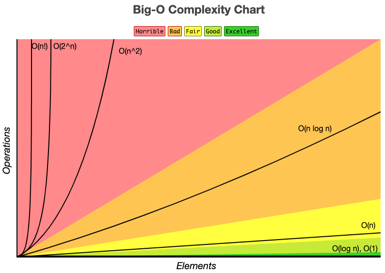
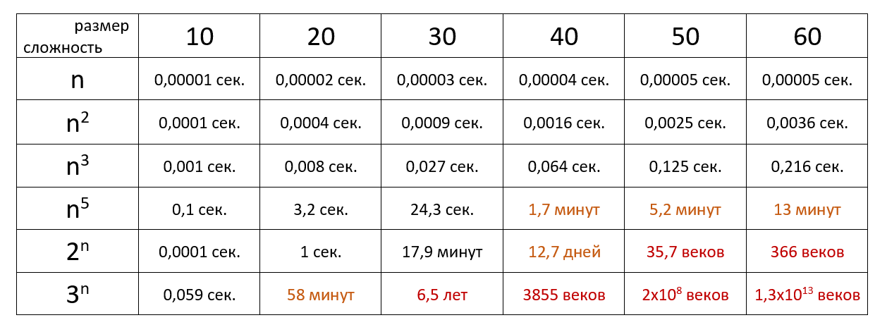

# Алгоритмическая сложность

- [Общее](#общее)
- [Примеры](#примеры)
- [Полезные ссылки](#полезные-ссылки)

## Описание

Сложность алгоритмов обычно оценивают по времени выполнения или по используемой памяти. В обоих случаях сложность зависит от размеров входных данных: массив из 100 элементов будет обработан быстрее, чем аналогичный из 1000. При этом точное время мало кого интересует: оно зависит от процессора, типа данных, языка программирования и множества других параметров. Важна лишь асимптотическая сложность, т. е. сложность при стремлении размера входных данных к бесконечности.

Допустим, некоторому алгоритму нужно выполнить `4n^3 + 7n` условных операций, чтобы обработать `n` элементов входных данных. При увеличении `n` на итоговое время работы будет значительно больше влиять возведение `n` в куб, чем умножение его на `4` или же прибавление `7n`. Тогда говорят, что временная сложность этого алгоритма равна `О(n^3)`, т. е. зависит от размера входных данных кубически.

Использование заглавной буквы О (или так называемая О-нотация) пришло из математики, где е е применяют для сравнения асимптотического поведения функций. Формально `O(f(n))` означает, что время работы алгоритма (или объ ем занимаемой памяти) раст ет в зависимости от объ ема входных данных не быстрее, чем некоторая константа, умноженная на `f(n)`.

## Примеры

### O(1) — константная сложность

Случается, что время работы алгоритма вообще не зависит от размера входных данных. Тогда сложность обозначают как `O(1)`. Например, для определения значения третьего элемента массива не нужно ни запоминать элементы, ни проходить по ним сколько-то раз. Всегда нужно просто дождаться в потоке входных данных третий элемент и это будет результатом, на вычисление которого для любого количества данных нужно одно и то же время.

### O(n) — линейная сложность

Такой сложностью обладает, например, алгоритм поиска наибольшего элемента в не отсортированном массиве. Нам прид ется пройтись по всем `n` элементам массива, чтобы понять, какой из них максимальный.

### O(log n) — логарифмическая сложность

Простейший пример — бинарный поиск. Если массив отсортирован, мы можем проверить, есть ли в н ем какое-то конкретное значение, методом деления пополам. Проверим средний элемент, если он больше искомого, то отбросим вторую половину массива — там его точно нет. Если же меньше, то наоборот — отбросим начальную половину. И так будем продолжать делить пополам, в итоге проверим `log n` элементов.

### O(n^2) — квадратичная сложность

Такую сложность имеет, например, алгоритм сортировки вставками. В канонической реализации он представляет из себя два вложенных цикла: один, чтобы проходить по всему массиву, а второй, чтобы находить место очередному элементу в уже отсортированной части. Таким образом, количество операций будет зависеть от размера массива как `n * n`, т. е. `n2`.

## Полезные ссылки

- [Оригинал статьи](https://tproger.ru/articles/computational-complexity-explained/)