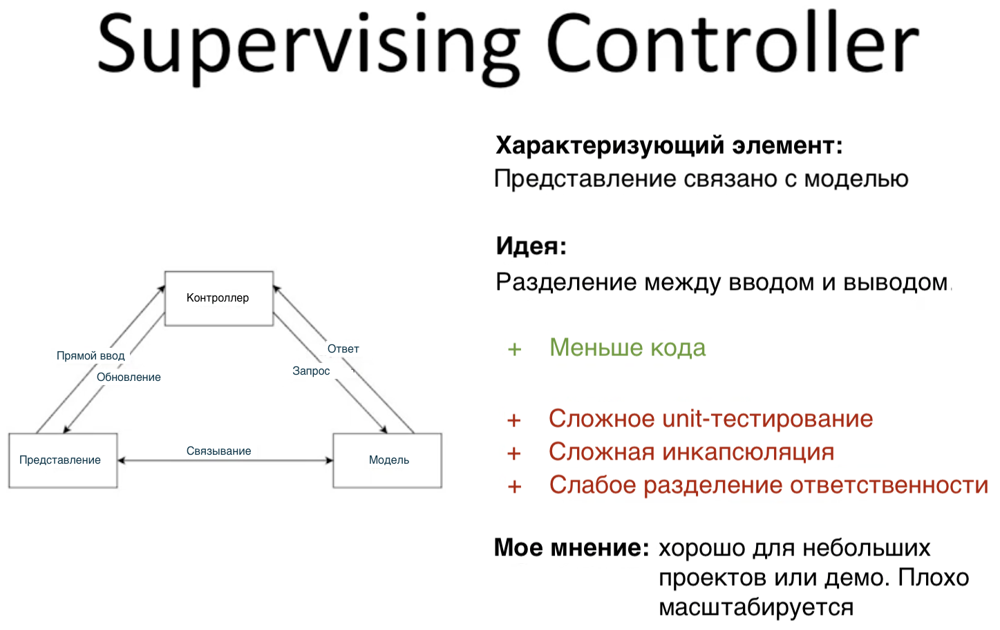
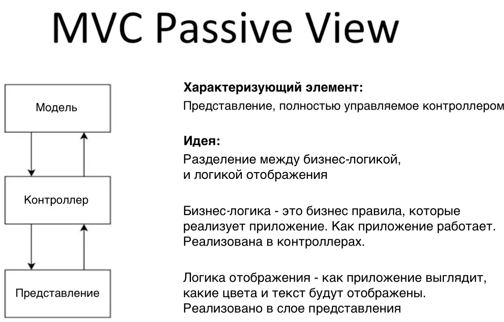
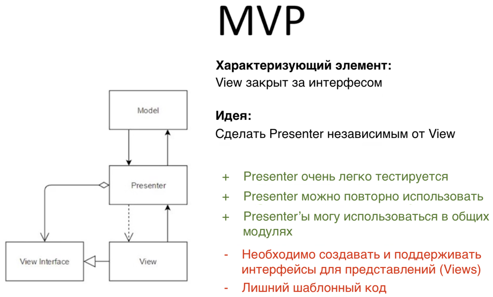
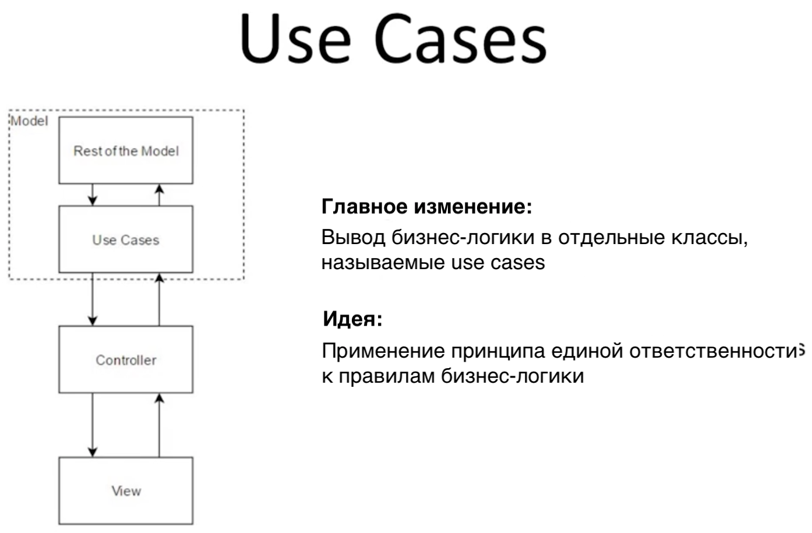
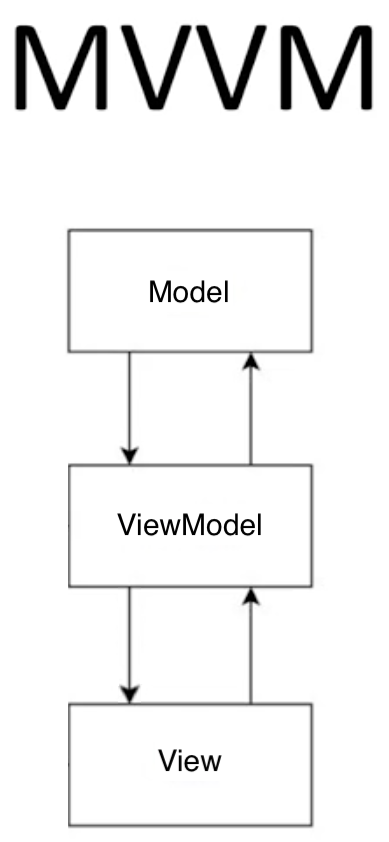
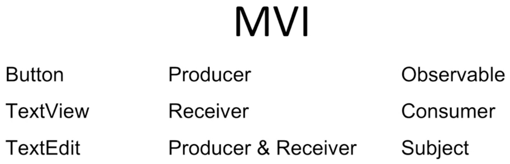

# Паттерны разработки

- [Чего хотим добиться](#чего-хотим-добиться)
- [Model View Controller (MVC)](#model-view-controller-mvc)
- [Пассивное представление MVC](#пассивное-представление-mvc)
- [Massive View Controller](#massive-view-controller)
- [Model View Presenter (MVP)](#model-view-presenter-mvp)
- [Use Cases](#use-cases)
- [Привязывание представления (View Bindings)](#привязывание-представления-view-bindings)
- [Model View View-Model (MVVM)](#model-view-view-model-mvvm)
- [Model View Intent (MVI)](#model-view-intent-mvi)
- [Полезные ссылки](#полезные-ссылки)

## Чего хотим добиться

**Масштабируемость (scalability)** — возможность расширять проект, реализовывать новые функции.

**Сопровождаемость (maintainability)** — можно определить как необходимость небольших, атомарных изменений после того, как все функции реализованы. Например, это может быть изменение цвета в пользовательском интерфейсе. Чем лучше сопровождаемость проекта, тем легче новым разработчикам поддерживать проект.

**Надежность (reliability)** — понятно, что никто не станет тратить нервы на нестабильные приложения!

Важнейшим элементом здесь является разделение ответсвенности (Separation of Concerns): **различные идеи должны быть разделены**. Если мы хотим изменить что-то, мы не должны ходить по разным участкам кода.

Без разделения ответственности ни **повторное использование кода (Code Reusability)**, ни **тестируемость (Testability)** практически невозможно реализовать.

Ключ в **независимости**, как заметил Uncle Bob в Clean Architecture. К примеру, если вы используете библиотеку для загрузки изображений, вы не захотите использовать другую библиотеку, для решения проблем, созданных первой! Независимость в архитектуре приложения — частично реализует масштабируемость и сопровождаемость.

## Model View Controller (MVC)

У архитектуры MVC есть два варианта: **контроллер-супервизор (supervising controller)** и **пассивное представление (passive view)**.

В мобильной экосистеме — практически никогда не встречается реализация контроллера-супервизора.

Архитектуру MVC можно охарактеризовать двумя пунктами:

- Представление — это **визуальная проекция модели**
- Контроллер — это **соединение между пользователем и системой**

Диаграмма иллюстрирует идеологию паттерна. Здесь, представление определяет как слушателей, так и обратные вызовы; представление передает вход в контроллер.

Контроллер принимает входные данные, а представление — выходные, однако большое число операций происходит и между ними. Данная архитектура хорошо подходит только для небольших проектов.

## Пассивное представление MVC

Главная идея пассивного представления MVC — это то, что представление полностью управляется контроллером. Помимо этого, код четко разделен на два уровня: бизнес логику и логику отображения:

- Бизнес логика — то, как работает приложение
- Логика отображения — то, как выглядит приложение 
 

## Massive View Controller

**Нельзя трактовать Активити как представление (view)**. Необходимо рассматривать его как слой отображения, а сам контроллер выносить в отдельный класс.

А чтобы уменьшить код контроллеров представлений, можно разделить представления или определить субпредставления (subviews) с их собственными контроллерами. Реализация MVC паттерна таким образом, позволяет легко разбивать код на модули.

Однако, при таком подходе появляются некоторые проблемы:

- Объединение логики отображения и бизнес логики
- Трудности при тестировании

Решение этих проблем кроется за созданием абстрактного интерфейса для представления. Таким образом, презентер будет работать только с этой абстракцией, а не самим представлением. Тесты станут простыми, а проблемы решенными.

## Model View Presenter (MVP)

Данная архитектура облегчает unit-тестирование, **презентер (presenter)** прост для написание тестов, а также может многократно использоваться, потому что представление может реализовать несколько интерфейсов.

С точки зрения того, как лучше и корректней создавать интерфейсы, необходимо рассматривать MVP и MVC только как основные идеи, а не паттерны разработки.

## Use Cases

Создание **use cases** — это процесс выноса бизнес логики в отдельные классы, делая их частью модели. Они независимы от контроллера и каждый содержит в себе одно бизнес-правило. Это повышает возможность многократного использования, и упрощает написание тестов.

Например, в login controller, вынесен use case валидации и use case логина. Логин производит соединение с сетью. Если есть общие бизнес правила в других контроллерах или презентерах, можно будет переиспользовать эти use case’ы.

## Привязывание представления (View Bindings)

В реализации MVP есть четыре линейный функции, которые ничего не делают, кроме небольших изменений в пользовательском интерфейсе. Можно избежать этого лишнего кода, использовав **view binding**. 

Здесь простой подход: легко тестировать, и еще легче представить элементы представления как параметры через интерфейс, а не функции.

Стоит отметить, что с точки зрения презентера — ничего не изменилось.

## Model View View-Model (MVVM)

Существует другой способ биндинга: вместо привязывания представления к интерфейсу, мы привязываем элементы представления к параметрам view-модели — такая архитектура называется MVVM. В нашем примере, поля email, password, и разметка определены с помощью связываний. Когда мы меняем параметры в нашей модели, в разметку тоже вносятся изменения.

ViewModel’и просты для написания тестов, потому что они не требуют написания mock-объектов — потому что вы меняете свой собственный элемент, а потом проверяете как он изменился.

## Model View Intent (MVI)

Еще один элемент, который можно ввести в архитектуре, обычно называется MVI.

Если взять какой-либо элемент разметки, например кнопку, то можно сказать, что кнопка ничего не делает, кроме того, что производит какие-либо данные, в частности посылает сведения о том что она нажата или нет.

В библиотеке **RxJava**, то, что создает события — называется observable, то есть кнопка будет являться **observable** в парадигме реактивного программирования.

А вот TextView только отображает какой-либо текст и никаких данных не создает. В RxJava такие элементы, которые только принимают данные, называются **consumer**.

Также существуют элементы, которые делают и то и то, т. е. и принимают и отправляют информацию, например TextEdit. Такой элемент одновременно является и создателем (producer) и приемником (receiver), а в RxJava он называется **subject**.

При таком подходе — все есть поток, и каждый поток начинается с того момента, как какой-либо producer, начинает испускать информацию, а заканчивается на каком-либо receiver, который, в свою очередь, информацию принимает. Как результат, приложение можно рассматривать как потоки данных. **Потоки данных — главная идея RxJava**.

## Полезные ссылки

- [Оригинал статьи](https://habr.com/ru/post/344184/)