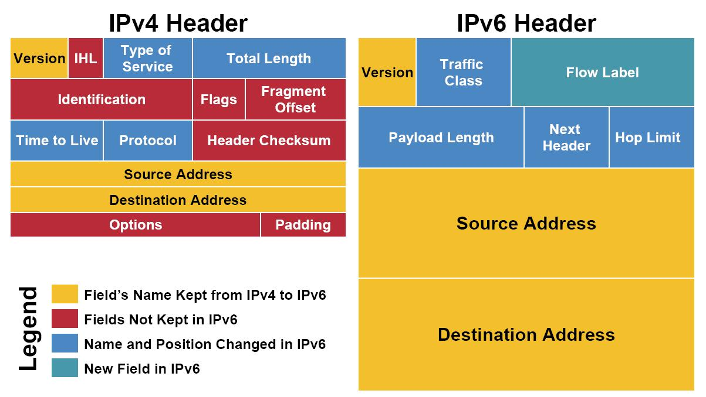
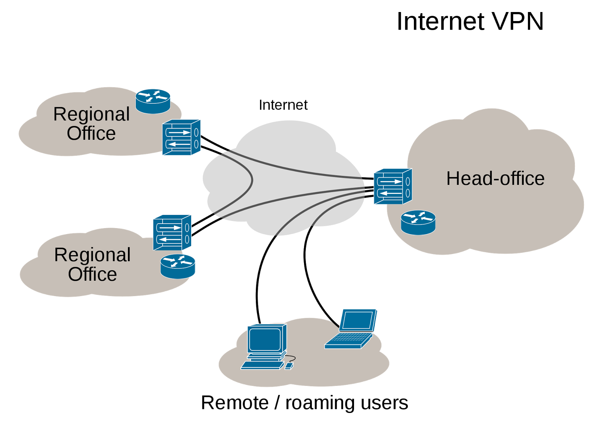
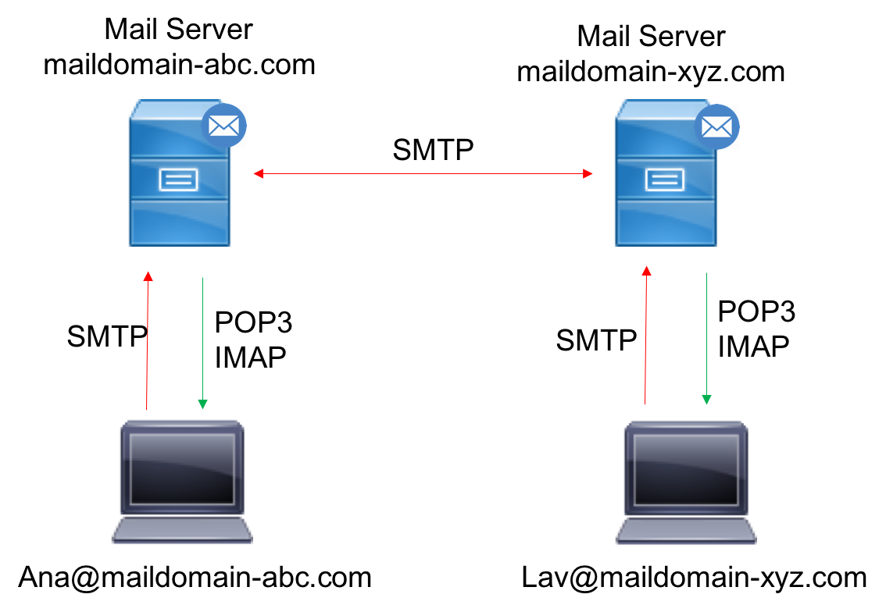

# Сети

- [Домены](#домены)
- [DNS](#dns)
- [Порты](#порты)
- [Сокеты](#сокеты)
- [IP](#ip)
- [IPv4](#ipv4)
- [IPv5](#ipv5)
- [IPv6](#ipv6)
- [IPsec](#ipsec)
- [TCP / UDP](#tcp--udp)
- [HTTP](#http)
- [HTTPS](#https)
- [LAN](#lan)
- [VLAN](#vlan)
- [VPN](#vpn)
- [SMTP](#smtp)
- [IMAP](#imap)
- [POP3](#pop3)
- [SSH](#ssh)
- [SSL](#ssl)
- [DDoS](#ddos)
- [Уровни модели OSI](#уровни-модели-osi)
- [Сетевое оборудование](#сетевое-оборудование)

## Домены

**Доменное имя** — символьное имя, служащее для идентификации областей — единиц административной автономии. Каждая из таких областей называется **доменом**. Общее пространство имен Интернета функционирует благодаря DNS — системе доменных имен. Доменные имена дают возможность адресации интернет-узлов в удобной для человека форме.

**Полное доменное имя** состоит из непосредственного имени домена и далее имен всех доменов, в которые он входит, разделенных точками. Например, полное имя `ru.wikipedia.org` обозначает домен 3-го уровня `ru`, который входит в домен 2-го уровня `wikipedia`, который входит в домен верхнего уровня «org», который входит в безымянный корневой домен `.` (точка).

## DNS

**DNS** (**D**omain **N**ame **S**ystem — система доменных имен) — компьютерная распределенная система для получения информации о доменах. Чаще всего используется для получения IP-адреса по имени хоста (компьютера или устройства), получения информации о маршрутизации почты, обслуживающих узлах для протоколов в домене (SRV-запись).

DNS служит для преобразования доменного имени в IP-адрес и наоборот. Эта система состоит из иерархической структуры DNS-серверов, каждый из которых является держателем одной или нескольких доменных зон и отвечает на запросы, касающиеся этих зон, а также DNS-резолверов, которые отвечают на запросы, касающиеся любых зон. Функции держателя зоны и резолвера часто совмещаются в одной программе.

Начиная с 2010 года в систему DNS внедряются средства проверки целостности передаваемых данных, называемые _DNS Security Extensions_ (DNSSEC). Передаваемые данные не шифруются, но их достоверность проверяется криптографическими способами. Внедряемый стандарт DANE обеспечивает передачу средствами DNS достоверной криптографической информации (сертификатов), используемых для установления безопасных и защищенных соединений транспортного и прикладного уровней.

## Порты

**Порт** (Port) — число, записываемое в заголовках протоколов транспортного уровня модели OSI (TCP, UDP, SCTP, DCCP). Используется для определения процесса — получателя пакета в пределах одного хоста. Порты TCP и UDP не пересекаются.

Некоторые номера портов стандартизованы. Стандартизацией занимается некоммерческая организация IANA.

В большинстве UNIX-подобных ОС прослушивание портов с номерами 0—1023 (почти все из которых зарегистрированы IANA) требует особых привилегий (root). Другие номера портов (некоторые из которых тоже зарегистрированы IANA) выдаются операционной системой первым запросившим их процессам.

## Сокеты

**Сокеты** (Socket — разъем) — название программного интерфейса для обеспечения обмена данными между процессами. Процессы при таком обмене могут исполняться как на одной ЭВМ, так и на различных ЭВМ, связанных между собой сетью. Сокет — абстрактный объект, представляющий конечную точку соединения.

Различают **клиентские** и **серверные сокеты**. Клиентское приложение (браузер) использует только клиентские сокеты, а серверное (веб-сервер) — как клиентские, так и серверные сокеты.

Для взаимодействия между машинами по протоколу IP используются адреса и порты. Первое на текущий момент представляет из себя 32-битный адрес, наиболее часто его представляют в символьной форме `mmm.nnn.ppp.qqq` (адрес, разбитый на четыре октета по одному байту в октете и разделенный точками). Второе — это номер порта в диапазоне от 0 до 65535. Эта пара и есть сокет («гнездо», в соответствующее адресу и порту). Каждый сокет имеет свой адрес.

Количество портов ограничено с учетом 16-битной адресации (2^16=65536, начало — «0»). Все порты разделены на три диапазона — **общеизвестные** (или **системные**, 0—1023), **зарегистрированные** (или **пользовательские**, 1024—49151) и **динамические** (или **частные**, 49152—65535). Первоначально номера портов использовались в ARPANET протоколом NCP. Передача велась в полудуплексном режиме, и для соединения требовалось два порта. С принятием протоколов TCP и UDP необходимым остался только один порт, и четные номера не применялись.

Обычно клиент явно «подсоединяется» к слушателю, после чего любое чтение или запись через его файловый дескриптор будут передавать данные между ним и сервером.

## IP

**IP** (**I**nternet **P**rotocol – межсетевой протокол) — маршрутизируемый протокол сетевого уровня стека TCP/IP. Именно IP стал тем протоколом, который объединил отдельные компьютерные сети во всемирную сеть Интернет. Неотъемлемой частью протокола является *адресация* сети.

IP объединяет сегменты сети в единую сеть, обеспечивая доставку пакетов данных между любыми узлами сети через произвольное число промежуточных узлов (маршрутизаторов). Он классифицируется как протокол третьего уровня по сетевой модели OSI. IP не гарантирует надежной доставки пакета до адресата — пакеты могут прийти не в том порядке, в котором были отправлены, дублироваться, оказаться поврежденными или не прийти вовсе. Гарантию безошибочной доставки пакетов дают некоторые протоколы более высокого уровня — **транспортного уровня** сетевой модели OSI, — например, TCP, которые используют IP в качестве транспорта.

## IPv4

**IPv4** (**I**nternet **P**rotocol **v**ersion 4) — 4-ая версия интернет протокола. Первая широко используемая версия. Использует 32-битные адреса, ограничивающие адресное пространство 4 294 967 296 (2^32) возможными уникальными адресами.

Традиционной формой записи IPv4 адреса является запись в виде четырех десятичных чисел (от 0 до 255), разделенных точками. Через дробь указывается длина маски подсети.

Пакет IP содержит 14 полей, из которых 13 являются обязательными. Четырнадцатое поле предназначено для необязательных опций. Поля используют порядок байтов от старшего (идут первыми) к младшему. Первый бит имеет номер 0.

## IPv5

**IPv5** (**I**nternet **P**rotocol **v**ersion 5), **Stream protocol** — экспериментальный протокол реального времени, определенный в IEN-119. Позднее был переписан в RFC 1190 (ST) и RFC 1819 (ST2+).

ST предполагался быть ориентированным на соединение версией IPv4, но так и не был принят для публичного использования. Многие концепции, присутствующие в ST, применяются в MPLS.

Заголовки ST2 не совпадают с IPv4, однако, ST использует аналогичную структуру IP-адреса и тот же номер протокола в PDU канального уровня (ethertype 0x800), что и IPv4.

## IPv6

**IPv6** (**I**nternet **P**rotocol **v**ersion 6) — новая версия протокола IP, призванная решить проблемы, с которыми столкнулась IPv4 за счет использования длины адреса 128 бит вместо 32. Классическое применение IPv6 обеспечит возможность использования более 300 млн IP-адресов на каждого жителя Земли. Это сделает NAT необязательным. Несмотря на огромный размер адреса IPv6, заголовок пакета удлинился всего лишь вдвое: с 20 до 40 байт.

В настоящее время протокол IPv6 используется в нескольких тысячах сетей по всему миру, но пока еще не получил столь широкого распространения как IPv4.

После того, как адресное пространство в IPv4 закончится, IPv6 и IPv4 — будут использоваться параллельно (**dual stack**). Это станет возможно из-за наличия огромного количества устройств, не поддерживающих IPv6.

**Из IPv6 убраны функции, усложняющие работу маршрутизаторов:**

- Маршрутизаторы больше не должны фрагментировать пакет, вместо этого пакет отбрасывается с ICMP-уведомлением о превышении MTU. Передающая сторона в IPv6, таким образом, обречена на использование технологии Path MTU discovery
- Из IP-заголовка исключена контрольная сумма. С учетом того, что канальные (Ethernet) и транспортные (TCP и UDP) протоколы имеют свои контрольные суммы, еще одна контрольная сумма на уровне IP воспринимается как излишняя

Улучшения IPv6 по сравнению с IPv4 – В сверхскоростных сетях возможна поддержка огромных пакетов (джамбограмм) до 4 гигабайт; Появились метки потоков и классы трафика; Появилось многоадресное вещание.

## IPsec

**IPsec** (**IP Sec**urity) — набор протоколов для обеспечения защиты данных, передаваемых по протоколу IP. Позволяет осуществлять аутентификацию, проверку целостности и/или шифрование IP-пакетов. Также включает в себя протоколы для защищенного обмена ключами в сети Интернет. В основном, применяется для организации VPN-соединений.

Для начала обмена данными между двумя сторонами необходимо установить соединение, которое носит название SA (**S**ecurity **A**ssociation). Концепция SA является его сутью. Описывает, как стороны будут использовать сервисы для обеспечения защищенного общения. Соединение SA является однонаправленным, поэтому для взаимодействия сторон необходимо установить два соединения. Установка соединения начинается со взаимной аутентификации сторон. Далее происходит выбор параметров (будет ли осуществляться аутентификация, шифрование, проверка целостности данных) и необходимого протокола (AH или ESP) передачи данных. После этого выбирается конкретные алгоритмы (шифрования (DES), хэш-функция (MD5 либо SHA-1)).

## TCP / UDP

**TCP** (**T**ransmission **C**ontrol **P**rotocol, протокол управления передачей) — один из основных протоколов передачи данных Интернета, предназначенный для управления передачей данных в сетях и подсетях TCP/IP. Выполняет функции протокола транспортного уровня в стеке протоколов IP. Реализация TCP, как правило, встроена в ядро ОС, хотя есть и реализации TCP в контексте приложения. Механизм TCP предоставляет поток данных с предварительной установкой соединения.

**UDP** (**U**ser **D**atagram **P**rotocol — протокол пользовательских датаграмм) — один из ключевых элементов TCP/IP, набора сетевых протоколов для Интернета. С UDP компьютерные приложения могут посылать сообщения другим хостам по IP-сети без необходимости предварительного сообщения для установки специальных каналов передачи или путей данных.

**TCP** — ориентированный на соединение протокол, что означает необходимость «рукопожатия» для установки соединения между двумя хостами. Как только соединение установлено, пользователи могут отправлять данные в обоих направлениях.

- *Надежность* — TCP управляет подтверждением, повторной передачей и тайм-аутом сообщений. Производятся многочисленные попытки доставить сообщение. Если оно потеряется на пути, сервер вновь запросит потерянную часть
- *Упорядоченность* — если 2 сообщения последовательно отправлены, 1-ое сообщение достигнет получателя первым
- *Тяжеловесность* — TCP необходимо три пакета для установки сокет-соединения перед тем, как отправить данные
- *Потоковость* — данные читаются как поток байтов, не передается никаких особых обозначений для границ сообщения

**UDP** — более простой, основанный на сообщениях протокол без установления соединения. Протоколы такого типа не устанавливают выделенного соединения между двумя хостами. Связь достигается путем передачи информации в одном направлении от источника к получателю без проверки готовности или состояния получателя.

- *Ненадежный* — когда сообщение посылается, неизвестно, достигнет ли оно своего назначения — оно может потеряться по пути
- *Неупорядоченность* — если 2 сообщения отправлены получателю, то порядок их достижения цели не может быть предугадан
- *Легковесность* — никакого упорядочивания сообщений, никакого отслеживания соединений и т. д.
- *Датаграммы* — пакеты посылаются по отдельности и проверяются на целостность только если они прибыли. Пакеты имеют определенные границы, которые соблюдаются после получения
*Нет контроля перегрузок* — UDP сам по себе не избегает перегрузок, возможно вызвать коллапс перегрузок.

## HTTP

**HTTP** (**H**yper**T**ext **T**ransfer **P**rotocol — протокол передачи гипертекста) — протокол прикладного уровня передачи данных изначально — в виде гипертекстовых документов в формате `HTML`, в настоящий момент используется для передачи произвольных данных. Основой HTTP является технология «клиент-сервер», то есть предполагается существование:

- Потребителей (клиентов), которые инициируют соединение и посылают запрос
- Поставщиков (серверов), которые ожидают соединения для получения запроса, производят необходимые действия и возвращают обратно сообщение с результатом

HTTP используется также в качестве «транспорта» для других протоколов прикладного уровня, таких как SOAP, XML-RPC, WebDAV.

Основным объектом манипуляции в HTTP является ресурс, на который указывает URI (Uniform Resource Identifier) в запросе клиента. Обычно такими ресурсами являются хранящиеся на сервере файлы, но ими могут быть логические объекты или что-то абстрактное. Особенностью протокола HTTP является возможность указать в запросе и ответе способ представления одного и того же ресурса по различным параметрам: **формату**, **кодировке**, **языку** и т. д. (в частности, для этого используется HTTP-заголовок). Именно благодаря возможности указания способа кодирования сообщения, клиент и сервер могут обмениваться двоичными данными, хотя данный протокол является текстовым.

HTTP/2 (изначально HTTP/2.0) — вторая крупная версия сетевого протокола HTTP, используемая для доступа к World Wide Web. Протокол основан на SPDY. Протокол HTTP/2 существенно ускоряет открытие сайтов за счет следующих особенностей:

- **Соединение** — несколько запросов могут быть отправлены через одно TCP-соединение, и ответы могут быть получены в любом порядке. Отпадает необходимость держать несколько TCP-соединений
- **Приоритеты потоков** — клиент может задавать серверу приоритеты — какого типа ресурсы для него более важны, чем другие
- **Сжатие заголовка** — размер заголовка HTTP может быть сокращен
- **Push-отправка данных со стороны сервера** — сервер может отправлять клиенту данные, которые тот еще не запрашивал, например, на основании данных о том, какую следующую страницу открывают пользователи

## HTTPS

**HTTPS** (**H**yper**T**ext **T**ransfer **P**rotocol **S**ecure) — расширение протокола HTTP для поддержки шифрования в целях повышения безопасности. Данные в протоколе HTTPS передаются поверх криптографических протоколов SSL или TLS.

По умолчанию HTTPS URL использует `443` TCP-порт (для незащищённого HTTP — `80`). Чтобы подготовить веб-сервер для обработки HTTPS-соединений, администратор должен получить и установить в систему сертификат открытого ключа для этого веб-сервера. В TLS используется как **асимметричная** схема шифрования (для выработки общего секретного ключа), так и **симметричная** (для обмена данными, зашифрованными общим ключом). Сертификат открытого ключа подтверждает принадлежность данного открытого ключа владельцу сайта. Сертификат открытого ключа и сам открытый ключ посылаются клиенту при установлении соединения; закрытый ключ используется для расшифровки сообщений от клиента.

В HTTPS для шифрования используется длина ключа 40, 56, 128 или 256 бит. Некоторые старые версии браузеров используют длину ключа 40 бит (например, IE версий до 4.0). Длина ключа 40 бит не является сколько-нибудь надежной. Многие современные сайты требуют использования новых версий браузеров, поддерживающих шифрование с длиной ключа 128 бит, с целью обеспечить достаточный уровень безопасности. Такое шифрование значительно затрудняет злоумышленнику поиск паролей и другой личной информации.

## LAN

**LAN** (**L**ocal **A**rea **N**etwork – локальная вычислительная сеть) — компьютерная сеть, покрывающая обычно относительно небольшую территорию или группу зданий.

Компьютеры могут соединяться между собой, используя различные среды доступа: медные проводники (витая пара), оптические проводники (оптические кабели) и через радиоканал (беспроводные технологии). Отдельная локальная вычислительная сеть может иметь связь с другими локальными сетями через шлюзы, а также быть частью глобальной вычислительной сети (Интернет). Для построения простой локальной сети используются маршрутизаторы, коммутаторы, точки беспроводного доступа, беспроводные маршрутизаторы, модемы и сетевые адаптеры. Реже используются преобразователи (конвертеры) среды, усилители сигнала. Маршрутизация в локальных сетях используется примитивная, если она вообще необходима. Чаще всего это статическая либо динамическая маршрутизация (основанная на протоколе RIP).

Технологии локальных сетей реализуют, как правило, функции только физический и канальный уровни модели OSI. Функциональности этих уровней достаточно для доставки кадров в пределах стандартных топологий, которые поддерживают LAN: звезда, общая шина, кольцо и дерево.

В локальных сетях, основанных на протоколе IPv4, могут использоваться специальные адреса, назначенные IANA. Такие адреса называют **частными**, **внутренними**, **локальными** или **«серыми»**; эти адреса не доступны из сети Интернет. Необходимость использовать такие адреса возникла из-за того, что при разработке протокола IP не предусматривалось столь широкое его распространение, и постепенно адресов стало не хватать. В различных непересекающихся локальных сетях адреса могут повторяться, и это не является проблемой – доступ в другие сети происходит с подменой или скрытием адреса внутреннего узла сети за ее пределами — NAT или прокси дают возможность подключить ЛВС к глобальной сети (WAN).

Конфликт IP адресов — ситуация в локальной сети, при которой в одной IP-подсети оказываются два или более компьютеров с одинаковыми IP-адресами. Для предотвращения таких ситуаций применяется протокол DHCP, позволяющий компьютерам автоматически получать IP-адрес и другие параметры, необходимые для работы в сети TCP/IP.

## VLAN

**VLAN** (**V**irtual **L**ocal **A**rea **N**etwork) — логическая («виртуальная») локальная сеть, представляет собой группу хостов с общим набором требований, которые взаимодействуют так, как если бы они были подключены к широковещательному домену. VLAN имеет те же свойства, что и физическая локальная сеть, но позволяет конечным станциям группироваться вместе, даже если они не находятся в одной физической сети. Такая реорганизация может быть сделана на основе ПО вместо перемещения устройств.

Для этого существуют следующие решения:

- По порту (**Port-based**) – порту коммутатора вручную назначается одна VLAN. В случае, если одному порту должны соответствовать несколько VLAN, то этот порт должен быть членом транка. Только одна VLAN может получать все пакеты, не отнесенные ни к одной VLAN (**untagged** / **native VLAN**). Сетевой коммутатор будет добавлять метки данной VLAN ко всем принятым кадрам не имеющим никаких меток.
- По MAC-адресу (**MAC-based**): основывается на MAC-адресе рабочей станции. Сетевой коммутатор имеет таблицу MAC-адресов всех устройств вместе с VLANами, к которым они принадлежат
- По протоколу (**Protocol-based**): данные 3-4 уровня в заголовке пакета используются чтобы определить членство в VLANe. Основной недостаток этого метода – он нарушает независимость уровней, поэтому, например, переход с IPv4 на IPv6 приведет к нарушению работоспособности сети
- Метод аутентификации (**Authentication based**): устройства могут быть автоматически перемещены в VLAN основываясь на данных аутентификации пользователя или устройства при использовании протокола 802.1x

## VPN

**VPN** (**V**irtual **P**rivate **N**etwork — виртуальная частная сеть) — обобщенное название технологий, позволяющих обеспечить одно или несколько сетевых соединений поверх другой сети (например, Интернет). Несмотря на то, что коммуникации осуществляются по сетям с меньшим или неизвестным уровнем доверия, уровень доверия к построенной логической сети не зависит от уровня доверия к базовым сетям благодаря использованию средств криптографии (шифрования, аутентификации, средств для защиты от повторов и изменений передаваемых по логической сети сообщений). В зависимости от применяемых протоколов и назначения, VPN может обеспечивать соединения трех видов: **узел-узел**, **узел-сеть** и **сеть-сеть**.

VPN состоит из двух частей: «внутренняя» (подконтрольная) сеть, которых может быть несколько, и «внешняя» сеть, по которой проходит инкапсулированное соединение (обычно Интернет). Возможно также подключение к виртуальной сети отдельного компьютера. Подключение удаленного пользователя к VPN производится посредством сервера доступа, который подключен как к внутренней, так и к внешней сети. При подключении удаленного пользователя (либо при установке соединения с другой защищенной сетью) сервер доступа требует прохождения процесса идентификации и аутентификации. После успешного прохождения обоих процессов удаленный пользователь (удаленная сеть) проходит процесс авторизации.

## SMTP

**SMTP** (**S**imple **M**ail **T**ransfer **P**rotocol — простой протокол передачи почты) — широко используемый сетевой протокол, предназначенный для передачи электронной почты в сетях TCP/IP. Предназначен для передачи исходящей почты по порту TCP 25.

В то время, как электронные почтовые серверы используют SMTP для отправки и получения почтовых сообщений, клиентские почтовые приложения обычно используют SMTP только для отправки сообщений на почтовый сервер для ретрансляции. Для получения сообщений клиентские приложения обычно используют либо POP, либо IMAP, либо патентованные системы (Microsoft Exchange и Lotus Notes/Domino) для доступа к учетной записи своего почтового ящика на сервере.

SMTP-сервер — это почтовый сервер, поддерживающий только отправку электронной почты. При использовании SMTP-сервера используется порт 25. Некоторые интернет-провайдеры блокируют порт 25. В этом случае, нужно либо обратиться к администратору сети, либо использовать альтернативный порт 587.

## IMAP

**IMAP** (**I**nternet **M**essage **A**ccess **P**rotocol) — протокол прикладного уровня для доступа к электронной почте. Базируется на транспортном протоколе TCP и использует порт 143. Протокол, поддерживающий прием и возможность управления электронной почтой прямо на почтовом сервере. Для отправки писем используется обычно протокол SMTP, так как собственная команда отправки протокола IMAP, называемая APPEND, считается «неудачной» и «небезопасной».

При использовании IMAP электронные письма всегда находятся на сервере и скачиваются каждый раз при просмотре. Это удобно, когда доступ к почтовому ящику должны иметь несколько человек — все операции с письмами, которые произведет один из них, увидят все остальные. Недостаток — для работы с почтой необходимо активное подключение к интернету.

## POP3

**POP3** (**P**ost **O**ffice **P**rotocol — протокол почтового отделения) — протокол прикладного уровня, используемый клиентами электронной почты для получения почты с удаленного сервера по TCP/IP-соединению. POP3 — протокол для приема сообщений электронной почты.

При просмотре почты с использованием протокола POP3 все электронные письма скачиваются пользователю на компьютер и автоматически удаляются с сервера (хотя это можно отключить). Все дальнейшие действия с письмами будут производиться именно на компьютере пользователя. Предпочтителен, если почтовым ящиком пользуется лишь один человек с одного-единственного компьютера, и доступ к почте необходим даже при отсутствии подключения к интернету.

## SSH

**SSH** (**S**ecure **Sh**ell) — сетевой протокол прикладного уровня, позволяющий производить удаленное управление операционной системой и туннелирование TCP-соединений (например, для передачи файлов). Схож по функциональности с протоколами **Telnet** и **rlogin**, но, в отличие от них, шифрует весь трафик, включая и передаваемые пароли. SSH допускает выбор различных алгоритмов шифрования. SSH клиенты и серверы доступны для большинства сетевых операционных систем.

SSH позволяет безопасно передавать в незащищенной среде практически любой другой сетевой протокол. Т.о. можно не только удаленно работать на компьютере через командную оболочку, но и передавать по шифрованному каналу звуковой поток или видео. Также SSH может использовать сжатие передаваемых данных перед шифрованием (запуск клиентов X Window System).

SSH-туннель — туннель, создаваемый посредством SSH-соединения и используемый для шифрования туннелированных данных. Используется, чтобы обезопасить передачу данных в Интернете (аналогично IPsec). При пересылке через SSH-туннель незашифрованный трафик любого протокола шифруется на одном конце SSH-соединения и расшифровывается на другом.

SSH-сервер обычно прослушивает соединения на TCP-порту 22. Для аутентификации сервера в SSH используется протокол аутентификации сторон на основе алгоритмов ЭЦП RSA, но допускается аутентификация при помощи пароля и IP-адреса хоста. Аутентификация по паролю наиболее распространена: она безопасна, так как пароль передается по зашифрованному виртуальному каналу. Аутентификация по IP-адресу небезопасна. Для создания общего секрета используется алгоритм Диффи — Хеллмана. Для шифрования передаваемых данных используется симметричное шифрование, алгоритмы AES, Blowfish или 3DES.

## SSL

**SSL** (**S**ecure **S**ockets **L**ayer — уровень защищенных сокетов) — криптографический протокол, который подразумевает более безопасную связь. Он обеспечивает защищенный обмен данных за счет использования асимметричной криптографии для аутентификации ключей обмена, симметричного шифрования для сохранения конфиденциальности, кодов аутентификации сообщений для целостности сообщений. Протокол широко использовался для обмена мгновенными сообщениями и передачи голоса через IP (VoIP). В настоящее время известно, что протокол не является безопасным.

Протокол SSL предоставляет "безопасный канал", который имеет три основных свойства:

- Канал является частным. Шифрование используется для всех сообщений после простого диалога, который служит для определения секретного ключа
- Канал аутентифицирован. Серверная сторона диалога всегда аутентифицируется, а клиентская делает это опционно
- Канал надежен. Транспортировка сообщений включает в себя проверку целостности

Преимуществом SSL является то, что он независим от прикладного протокола. Протоколы приложений (HTTP, FTP, TELNET) могут работать поверх протокола SSL совершенно прозрачно, т.е. SSL может согласовывать алгоритм шифрования и ключ сессии, а также аутентифицировать сервер до того, как приложение примет или передаст первый байт сообщения.

## DDoS

**DoS** (**D**enial **o**f **S**ervice — отказ в обслуживании) — хакерская атака на вычислительную систему с целью довести ее до отказа – создание таких условий, при которых легальные пользователи системы не могут получить доступ к серверам. Если атака выполняется одновременно с большого числа компьютеров, говорят о **DDoS-атаке** (**D**istributed **D**enial **o**f **S**ervice – распределенная атака типа «отказ в обслуживании»). Такая атака проводится в том случае, если требуется вызвать отказ в обслуживании хорошо защищенной крупной компании или правительственной организации. Отказ системы может быть и шагом к овладению системой, Но чаще это мера экономического давления – простой службы, приносящей доход, ощутимо бьет «цель» по карману.

Сначала злоумышленник сканирует крупную сеть, выявляя потенциально слабые узлы. Выбранные узлы подвергаются нападению. На захваченные узлы устанавливаются троянские программы. Далее злоумышленник отправляет команды захваченным компьютерам-зомби и те осуществляют мощную DoS-атаку на целевой компьютер.

### HTTP-флуд и ping-флуд

Самый примитивный вид DoS-атаки. Насыщение полосы пропускания можно осуществить с помощью обычных ping-запросов, если канал атакующего намного шире канала компьютера-жертвы. Но такая атака бесполезна против сервера. Для атаки на сервер обычно применяется HTTP-флуд. Атакующий шлет маленький по объему HTTP-пакет, чтобы сервер ответил на него пакетом, размер которого в сотни раз больше. А для того, чтобы ответные HTTP-пакеты не вызвали отказ в обслуживании у злоумышленника, он каждый раз подменяет свой IP-адрес на IP-адреса узлов в сети.

### Smurf-атака (ICMP-флуд)

Атака **Smurf** (ICMP-флуд) — одна из самых опасных видов DoS-атак – происходит отказ в обслуживании практически со 100% гарантией. Злоумышленник использует широковещательную рассылку для проверки работающих узлов в системе, отправляя ping-запрос. Требуется второй участник — усиливающая сеть. В ней по широковещательному адресу злоумышленник отправляет поддельный ICMP пакет. Затем адрес атакующего меняется на адрес жертвы. Все узлы пришлют ей ответ на ping-запрос. ICMP-пакет будет усилен в разы.

### Атака Fraggle (UDP-флуд)

Атака **Fraggle** (Fraggle attaсk) – полный аналог Smurf-атаки, где вместо ICMP пакетов используются пакеты UDP, поэтому ее еще называют UDP-флуд. На седьмой порт жертвы отправляются echo-команды по широковещательному запросу. Затем подменяется IP-адрес злоумышленника на IP-адрес жертвы, которая вскоре получает множество ответных сообщений. Эта атака приводит к насыщению полосы пропускания и полному отказу в обслуживании жертвы.

### Атака с помощью переполнения пакетами SYN (SYN-флуд)

До появления атаки Smurf была широко распространена атака с помощью переполнения пакетами SYN (SYN-флуд). На установку TCP-соединения выделяется некоторое количество ресурсов, этим и пользуются DoS-атаки. Отправив несколько ложных запросов, можно израсходовать все ресурсы системы, отведенные на установление соединения.  Хакер отправляет пакет SYN жертве, но предварительно поменяв свой IP-адрес на несуществующий. Затем жертва отправляет ответ SYN/ACK на несуществующий IP-адрес и переходит в состояние SYN-RECEIVED. Так как сообщение SYN/ACK не дойдет до системы А, то жертва никогда не получит пакет с флагом ACK. Данное потенциальное соединение будет помещено в очередь, из которой выйдет только по истечении 75 секунд. Этим пользуются злоумышленники и отправляют сразу несколько пакетов SYN на компьютер жертвы с интервалом в 10 секунд, чтобы полностью исчерпать ресурсы системы.

## Уровни модели OSI

| Уровень OSI | Уровень TCP | Единица передаваемой информации | Пример протокола | Назначение |
| --- | --- | --- | --- | --- |
| Физический | Физический | Импульсы/биты Аналоговый сигнал | MAC Ethernet FDDI | Преобразование цифр. сигнала в аналоговый Передача различных типов сигнала Передача единичных импульсов |
| Канальный | Физический | Кадры Frame | MAC Ethernet VLAN | Коммутация каналов Соединение каналов между устройствами Обработка фреймов MAC адресация |
| Сетевой | Сетевой | Пакеты Frame | IPv4, IPv6, ARP, IPSec | Идентификация хостов в сети, клиентов Адресация сетей Маршрутизация между сетями |
| Транспортный | Транспортный | Блоки пакетов | SPX TCP/UDP | Проверка и обеспечение доступности хостов Проверка состояния каналов Организация кала передачи информации Восстановление каналов |
| Сеансовый | Прикладной | Блоки Сегменты | SQL, NFS, X-Window | Обеспечение сеанса связи Объединение транспортных потоков в сеанс |
| Представления | Прикладной | Датаграммы | SSH, IPSec, HTTPS, ASCII | Преобразование блоков данных Кодирование |
| Прикладной | Прикладной | Данные | HTTP, FTP, DNS, SMTP | Взаимодействие с пользователями |

**Инкапсуляция** – движение от Прикладного уровня к Физическому

**Деинкапсуляция** – движение от Физического уровня к Прикладному

## Сетевое оборудование

**Оборудование:**

1. Физический уровень
	1. Коаксиальный кабель (K)  – 20 кБит/с
	2. «Лапша» (T)
	3. Витая пара (TP)
	4. UTP (2 витые пары)
	5. Ethernet (8-ми жильный провод)
	6. Оптоволокно
	7. WiFi, LiFi
	8. Splinter – разделяет канал передачи на 2, пассивный
	9. Repeater (Повторитель) – усиливает сигнал, активный
	10. Hub (Концентратор) – разделение канала, активный
	11. Converter – преобразует сигнал от оптического волокна в аналоговый, активный (CPU, RAM, АЦП / ЦАП)
2. Канальный уровень
	12. Switch – коммутация клиентов (MAC-таблица, CPU, RAM, ROM)

**Классификация оборудования:**

1. По типам питания
	- Активное (сервер)
	- Пассивное (провода)
2. По уровням модели OSI
	- Прикладное
	- Представление
	- Сеансовое
	- Транспортное
	- Сетевой
	- Канальное
	- Физическое
3. По типу фильтрации
	- Фильтрующее (маршрутизатор, ПК)
	- Не фильтрующее (провода)
4. По типу сертификации
	- Сертифицированное
	- Несертифицированное
5. По месту расположения в сети
	- Узловое (Switch)
	- Оконечное (ПК)
	- Каналообразующее (провода)
6. По типу управления
	- Управляемое,
	- Неуправляемое

| R, D | Масштаб | Сокращение | Район |
| --- | --- | --- | --- |
| 1 м | Персональная сеть | PAN | Локальная |
| 10 м | Домашняя сеть | PAN | Квартира |
| 100 м | Кампус | LAN | Несколько зданий |
| 10 км | Муниципальная сеть | MAN | Город |
| 1000 км | Глобальная сеть | WAN | Город, Страна, Континент |
| 10 000 км | Интернет | INET | Планета |

**Типы взаимодействия между хостами в сети:**

1. Unicast – 1 с 1
2. Multicast – 1 со многими (только теми, чей ID в группе)
3. Broadcast – 1 ко всем
4. Anycast – 1 к любому случайному