# Структура форматов файлов

- [HTML (HTM)](#html-htm)
- [XHTML](#xtml)
- [XML](#xml)
- [DOCX](#docx)
- [DOC](#doc)
- [RTF](#rtf)
- [ODT](#odt)
- [XLSX](#xlsx)
- [XLS](#xls)
- [CSV](#csv)
- [Текстовый файл (TXT / MD)](#текстовый-файл-txt--md)
- [JSON](#json)
- [EPUB](#epub)
- [PDF](#pdf)
- [Полезные ссылки](#полезные-ссылки)

## HTML (HTM)

### Описание

**HTML** (**H**yper**T**ext **M**arkup **L**anguage — язык гипертекстовой разметки) — стандартизированный язык разметки документов в сети Интернет. Большая часть web-страниц содержат описание разметки именно на языке HTML. Язык HTML интерпретируется браузерами, результат отображается на экране компьютера или мобильного устройства.

HTML является теговым языком для разметки документов, то есть любой HTML файл представляет собой набор элементов, причем начало и конец каждого элемента обозначается специальными символами, которые называются тегами. Элементы могут не содержать никаких данных или текста, то есть быть пустыми (например, тег переноса строки ` `). В этом случае закрывающий тег не ставится. Кроме того, элементы могут иметь атрибуты, определяющие набор каких-либо свойств. Атрибуты указываются только в открывающем теге. Регистр имени тега не имеет значения.

Формат HTML имеет MIME-type `text/html`.

### Основные элементы

- Гиперссылки
	- `<a href="filename" target="_self">Название ссылки</a>` — общий вид ссылки
	- `href` — адрес web-страницы или файла, на который указывает ссылка
	- `Название ссылки` — название ссылки, которое будет отображаться на странице
	- `target` — значение окна, в котором будет открыт документ
- Текстовые блоки
	- `<h1>`, …, `<h6>` — заголовки 1–6 уровня. Используются для выделения частей текста (1 — самый большой, 6 — самый маленький)
	- `
` — новый абзац
	- ` ` — новая строка. Тег не закрывается
	- `
` — горизонтальная линия. Тег не закрывается
	- `<blockquote>` — цитата
	- `<pre>` — режим preview, в котором текст заключается в специальную рамку, в рамках которой текст никак не форматируется
	- `
` — блок
	- `` — строка
- Форматирование текста
	- `<i>` — выделение текста курсивом
	- `<b>` — выделение текста полужирным шрифтом
	- `<u>` — подчеркивание текста
	- `<strike>` — зачеркивание текста
	- `<big>` — увеличение шрифта
	- `<small>` — уменьшение шрифта
	- `` — подстрочный текст
	- `` — надстрочный текст
	- `` — параметры шрифта
- Таблицы
	- `<table>` — создание таблицы
	- `<tr>` — строка таблицы
	- `<th>` — заголовок столбца таблицы
	- `<td>` — ячейка таблицы
- Списки
	- `<ul>` — ненумерованный список
	- `<ol>` — нумерованный список
	- `<dl>` — список определений
	- `<li>` — элемент списка

### Валидация

Валидный документ должен содержать определение типа документа (DTD). DTD должен быть расположен до всех элементов документа. Наиболее распространенные типы DTD для HTML:

- `<!DOCTYPE HTML PUBLIC "-//W3C//DTD HTML 4.01//EN" "http://www.w3.org/TR/html4/strict.dtd">`
- `<!DOCTYPE HTML PUBLIC "-//W3C//DTD HTML 4.01 Transitional//EN" "http://www.w3.org/TR/html4/loose.dtd">`
- `<!DOCTYPE html>`

### Пример структуры

Пример структуры HTML файла:

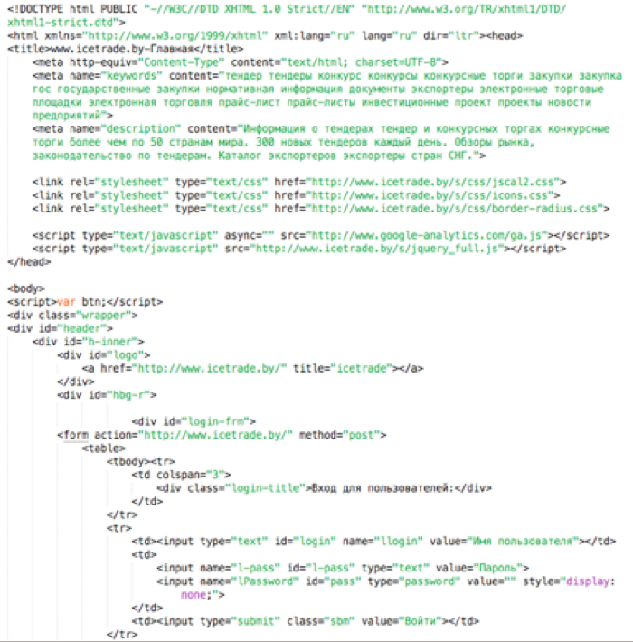

### Обработка файла

Порядок работы парсера:

- Чтение файла
- Удаление тэгов `tbody`, `thead`, `nobr`
- Восстановление и очистка верстки с помощью библиотеки `libtidy`
- Преобразование кодировки
- Извлечение изображений и сохранение в массив
- Выдача итогового HTML-документа

**Tidy** — консольное приложение для Windows, Linux, macOS. Оно исправляет и очищает HTML и XML-документы, исправляет ошибки разметки и обновляет устаревший код до современных стандартов. Существует в виде подключаемой библиотеки — `libtidy`.

## XHTML

### Описание

**XHTML** (e**X**tensible **H**yper**T**ext **M**arkup **L**anguage — расширяемый язык гипертекстовой разметки) — семейство языков разметки веб-страниц на основе XML, расширяющих возможности HTML 4. Спецификации XHTML 1.0 и XHTML 1.1 являются рекомендациями консорциума Всемирной паутины (W3C). Развитие XHTML остановлено, новые версии XHTML не выпускаются, рекомендуется использовать HTML (в частности HTML 5).

Главное отличие XHTML от HTML заключается в обработке документа. Документы XHTML обрабатываются своим синтаксическим анализатором аналогично документам XML. В процессе этой обработки ошибки, допущенные разработчиками, не исправляются.

Формат XHTML имеет MIME-type `application/xhtml+xml`.

### Различия между XHTML и HTML

Различия между XHTML и HTML:

- Все элементы должны быть закрыты. Теги, которые не имеют закрывающего тега (например, тег переноса строки ` `), должны иметь на конце `/` (` `)
- Логические атрибуты записываются в развернутой форме (например, `<option selected="selected">`)
- Все теги и атрибуты должны быть записаны строчными буквами (например, ``, а не ``)
- XHTML строже относится к ошибкам в коде. По рекомендации W3C браузеры, встретив ошибку в XHTML, должны сообщить о ней и прекратить обрабатывать документ. Для HTML браузеры должны попытаться понять начальный замысел разработчика и предложить свой вариант
- Кодировкой по умолчанию является UTF-8 (в отличие от HTML, где кодировкой по умолчанию является ISO 8859-1)
- Должна соблюдаться правильная вложенность тегов

### Валидация

Валидация XHTML-документа рекомендована даже несмотря на то, что она не гарантирует одинаковой работы во всех браузерах.

Валидный документ должен содержать определение типа документа (DTD). DTD должен быть расположен до всех других элементов документа. Вот наиболее распространенные типы DTD для XHTML:

- `XHTML 1.0 Strict: <!DOCTYPE html PUBLIC "-//W3C//DTD XHTML 1.0 Strict//EN" "http://www.w3.org/TR/xhtml1/DTD/xhtml1-strict.dtd">`
- `XHTML 1.0 Transitional: <!DOCTYPE html PUBLIC "-//W3C//DTD XHTML 1.0 Transitional//EN" "http://www.w3.org/TR/xhtml1/DTD/xhtml1-transitional.dtd">`
- `XHTML 1.0 Mobile: <!DOCTYPE html PUBLIC "-//WAPFORUM//DTD XHTML Mobile 1.0//EN" "http://www.wapforum.org/DTD/xhtml-mobile10.dtd">`
- `XHTML 1.1: <!DOCTYPE html PUBLIC "-//W3C//DTD XHTML 1.1//EN" "http://www.w3.org/TR/xhtml11/DTD/xhtml11.dtd">`

### Пример структуры

Пример структуры XHTML файла:

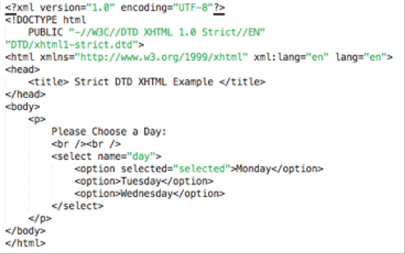

## XML

### Описание

**XML** (e**X**tensible **M**arkup **L**anguage — расширяемый язык разметки). Разрабатывался как язык с простым синтаксисом, удобный для создания и обработки документов программами и одновременно удобный для чтения и создания документов человеком. Язык называется расширяемым, так как он не фиксирует разметку, используемую в документах: разработчик может создать разметку в соответствии с потребностями к конкретной области. Сочетание простого синтаксиса, удобства для человека, расширяемости привело к широкому использованию как собственно XML, так и множества производных специализированных языков на базе XML в самых разнообразных программных средствах.

Правила создания XML-документа:

- В заголовке документа помещается объявление XML, в котором указывается язык разметки документа, номер его версии и дополнительная информация
- Каждый открывающий тэг должен иметь закрывающий тэг
- В XML учитывается регистр символов
- Все значения атрибутов должны быть заключены в кавычки
- Вложенность тэгов в XML строго контролируется, поэтому необходимо следить за порядком следования открывающих и закрывающих тэгов

Если XML-документ не нарушает приведенные правила, то он называется формально-правильным и все синтаксические анализаторы, предназначенные для разбора XML-документов, смогут работать с ним корректно.

Формат XML имеет MIME-type `application/xml`.

### Физическая структура документа

С физической точки зрения XML-документ состоит из сущностей — мельчайших частей в документе. Все сущности имеют имя и содержат символы, которые разделены на два типа — символы данных и символы разметки. К разметке принадлежат: теги, обозначающие границы элементов, их атрибуты, объявления и инструкции обработки, комментарии, а также последовательности символов, обрамляющие секции `CDATA`. Часть документа, не принадлежащая разметке, составляет символьные данные документа.

### Логическая структура документа

С логической точки зрения документ состоит из комментариев, объявлений, элементов, ссылок на сущности и инструкций обработки.

Все составляющие части документа обобщаются в пролог и корневой элемент. Корневой элемент — обязательная часть документа, составляющая всю его суть. Может включать вложенные в него элементы и символьные данные, а также комментарии. Вложенные в корневой элемент элементы могут включать вложенные в них элементы, символьные данные и комментарии, и так далее. Пролог может включать объявления, инструкции обработки, комментарии. Его следует начинать с объявления XML.

Элементы документа должны быть правильно вложены: любой элемент, начинающийся внутри элемента должен заканчиваться там же. Символьные данные могут встречаться внутри элементов как непосредственно так и в специальных секциях `CDATA`.

### Символы разметки

Разметка всегда начинается символом `<` и заканчивается символом `>`. Наряду с ними специальную роль для разметки играет также символ `&`. Угловые скобки обозначают границы элементов, инструкций обработки и некоторых других последовательностей. Амперсанд позволяет выполнить замену текста при помощи сущностей.

Употребление разметочных символов в символьных данных может создать проблему неоднозначности структуры. В XML эта проблема решается следующим образом: специальные символы не могут присутствовать в символьных данных, поэтому для их представления в этих случаях зарезервированы специальные сущности:

- `<` заменяется на `&lt;`
- `>` заменяется на `&gt;`
- `’` заменяется на `&apos;`
- `”` заменяется на `&quot;`

### Объявление XML

Объявление XML указывает версию языка, на которой написан документ. Поскольку интерпретация содержимого документа зависит от версии языка, то спецификация предписывает начинать документ с объявления XML. В первой (1.0) версии языка использование объявления не было обязательным, в последующих версиях оно обязательно.

Пример объявления XML:

- `<?xml version="1.1" encoding="UTF-8" ?>`
- `<?xml version="1.0" encoding="windows-1251" standalone="yes"?>`

### Секция CDATA

Секция `CDATA` не является логической единицей текста. Секция может встречаться в любом месте документа, где разрешено размещать символьные данные. Секция начинается `<![CDATA[` и завершается `]]>`. Между этой разметкой находятся символьные данные.

### Пример структуры

Пример структуры XML файла:

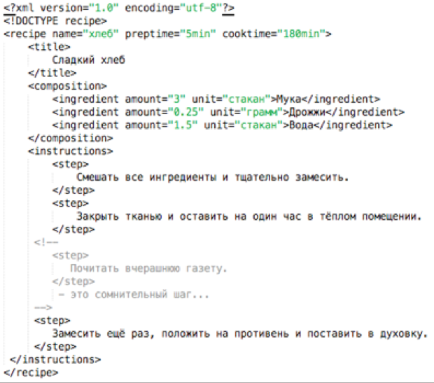

### Обработка файла

Порядок работы парсера:

- Чтение файла
- Создание дерева из XML-тэгов в памяти
- Рекурсивный проход по дереву
- Замена каждого тэга на элемент вложенного списка
- Выдача итогового HTML-документа

## DOCX

### Описание

**DOCX** (Microsoft Word Open XML Document) — документы созданные программным обеспечением для обработки текста Microsoft Word. Данный формат разработан компанией Microsoft. Файл с расширением DOCX содержит текст, изображения, форматирование текста, нарисованные объекты и другие элементы. Чаще всего применяться для создания деловых, научных и личных документов, является одним из самых популярных форматом среди текстовых редакторов.

DOCX файлы спроектированы так, чтобы содержимое текстового документа было доступным — текстовый документ сохраняется с помощью текстовых файлов (plain text) и изображений документов хранятся в виде отдельных файлов в DOCX формате.

Формат DOCX имеет MIME-type `application/vnd.openxmlformats-officedocument.wordprocessingml.document`.

### Структура

В отличие от DOC файлов, в которых хранение данных документа происходит в одном бинарном файле, DOCX файлы создаются с помощью Open XML формата, в котором документы хранятся, как набор отдельных файлов и папок в пакете ZIP, что позволяет уменьшить размер файла. DOCX-файлы содержат XML и бинарные файлы и три папки, `docProps`, `Word`, и `_rels`, которые сохраняют свойства документа, содержание и отношения между файлами.

Файл `_rels/.rels` содержит информацию о структуре документа. В нем хранятся пути к метаданным, а также к основному документу XML, который используется для хранения самого документа.

Информация о метаданных, как правило, хранится в папке `docProps`. Два или несколько файлов XML, которые хранятся в этой папке, `app.xml`, который хранит метаданные, извлеченные из приложения, и `core.xml`, который хранит метаданные из самого документа, например имя автора, последнее время изменения.

Папка Word хранит фактическое содержание документа. Файл XML, названный `document.xml`, является основным документом, содержащий большую часть текста самого документа.

### Пример структуры

Структура файлов:

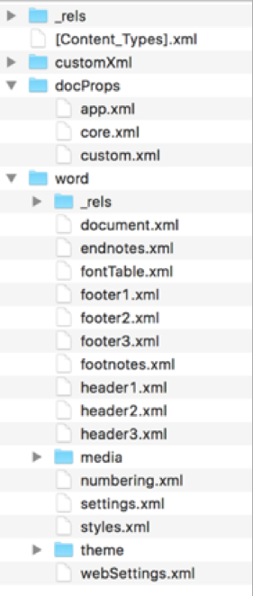

Пример `.rels`:

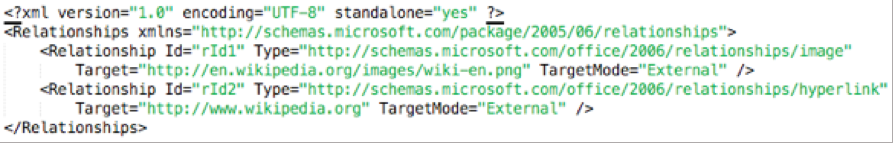

Пример `core.xml`:

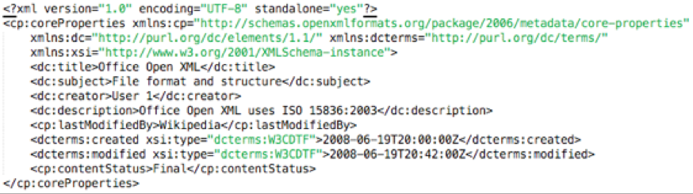

Пример `app.xml`:

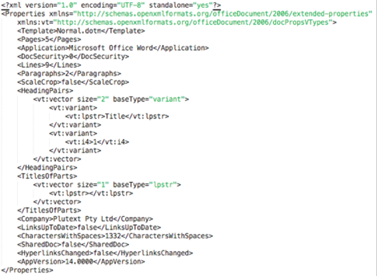

### Обработка файла

Порядок работы парсера:

- Разархивирование файла
- Извлечение информации о списках из файла `word/numbering.xml`
- Извлечение стилей из файла `word/styles.xml`
- Извлечение ссылок на файлы и изображения из файла `word/_rels/document.xml.rels`
- Извлечение содержимого из файла `word/document.xml`
- Рекурсивный обход всех тэгов, извлеченных на предыдущем этапе
- Формирование элементов (параграфов и заголовков, ссылок, изображений, таблиц, списков) с учетом ссылок и дополнительной мета информации
- Добавление стилей
- Формирование HTML-документа

## DOC

### Описание

Файл **MS DOC** — документ Microsoft Word — самой популярной программы для работы с текстами. Файлы формата DOC являются бинарными. Они содержат информацию о форматировании текста — шрифты, выравнивание текста, отступы, списки, колонки. Документы Word также могут включать в себя изображения, диаграммы, таблицы, сценарии. Кроме различных объектов, текста и информации о его форматировании, файл DOC содержит параметры самого документа, печати.

Из-за закрытой спецификации формата в процессе создания документов программными средствами, отличных от Microsoft Word могли возникать ошибки в разметке документа. Только в 2008 году Microsoft открыла спецификацию формата, но бесплатно пользоваться ей можно для некоммерческих целей.

Формат DOC имеет MIME-type:

- `application/msword`
- `application/vnd.ms-office`

### Структура

В DOC в качестве формата по умолчанию используется двоичный формат файлов MS-DOC. Базовой единицей измерения данных в документе Word является символ. К таким символам может относиться форматирование, невидимые символы, а также символы в кодировке ANSI и Юникод. Все данные о символах размещаются в потоке `WordDocument`. В начале этого потока находится структура под названием блок файловой информации (File Information Block — `FIB`), которая содержит указатели на все данные в файле.

**Основные структуры:**

- Поток `WordDocument` — основной поток в файле DOC, который содержит все данные файла, кроме таблиц (хранятся в потоках `1Table` и `0Table`)
- Символ — может быть текстовым или нетекстовым (например, знак абзаца). Его размер может изменяться в зависимости от того, относится ли он к кодировке ANSII, Юникод или управляющим символам. Соседние символы в документе необязательно являются соседними в двоичном файле
- `Plc` — представляет собой массив позиций символов, за которым следует массив элементов данных. Разные структуры `Plc` имеют разные имена и функции (например, структура `Plcbkf` состоит из закладок и указателей на них)
- Структура `PlcPcd` — является структурой `Plc`, которая сопоставляет массив позиций символов со структурами `Pcd` (то есть с символами в тексте)

**Структуры потока `WordDocument`:**

- File Information Block (`FIB`) — начинается со смещения `0x00` по отношению к потоку `WordDocument`. Указывает расположение всех остальных данных в файле с помощью пары целых чисел, первое из которых указывает расположение, а второе — размер. Эти числа указываются в подструктурах `FIB` (например `FibRgFcLcb97`). Имена расположений содержат префикс `fc`, а названия размеров — префикс `lcb`
- Структура `Clx` — представляет собой массив из 0 или большего числа структур `Prc`, которые содержат сведения о свойствах. После них идет структура `Pcdt`, содержащая структуру `PlcPcd`

**Символьные структуры:**

- Character Position (`CP`) — 32-разрядное целое число без знака, которое определяет расположение индекса символа в тексте документа
- Структура `Pcd` — указывает положение текста в потоке `WordDocument`, а также некоторые свойства текста

### Пример структуры

Бинарная структура DOC файла:

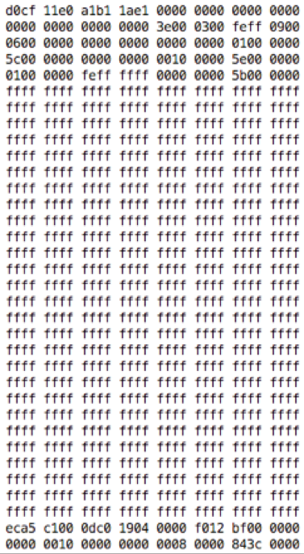

Пример содержания DOC файла:

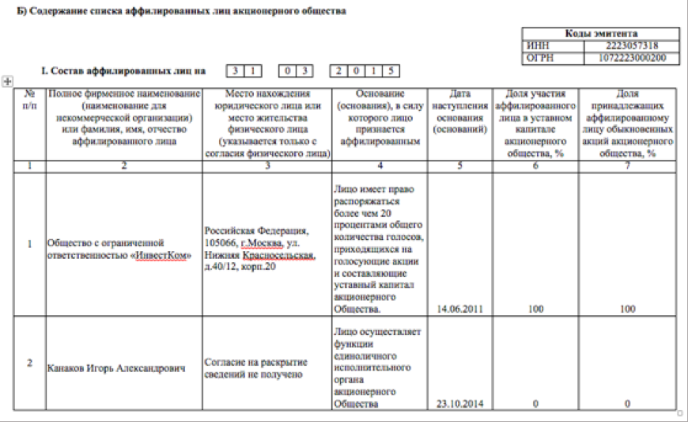

### Обработка файла

Порядок работы парсера:

- Чтение файла
- Разбор внутренней файлов структуры, поиск потоков
- Чтение потока `WordDocument`
- Чтение позиции (`fc`) и размера (`lcb`) блока `CLX`, который находится в потоке таблиц
- Определение потока таблиц путем считывания седьмого бита по смещению `0x000A`
- Чтение потока таблиц `0Table`, если седьмой бит равен `0`, или `1Table`, если седьмой бит равен `1`
- Чтение структуры `CLX` в потоке таблиц
- Поиск позиции и размера структуры `PieceTable` внутри `CLX`. Для этого находим возможное начало `PieceTable`, который обязательно начинается на `0х02`. Далее читаем следующие 4 байта — размерность. Если размерность по факту и записанная по смещению совпадают, то нашли `PieceTable`. Иначе продолжаем поиск
- Разделение `PieceTable` на структуры `CP` и `PCD`. Концом `CP` и началом `PCD` является значение последнего `CP`, которое можно найти как сумму 8 значений, начиная со смещения `0x004C`
- Чтение символов в `PCD`
- Определение кодировки символа. Если первый бит равен `1`, то ANSI и значит нужно начать читать в 2 раза раньше, если `0`, то Unicode и значит нужно прочитать в 2 раза больше
- Преобразование специальных символов в HTML-тэги, а также преобразование оставшихся символов в простой текст
- Выдача итогового HTML-документа

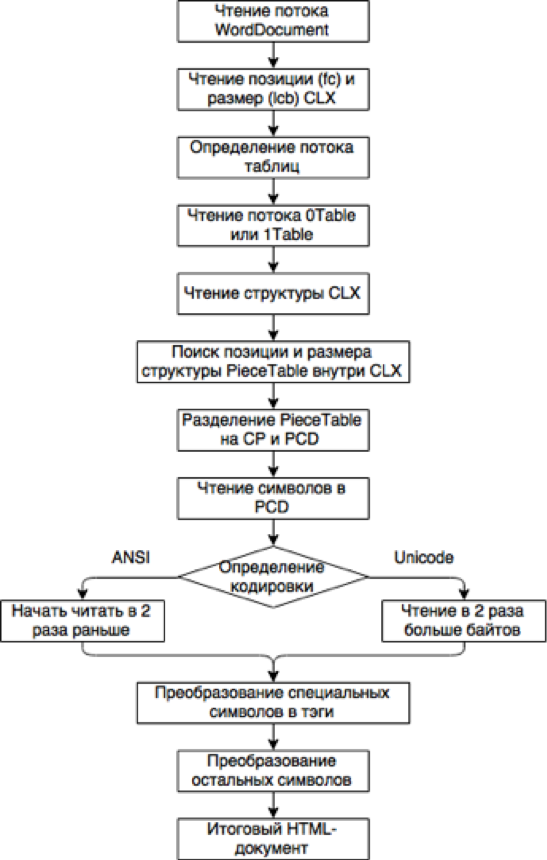

## RTF

### Описание

**RTF** (**R**ich **T**ext **F**ormat — формат обогащенного текста) — проприетарный формат хранения размеченных текстовых документов, предложенный группами программистов из компаний Adobe и Microsoft, как тэговый формат для редактора Word в 1982 году. С тех пор спецификация формата несколько раз изменялась. После разрыва отношений с Microsoft компания Adobe продолжила самостоятельное развитие языка, заложенного в основу RTF, создав в 1985 году язык PostScript.

RTF был определен Microsoft как стандартный формат для обмена текстовыми документами. Поэтому, по назначению этот формат подобен формату для электронных таблиц. RTF поддерживается многими продуктами фирмы Microsoft. Начиная с версии 2.0, он введен в Windows в качестве формата буфера обмена, благодаря чему возможен обмен данными между различными прикладными программами Windows.

Формат RTF имеет MIME-type `text/rtf`.

### Структура

В RTF для обмена документами используются только представимые символами коды из ASCII- и PC-символьного набора. Кроме текста, RTF в читаемой форме содержит команды управления.

Документ состоит преимущественно из команд управления настройки программы чтения файлов. Эти команды можно разделить на управляющие слова (control words) и управляющие символы (control symbols).

Управляющее слово представляет собой последовательность символов с разделителем (delimiter) в конце — `\lettersequence <delimiter>`. Перед управляющим словом вводится обратная косая черта `\` (backslash). В качестве разделяющих могут использоваться следующие символы:

- Пробел, причем этот символ относится к управляющему слову
- Цифра или знак `-`. После этих символов должен следовать параметр с разделителем
- Все символы, отличные от цифр и букв. Эти символы не относятся к управляющему слову

В RTF для задания управляющей последовательности используются буквы от `А` до `Z` и от `а` до `z`, а также цифры от `0` до `9`. Национальные символы к управляющей информации не относятся.

В качестве, управляющих символов используются отдельные буквы. Перед каждым управляющим символом вводится обратная косая черта `\` — `\control symbol`. В настоящее время определены только некоторые из этих символов. Поэтому при чтении неизвестные символы могут быть пропущены.

В RTF существует возможность объединять отдельные последовательности в группы, используемые для описания сносок и колонтитулов, при помощи скобок:

- `{` — начало группы
- `}` — конец группы

Если необходимо разместить символы `\`, `{` или `}` внутри обычного текста, то перед ними надлежит поставить обратную косую черту. Это позволяет программе, читающей RTF, распознать, что символ не следует интерпретировать как управляющий.

**Специальные управляющие слова:**

- `\chpgn` — управляющее слово change page number выводит текущий номер страницы
- `\chftn` — управляющее слово change footnote включает автоматическую нумерацию сносок
- `\chdate` — управляющее слово change date выводит текущую дату
- `\chtime` — управляющее слово change time выводит текущее время
- `\page` — задает переход на новую страницу
- `\line` — вызывает переход на новую строку
- `\раr` — обозначает конец абзаца. Последовательность `\раr` может заменяться последовательностью `\10` или `\13`. При этом `\10` соответствует ASCII-символу с кодом `10` (carriage return)
- `\sect` — обозначает конец текстового фрагмента или текстового абзаца
- `\tab` — обозначает знак табуляции. Можно также непосредственно задавать ASCII-код `09Н`
- `\сеll` — обозначает конец ячейки таблицы
- `\row` — обозначает конец строки таблицы

### Пример структуры

Пример структуры RTF файла:

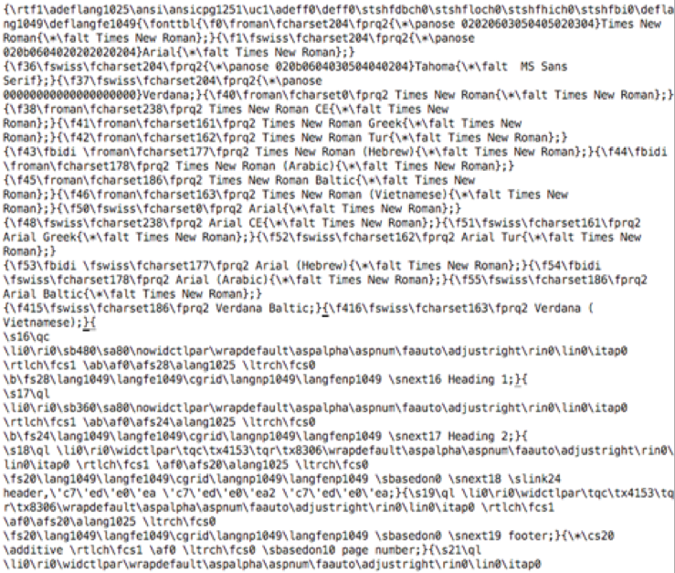

### Обработка файла

Порядок работы парсера:

- Посимвольное считывание данных из файла
- Поиск в начале файла словарей, содержащих информацию о цветах и шрифтах
- Поиск ключевых символов, обозначающих группы (`{` и `}`)
- Извлечение информации о форматировании группы
- Извлечение текста из группы
- Преобразование символов, представленных в виде `\u0000` (2-байтный Unicode) и `\'00` (7-битный символ в кодировке документа)
- Извлечение изображений и сохранение в массив
- Формирование HTML-документа

## ODT

### Описание

**OpenDocument Format**, **ODF** (Open Document Format for Office Application — открытый формат документов для офисных приложений) — открытый формат документов для обмена и хранения офисными документами, текстовыми документами (отчеты, заметки, книги), таблицами, презентациями, рисунками.

Стандарт разработан индустриальным сообществом OASIS и основан на формате XML. 1 мая 2006 года принят как международный стандарт ISO/IEC 26300. Стандарт разработан различными организациями, может использоваться без ограничений и доступен для всех. Представляет собой альтернативу закрытым форматам (DOC, XLS, PPT), а также формату Microsoft Office Open XML (DOCX, XLSX, PPTX).

Формат ODT имеет MIME-type `application/vnd.oasis.opendocument.text`.

### Структура

Каждый документ ODF представляет собой ZIP файл. Поэтому, чтобы просмотреть структуру документа, достаточно сменить расширение файла на ZIP. Внутри архива можно увидеть, пять и более XML-файлов, несколько папок.

В XML-файлах, кроме непосредственно документа, находятся специальные метаданные. Это дополнительная информация, которая позволяет задать тексту определенные параметры. Такими параметрами могут быть размер и тип шрифта, положение на странице, параметры печати или вывода на экран монитора.

Главный файл с содержанием является `content.xml`, файл стиля — `style.xml`. В папках могут находиться различные мультимедийные файлы — картинки, аудиофайлы, видеофайлы.

Простота формата дает более легкую возможность извлекать как содержание, так и метаинформацию из файла, не прибегая к изучению всех особенностей стандарта.

### Пример структуры

Структура файлов:

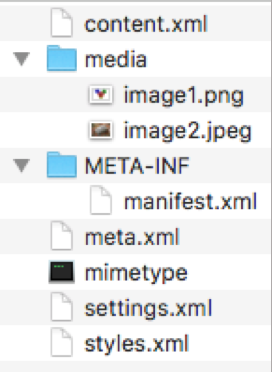

Пример `content.xml`:

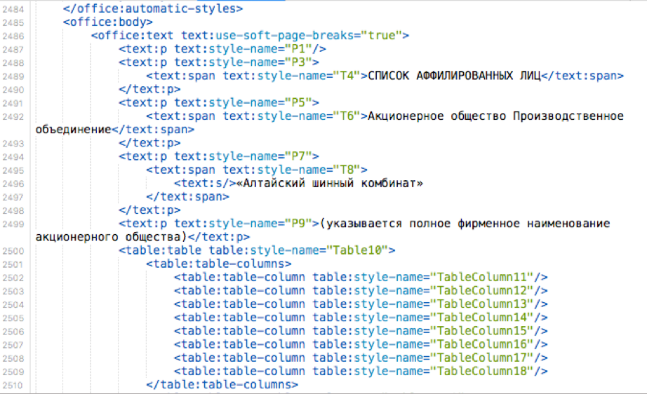

Пример `styles.xml`:

Пример `meta.xml`:

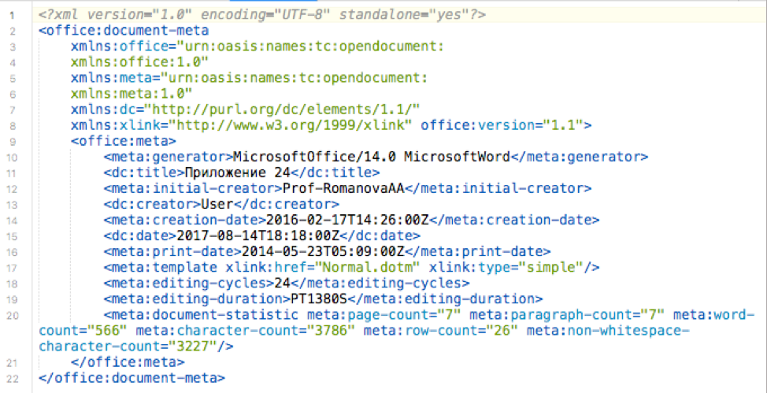

### Обработка файла

Обработка ODT похожа на алгоритм обработки DOCX файлов. При этом обработка ODT происходит гораздо проще за счет то, что большая часть необходимой информации содержится в одном файле `content.xml`, а также теги имеют более понятные названия, что позволяет узнать их назначение без использования документации.

Порядок работы парсера:

- Разархивирование файла
- Извлечение информации о списках из файла `styles.xml`
- Извлечение стилей из файла `content.xml`
- Извлечение содержимого из файла `content.xml`
- Рекурсивный обход всех тэгов, извлеченных на предыдущем этапе
- Формирование элементов (параграфов и заголовков, ссылок, изображений, таблиц, списков). В отличие от DOCX здесь не используются ссылки между файлами и элементами
- Добавление стилей
- Формирование HTML-документа

## XLSX

### Описание

Файл **XLSX** — таблицы, созданные в Microsoft Excel — программе, используемой для создания электронных таблиц. Данные хранятся на так называемых листах, в которых содержатся ячейки, расположенные в строках и столбцах. Может содержать, математические функции, диаграммы, форматирование и стили; обычно используется для хранения финансовых данных и для создания простых или сложных математических моделей.

Каждая ячейка в таблице XLSX может быть отформатирована в индивидуальном порядке. Например, в ячейке возможно указать формат числа, текста, или другой формат, а также цвет, шрифт и размер. Ячейки могут содержать ссылки на другие ячейки, чтобы вычислить результирующее значение.

Формат XLSX имеет MIME-type `application/vnd.openxmlformats-officedocument.spreadsheetml.sheet`.

### Структура

Файлы XLSX хранятся в виде ZIP архивов, которые применяются для уменьшения размера файла, который содержит набор отдельных файлов. Архив включает в себя файл `[Content_Types].xml`, который описывает таблицу и XML-файл для каждого листа в пределах таблицы.

Файл `[Content_Types].xml` содержит информацию о типе содержимого каждого файла. При записи XLSX изменяется та часть, которая связана с информацией о листе, поскольку она зависит от количества листов. Остальная часть не изменяется.

Файл `app.xml` содержит информацию о количестве и названиях листов. При записи данного файла изменяется только значение количества листов и имена листов в соответствии с документом.

Файл `Workbook.xml` содержит информацию о листах. Это файл, в котором определены название листов, остальные файлы ссылаются на эти названия. Этот файл также содержит отображение между отношениями и именами листов, путем определения значения атрибута `г: Id`. При создании данного файла необходимо быть осторожным, так как нужно сопоставить правильные идентификаторы `id` для всех листов, иначе файл будет поврежден.

### Пример структуры

Структура файлов:

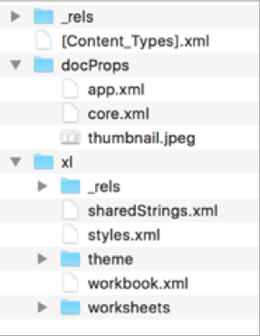

Пример `[Content_Types].xml`:

![Пример \[Content_Types\].xml](files/extensions/xlsx2.png)

Пример `app.xml`:

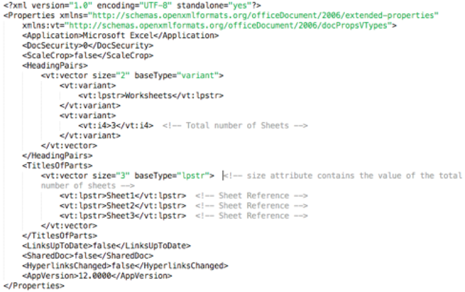

Пример `meta.xml`:

### Обработка файла

Порядок работы парсера:

- Разархивирование файла
- Извлечение стилей из файлов `xl/theme/theme1.xml` и `xl/styles.xml`
- Извлечение текстовых строк из структуры `SST` (Shared Strings Table) из файла `xl/sharedstrings.xml`
- Извлечение ссылок на файлы из файла `xl/_rels/workbook.xml.rels`
- Извлечение информации о документе (автор, дата создания, и т.д.) из файла `docprops/core.xml`
- Извлечение основного содержимого документа из файла `xl/workbook.xml`
- Поиск информации о каждом листе (название, расположение и количество ячеек)
- Поиск информации о ячейках (содержимое, связи, границы, объединения)
- Преобразование формул, содержащихся в ячейках, в значения
- Извлечение изображений
- Применение стилей
- Формирование HTML-документа

## XLS

### Описание

Файл **MS XLS** — электронная таблица, созданная в Microsoft Excel. Данные в документе хранятся в ячейках, каждая из которых имеет определенный адрес (колонки нумеруются английскими буквами, строки — цифрами).

Каждая ячейка может содержать как фиксированные данные, так и математические формулы. Как и в документе Microsoft Word (.DOC), формат XLS позволяет пользователю изменять представление текста: его шрифт, цвет, начертание, выравнивание (в ячейке) и другие параметры. Кроме того, документ может содержать изображения, а также диаграммы, построенные на основе данных в определенных ячейках.

Формат XLS имеет MIME-type `application/vnd.ms-excel`.

### Структура

Формат состоит из потоков и подпотоков. Каждый лист таблицы хранится в собственном подпотоке. Все данные содержатся в записях, которые имеют заголовки, которые дают тип записи и длину. Ячейки, которые содержат фактические данные и формулы, находятся в таблице. Строковые значения хранятся не в ячейках, а в специальной таблице, на которую ссылается ячейка. Строки содержат информацию о расположении строк и ячеек. Только ячейки, которые содержат данные или форматирование хранятся в подпотоке.

Формат файла MS XLS содержит потоки, подпотоки и записи. Все записи начинаются с 2-байтовых целых чисел для указания типа записи (`rt`), и размера записи (`cb`). Запись не может превышать 8224 байт. Если размер записи превышает данное ограничение, то часть, которая не помещается, располагается в одну или несколько записей продолжения (continue records).

**Основные потоки, подпотоки и записи:**

- Поток `Workbook` — является основным потоком XLS-файла. Он содержит несколько потоков, каждый из которых начинается с начала файла (`BOF`) и заканчивается в конце файла (`EOF`). Первый поток всегда является подпотоком `Globals`, а все остальные подпотоки `sheet`. К ним относятся листы, макросы, диаграммы, модули VBA
- Подпоток `Globals` — определяет глобальные свойства и данные книги. Он также включает `BoundSheet8` запись для каждого подпотока потока `Workbook`
- Запись `BoundSheet8` — содержит сведения о подпотоке листа — имя, расположение, тип и видимость. Первые 4 байта для записи, `lbPlyPos` указывает позицию в потоке `Workbook`, где начинается подпоток листа
- Подпоток `Worksheet` — указывает лист в книге

**Структуры подпотока `Worksheet`:**

- `Cell Table` — часть потока листа, где хранятся ячейки. Содержит ряд блоков, каждый из которых содержит 32 строки ячеек и заполняется последовательно. Каждый блок строки начинается с серии записей, за которыми следуют ячейки, и заканчивается `DBCell` записью, которая дает смещение первой ячейки каждой строки в блоке
- Запись `Row` — определяет строку в листе. Представляет собой сложную структуру, но первые 6 байт необходимы для получения основного содержимого — индекс первой строки и столбца первой и последней ячейки
- `Cell` — все ячейки в строке блока хранятся после последней строки в блоке. Существует семь типов записей, представляющих собой ячейки на листе. Большинство записей начинаются с 6-байтной `Cell` структуры — первые 2 байта указывают строку, следующие два байта указывают столбец, а последние 2 байта указывают запись `XF` в подпотоке `Globals`, который содержит сведения о форматировании. Если не указано иное, первые 6 байтов занимаемое структуру ячеек, а оставшиеся байты содержат значения
- Shared String Table (`SST`) — содержит все строковые значения в книге. Эти значения ссылаются на лист с помощью записи `LabelSst`. Первые 8 байт `SST` содержат количество ссылок на строки в книге и количество уникальных строковых значений в `SST`. Остальные представляют собой массив структур `XLUnicodeRichExtendedString`, содержащий строки в виде массивов знаков. 16-й бит определяет, должны ли символы быть 1 байт или 2 байта

**Основные виды ячеек:**

- `Blank` — задает пустую ячейку, которая не имеет формулы или значения. Этот тип записи используется только для ячеек, содержащих форматирование. В противном случае пустые ячейки хранятся в записях `MulBlank`
- `RK` — содержит 32-разрядное число. Excel автоматически преобразует числа, которые могут быть представлены в 32 бит или меньше, в этот формат для уменьшения размер файла. Вместо 6-байтовой структуры ячейки первые 2 байта определяют строку и вторые 2 байта определяют столбец. Оставшиеся 6 байт определяют номер в структуре `RkRec` для оптимизации памяти
- `BoolErr` — содержит 2-байтовую структуру `Bes`, которая может принимать значения типа Boolean или код ошибки
- `Number` — содержит 64-разрядное число с плавающей запятой
- `LabelSst` — содержит 4-байтовое целое число, которое указывает строку в таблице общих строк (`SST`)
- `Formula` — содержит формулу и полученные результаты. Значение, отображаемое в ячейке, определено в структуре `FormulaValue` в 8 байтах, которые следуют за структурой ячейки. Следующие 6 байт могут игнорироваться, а остальная часть записи является представляет собой `CellParsedFormula` структуру, содержащую саму формулу
- `MulBlank` — задает набор пустых ячеек в строке
- `MulRK` — похожа на запись `MulBlank`, но вместо пустых ячеек, `MulRk` состоит из `RK` данных в структурах `RkRec`

### Пример структуры

Бинарная структура XLS файла:

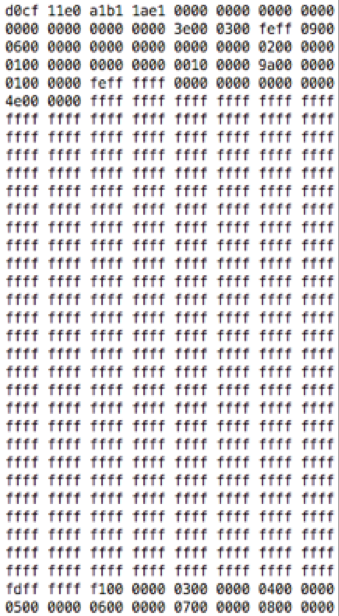

Пример содержания XLS файла:

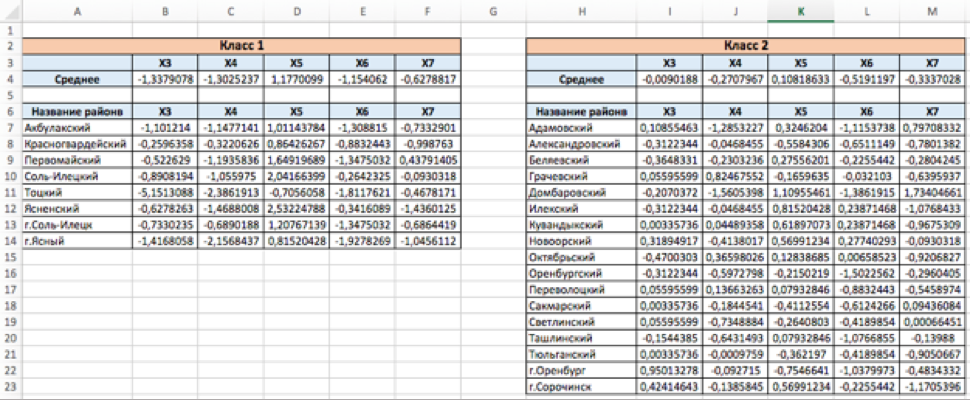

### Обработка файла

Обработка похожа на алгоритм обработки DOC файлов (в части структуры бинарного файла), и XLSX файлов (в части порядка обработки составных частей документа).

Порядок работы парсера:

- Чтение файла
- Разбор внутренней файлов структуры, поиск потоков
- Чтение потока Workbook
- Определение версии файла
- Поиск частей данных о листах
- Извлечение текстовых строк из структуры `SST` (Shared Strings Table)
- Поиск информации о каждом листе (название, расположение и количество ячеек)
- Поиск информации о ячейках (содержимое, связи, границы, объединения)
- Извлечение стилей
- Извлечение прочих частей документа (встроенные объекты, заметки, комментарии)
- Преобразование формул, содержащихся в ячейках, в значения
- Преобразование бинарных данных в текст с учетом кодировки документа
- Преобразование специальных символов в HTML-тэги, а также преобразование оставшихся символов в простой текст
- Применение стилей
- Формирование HTML-документа

## CSV

### Описание

**CSV** (**C**omma-**S**eparated **V**alues — значения, разделенные запятыми) — текстовый формат, предназначенный для представления табличных данных. Каждая запись состоит из одного или нескольких полей, разделенных запятыми. Использование запятой в качестве разделителя полей является источником названия для формата.

Данный формат поддерживается многими программными продуктами. CSV-файлы часто используются для импорта/экспорта табличных данных между двумя различными программами, например, между электронной таблицей и базой данных.

Первый CSV файл появился в начале 70-х годов. Данные, разделенные запятыми, их было легко вводить (например, в перфокарты), были менее склонны к получению неверных результатов, если столбцы отклонялись от предполагаемого местоположения. Несмотря на длительную историю, формат популярен и сегодня и используются для различных целей, например, для экспорта контактов в Microsoft Outlook.

Первые попытки стандартизовать формат были предприняты еще в 2005 году. Однако, только в 2015 W3C, пытаясь улучшить формат, обнародовал первые проекты рекомендаций по стандарту.

Формат CSV имеет MIME-type:

- `text/csv`
- `application/csv`
- `application/vnd.msexce`

### Структура

Каждая строчка в CSV файле соответствует одной строчке в таблице. На одной линии поля разделяются символом запятой `,`, каждое поле является частью одного столбца таблицы. Однако на практике часто используют другие разделители, например, точка с запятой, то есть формат CSV путают с **DSV** (**D**elimiter-**S**eparated **V**alues — значения, разделенные разделителем) и **TSV** (**T**ab-**S**eparated **V**alues — значения, разделенные табуляцией).

Данные, содержащие зарезервированные символы (двойная кавычка, запятая, точка с запятой, новая строка) заключаются в двойные кавычки `"`. Если в тексте встречаются кавычки, то они представляются в виде двух подряд идущих кавычек. Иногда в двойные кавычки заключаются и текстовые значения. Строки, в зависимости от операционной системы, разделяются символами `CR LF` (`0x0D 0x0A`), или `LF` (`0x0A`).

Так как разделители строк и столбцов могут различаться, может быть разной и кодировка итогового файла, и обрамление двойными кавычками, что значительно усложняет перенос данных из одних программ в другие, несмотря на всю довольно простую реализацию CSV.

### Основные правила

Основные правила, используемые при создании CSV-файлов:

- CSV — разделенный формат данных, который имеет поля (столбцы), разделенные символом запятой и записи (строки), заканчивающиеся символами новой строки
- CSV не требует конкретной кодировки символов, порядка следования байтов, или формата разделителя строки (некоторое программное обеспечение не поддерживает все разделители)
- Запись заканчивается разделителем строки. Тем не менее, разделители могут быть тексте, поэтому программное обеспечение должно правильно их распознавать
- Все записи должны иметь одинаковое количество полей и одинаковый порядок
- Данные в полях интерпретируются как последовательность символов, а не в виде последовательности битов
- Соседние поля должны быть отделены друг от друга одной запятой. Однако, в локализациях, где запятая используется в качестве десятичного разделителя, поля отделяются точкой с запятой, табуляцией или другими символами
- Любое поле может заключаться в двойные кавычки
- Поля, содержащие запятые или двойные кавычки, должны заключаться в кавычки
- Если в поле встречаются кавычки, то они представляются в виде двух кавычек подряд
- Поля, содержащие переносы строки, должны быть заключены в кавычки
- Пробелы вне кавычек в поле не допускаются
- Первая запись может быть заголовком, который содержит имя каждого поля

### Пример структуры

Пример структуры CSV файла:

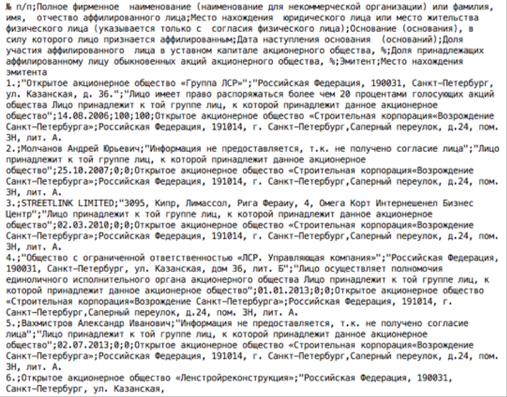

### Обработка файла

Порядок работы парсера:

- Чтение первых 4000 байт файла (либо всего файла целиком, если он меньше)
- Подсчитывается число вхождений символов, которые могут выступать в качестве разделителя ячеек
- Определяется наиболее вероятный разделитель ячеек
- Построчное чтение файла, разбиение строк на ячейки
- Формирование HTML-документа

## Текстовый файл (TXT / MD)

### Описание

**TXT** (**T**e**XT**) — текстовый файл, содержащий текстовые данные в отличие от бинарных (двоичных) файлов, в которых содержатся данные, не рассчитанные на интерпретацию в качестве текстовых (видео, звуки).

**Markdown** — облегченный язык разметки, созданный с целью написания максимально читаемого и удобного для правки текста, но пригодного для преобразования в языки для сложных публикаций.

Текстовый файл содержит последовательность символов. Эти символы сгруппированы в строки. В современных системах строки разделяются специальными разделителями строк. Иногда конец текстового файла также отмечается одним или более специальными знаками, называемыми маркерами конца файла.

Формат TXT имеет MIME-type `text/plain`.

### Преимущества и недостатки

**Преимущества:**

- Универсальность — файл может быть прочитан на любой операционной системе
- Устойчивость — каждый символ и слово самодостаточны и, если случится повреждение байтов в таком файле, то можно восстановить данные или продолжить обработку остального содержимого
- Простота — формат текстового файла прост и его можно изменять любым текстовым редактором, который входит в состав любой операционной системы

**Недостатки:**

- Низкая информационная энтропия у больших несжатых текстовых файлов — эти файлы занимают больше места, нежели минимально необходимо
- Некоторые операции с текстовыми файлами неоптимальны — например, чтобы прочитать 100-ю строку, требуется считать 99 строк, идущих до нее; сложно заменить одну строку другой

### Управляющие символы и разметка

Различные операционные системы имеют свое представление перевода строки и конца файла. В UNIX перевод строки состоит из одного символа `LF` (код `0xA`), в macOS — из символа `CR` (код `0xD`), а в Windows перевод строки кодируется сразу двумя символами `CR` и `LF`.

Символы, которые обычно рассматриваются в Markdown как специальные, могут быть экранированы с помощью символа `\`. Также Markdown не преобразует текст внутри блоков HTML, поэтому в документ можно включать секции HTML кода, предварительно заключив их в теги уровня блока.

### Пример структуры

Пример структуры TXT файла:

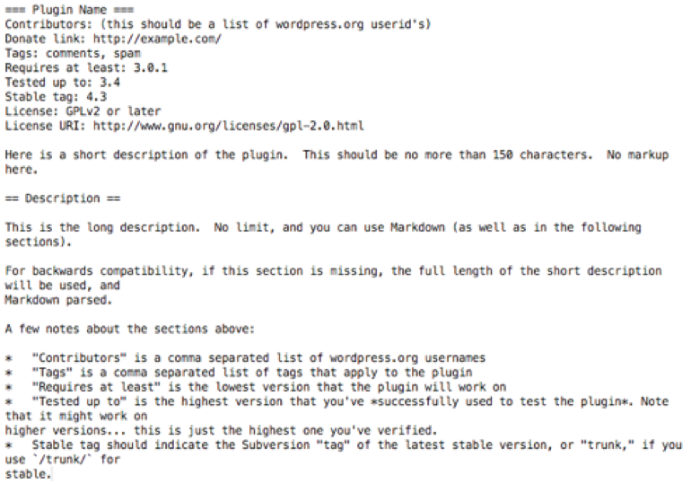

### Обработка файла

Порядок работы парсера:

- Посимвольное считывание данных из файла
- Поиск ключевых символов, обозначающих форматирование
- Поиск ключевых «фраз» с помощью регулярных выражений
- Извлечение изображений и сохранение в массив
- Формирование HTML-документа

## JSON

### Описание

**JSON** (**J**ava**S**cript **O**bject **N**otation) — текстовый формат для обмена данными, основанный на JavaScript. Как и многие текстовые форматы, JSON легко читается человеком. Формат был разработан американским программистом Дугласом Крокфордом.

Несмотря на происхождение от JavaScript, формат является независимым от языка и может использоваться с любым языком программирования.

JSON5 — предложенное расширение формата JSON в соответствии со стандартом ECMAScript 5, вызванное тем, что JSON используется не только для общения между программами, но и создается/редактируется человеком. Является корректным кодом ECMAScript 5.

Основными нововведениями являются поддержка как однострочных, так и многострочных комментариев, использование ключей объектов без кавычек, а также поддержка различных способов представления чисел — могут начинаться со знака `+`, быть в шестнадцатеричном виде, начинаться или заканчиваться десятичной точкой.

Формат JSON имеет MIME-type `application/json`.

### Структура

JSON-текст представляет собой одну из двух структур:

- набор пар `ключ: значение` (словарь, ассоциативный массив), где ключом может быть только строка, значением — любая форма
- упорядоченный набор значений (массив, список)

В качестве значений в JSON могут быть использованы:

- массив — упорядоченное множество значений. Заключается в квадратные скобки `[…]`. Значения разделяются запятыми `,`
- объект — неупорядоченное множество пар `ключ: значение`, заключенное в фигурные скобки `{…}`. Ключ описывается строкой, между ним и значением стоит символ двоеточия `:`. Пары отделяются друг от друга запятыми
- строка — упорядоченное множество из нескольких символов, заключенное в двойные кавычки, похожа на одноименный тип данных в языках Java и С
- ключевые слова `null`, `true`, `false`
- число — похоже на число в языках Java и C (за исключением того, что используется только десятичный формат)

Между любыми двумя синтаксическими элементами могут быть вставлены пробелы (любое число).

### Пример структуры

Пример структуры JSON файла:

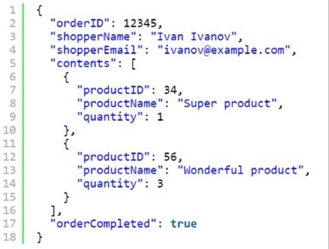

### Обработка файла

Порядок работы парсера:

- Чтение файла
- Создание дерева из JSON-объектов в памяти
- Рекурсивный проход по объектам
- Замена каждого объекта на элемент вложенного списка
- Выдача итогового HTML-документа

## EPUB

### Описание

**ePub** (**E**lectronic **Pub**lication) — открытый формат электронных книг, разработанный Международным форумом по цифровым публикациям в 2007 году. Формат позволяет издателям производить и распространять цифровую публикацию в одном файле, обеспечивая совместимость между аппаратным и программным обеспечением, необходимым для воспроизведения цифровых книг и других публикаций.

Формат EPUB имеет MIME-type `application/epub+zip`.

### Структура

Книга в формате EPUB представляет собой ZIP-архив, в котором содержатся следующее:

- Папка `META-INF`, которая содержит файл `container.xml`
- Папка `OEBPS`
- Файл `mimetype`

Папка `OEBPS`, в свою очередь, содержит следующее:

- Папка `Text` — текст публикации в виде XHTML/HTML страниц или PDF файлов
- Папка `Fonts` — набор шрифтов
- Папки `Images`, `Video`, `Audio` — медиа-контент: видео, изображения, аудио
- Папка `Styles` — стили текста (CSS)
- Файл `toc.ncx` — оглавление книги
- Файл `content.opf` — содержимое книги, метаданные

### Пример структуры

Структура файлов:

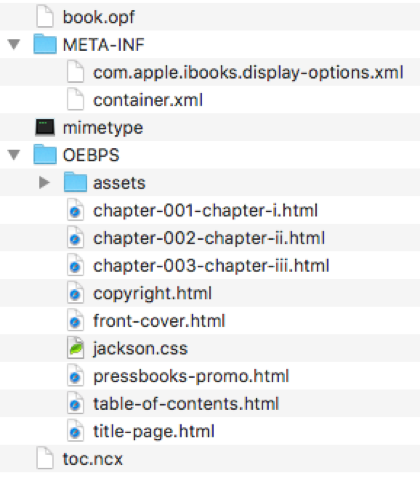

Пример `toc.ncx`:

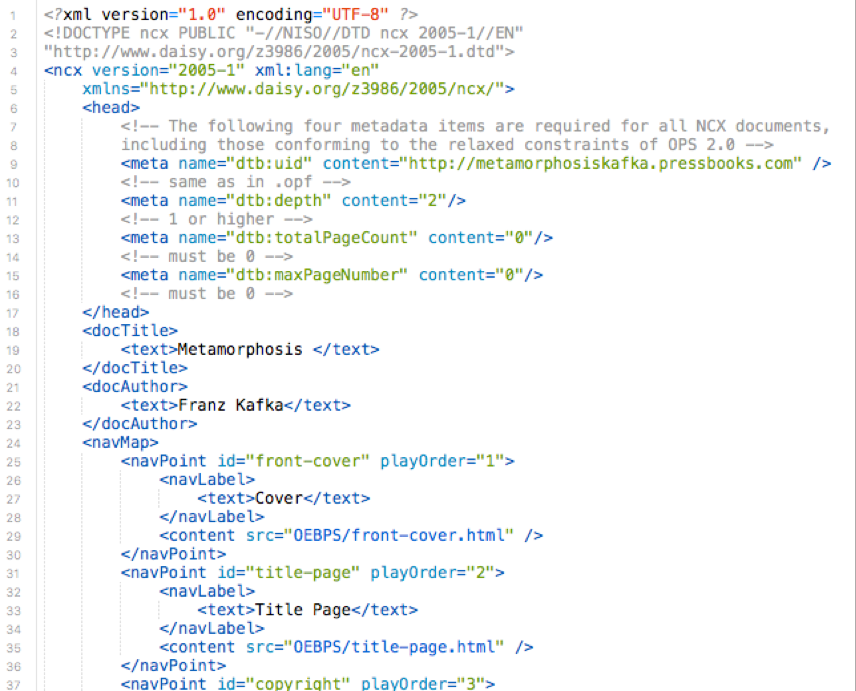

Пример `chapter1.html`:

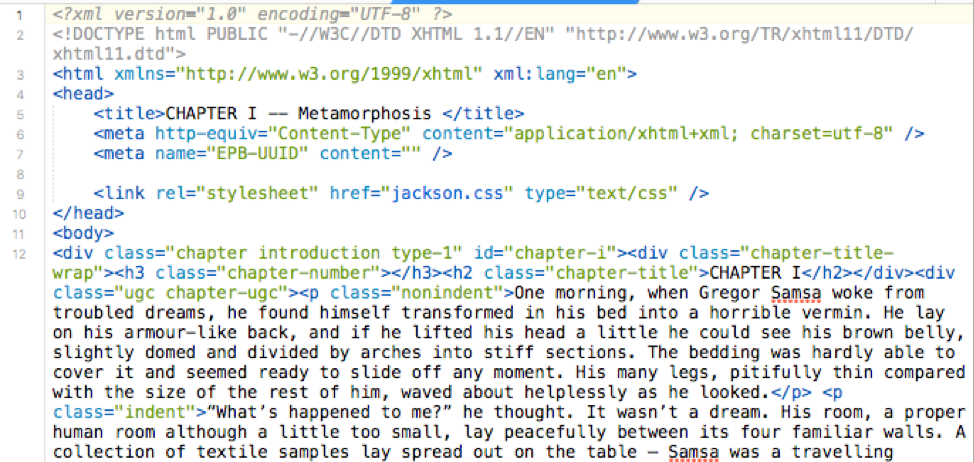

### Обработка файла

Порядок работы парсера:

- Разархивирование файла
- Чтение файла с содержанием (ссылками на части книги)
- Поиск частей документа по ссылкам, объединение в один документ
- Извлечение изображений и сохранение в массив
- Извлечение стилей
- Выдача итогового HTML-документа

## PDF

### Описание

**PDF** (**P**ortable **D**ocument **F**ormat) — кроссплатформенный формат электронных документов, разработанный компанией Adobe Systems с использованием ряда возможностей языка PostScript (который также разработан внутри Adobe). В первую очередь предназначен для представления печатной продукции в электронном виде. Значительное количество современного профессионального печатного оборудования имеет аппаратную поддержку формата PDF, что позволяет производить печать документов в данном формате без использования какого-либо специального программного обеспечения.

Формат PDF позволяет внедрять необходимые шрифты, растровые и векторные изображения, формы и мультимедийные вставки. Включает механизм электронных подписей для защиты и проверки целости и подлинности документов.

Формат PDF имеет MIME-type `application/pdf`.

### Структура

PDF файл представляет собой текстовый документ с вставками бинарных (двоичных) данных, поддерживает несколько базовых типов данных:

- Строки — унаследованы от языка PostScript, следовательно, под строкой подразумевается последовательность 8-битных символов, окруженная круглыми скобками. Есть несколько способов задания текстовых данных: по восьмеричным кодам символа (`\065`), с помощью отдельного 2-байтового HEX-символа (`<2B>`) или их последовательности (`<7754206F>`)
- Массивы — заключаются в квадратные скобки и представляют собой последовательность группированных объектов, содержащих текстовые строки
- Словари — пары "ключ-значение", заключенные в символы `<<` и `>>`. Часто используется для наделения объекта, который его содержит, свойствами, что описаны в словаре. Эти данные помогают определить, как, например, расшифровать поток, узнать его длину
- Потоки — представляют последовательность 8-битных данных между ключевыми словами `stream` и `endstream`. Всегда находятся внутри объекта и характеризуются, своей длиной (параметр `/Length N` в словаре) и часто методом сжатия (например, параметры `/Filter /FlateDecode`)
- Объекты — наибольшие структуры, могут содержать внутри себя любой другой тип данных от обычного числа до потока, обрамляются ключевыми словами `obj` и `endobj`. Каждый объект имеет свой ID внутри документа (чаще всего его порядковый номер), по которому можно ссылаться

### Пример структуры

Пример структуры PDF файла:

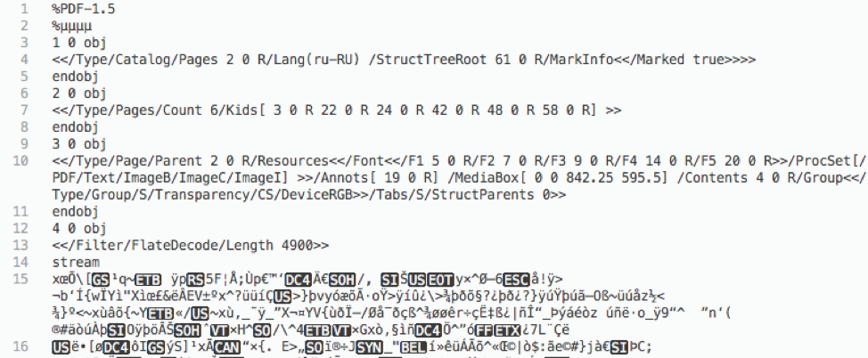

### Обработка файла

Порядок работы парсера:

- Чтение данных из PDF файла в бинарном режиме
- Осуществление первого прохода — получение "сырых" данных с позиционированием, hex-вставками
- Получение списка всех объектов
- Чтение параметров каждого объекта
- Проверка объектов на наличие потока данных
- Расшифровываем поток данных (чаще всего он сжат с помощью `gzip`, однако могут применятся такие методы как `ASCII Hex` и `ASCII 85-base`)
- Если перед нами изображение (параметр `/Image`) — собираем кусочки и преобразовываем данные, сохраняем в массив, добавляем тег `img`
- Если перед нами текст — ищем контейнер текста в текущем потоке (либо между `BT … ET`, либо в `[...] TJ`, либо между `Td (...) Tj`), применяем трансформации из словаря (`ToUnicode CMaps`) и собираем кусочки вместе. Таблица преобразований может находится либо между `beginbfchar … endbfchar`, либо между `beginbfrange … endbfrange`
- После окончания первичного парсинга документа осуществляется разбор полученных текстовых блоков с учетом символьных трансформаций
- Формирование итогового HTML-документа

## Полезные ссылки

- [Document2HTML converter](https://github.com/dmryutov/document2html)
- [Официальный сайт HTML спецификации](http://www.w3.org/TR/html4/)
- [Официальный сайт XML спецификации](http://www.w3.org/TR/REC-xml/)
- [Официальный сайт DOCX спецификации](https://msdn.microsoft.com/en-us/library/dd773189.aspx)
- [Официальный сайт DOC спецификации](https://msdn.microsoft.com/en-us/library/cc313153(v=office.12).aspx)
- [Официальный сайт RTF спецификации](https://www.microsoft.com/en-us/download/details.aspx?id=10725)
- [Официальный сайт ODT спецификации](http://docs.oasis-open.org/office/v1.1/OS/OpenDocument-v1.1-html/OpenDocument-v1.1.html)
- [Официальный сайт XLSX спецификации](https://msdn.microsoft.com/en-us/library/dd922181(v=office.12).aspx)
- [Официальный сайт XLS спецификации](https://msdn.microsoft.com/ru-ru/library/office/gg615597(v=office.14).aspx)
- [Официальный сайт CSV спецификации](https://www.loc.gov/preservation/digital/formats/fdd/fdd000323.shtml)
- [Официальный сайт Markdown спецификации](https://daringfireball.net/projects/markdown/syntax)
- [Официальный сайт JSON спецификации](http://www.json.org/json-ru.html)
- [Официальный сайт EPUB спецификации](http://www.idpf.org/epub/301/spec/epub-overview.html)
- [Официальный сайт PDF спецификации](http://www.adobe.com/content/dam/acom/en/devnet/pdf/adobe_supplement_iso32000.pdf)