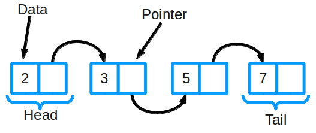
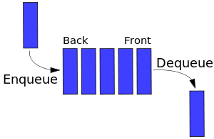
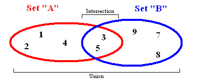
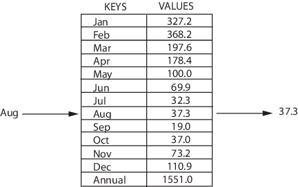
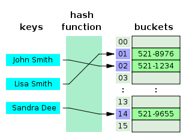
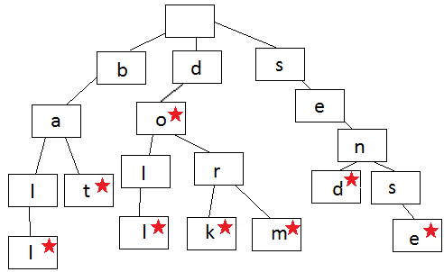
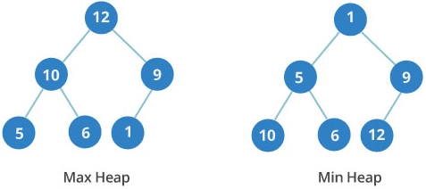
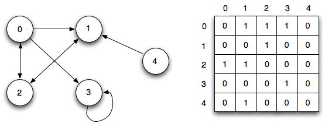

# Структуры данных

- [Связный список](#связный-список)
- [Стек](#стек)
- [Очередь](#очередь)
- [Множество](#множество)
- [Map](#map)
- [Хэш-таблица](#хэш-таблица)
- [Двоичное дерево поиска](#двоичное-дерево-поиска)
- [Префиксное дерево](#префиксное-дерево)
- [Двоичная куча](#двоичная-куча)
- [Граф](#граф)
- [Полезные ссылки](#полезные-ссылки)

## Связный список

**Связный список** — одна из базовых структур данных. Ее часто сравнивают с массивом, так как многие другие структуры можно реализовать с помощью либо массива, либо связного списка. У этих двух типов есть преимущества и недостатки.

Связный список состоит из группы узлов, которые вместе образуют последовательность. Каждый узел содержит две вещи: фактические данные, которые в нем хранятся (это могут быть данные любого типа) и указатель (или ссылку) на следующий узел в последовательности. Также существуют **двусвязные списки**: в них у каждого узла есть указатель и на следующий, и на предыдущий элемент в списке.

**Основные операции:**

- Добавление элемента
- Удаление элемента
- Поиск элемента

**Алгоритмическая сложность:**

| Алгоритм | Среднее значение | Худший случай |
| --- | :---: | :---: |
| Поиск | O(n) | O(n) |
| Вставка | O(1) | O(1) |
| Удаление | O(1) | O(1) |

[Реализация на Python](files/structures/linked_list.py)
[Реализация на JavaScript](files/structures/linked_list.js)

## Стек

**Стек** — базовая структура данных, которая позволяет добавлять или удалять элементы только в ее начале. Она похожа на стопку книг: если вы хотите взглянуть на книгу в середине стека, сперва придется убрать лежащие сверху.

Стек организован по принципу **LIFO** (**L**ast **I**n **F**irst **O**ut, "последним пришел — первым вышел") . Это значит, что последний элемент, который вы добавили в стек, первым выйдет из него.

**Основные операции:**

- Добавление элемента (`push`)
- Удаление элемента (`pop`)
- Отображение содержимого стека (`pip`)

**Алгоритмическая сложность:**

| Алгоритм | Среднее значение | Худший случай |
| --- | :---: | :---: |
| Поиск | O(n) | O(n) |
| Вставка | O(1) | O(1) |
| Удаление | O(1) | O(1) |

[Реализация на Python](files/structures/stack.py)
[Реализация на JavaScript](files/structures/stack.js)

## Очередь

Эту структуру можно представить как очередь в продуктовом магазине. Первым обслуживают того, кто пришел в самом начале — все как в жизни.

Очередь устроена по принципу **FIFO** (**F**irst **I**n **F**irst **O**ut, "первый пришел — первый вышел"). Это значит, что удалить элемент можно только после того, как были убраны все ранее добавленные элементы.

**Основные операции:**

- Добавление элемента в конец (`enqueue`)
- Удаление первого элемента (`dequeue`)

**Алгоритмическая сложность:**

| Алгоритм | Среднее значение | Худший случай |
| --- | :---: | :---: |
| Поиск | O(n) | O(n) |
| Вставка | O(1) | O(1) |
| Удаление | O(1) | O(1) |

[Реализация на Python](files/structures/queue.py)
[Реализация на JavaScript](files/structures/queue.js)

## Множество

**Множество** хранит значения данных без определенного порядка, не повторяя их. Оно позволяет не только добавлять и удалять элементы: есть еще несколько важных функций, которые можно применять к двум множествам сразу.

- Объединение комбинирует все элементы из двух разных множеств, превращая их в одно (без дубликатов)
- Пересечение анализирует два множества и  создает еще одно из тех элементов, которые присутствуют в обоих изначальных множествах
- Разность выводит список элементов, которые есть в одном множестве, но отсутствуют в другом
- Подмножество выдает булево значение, которое показывает, включает ли одно множество все элементы другого множества

[Реализация на Python](files/structures/set.py)
[Реализация на JavaScript](files/structures/set.js)

## Map

**Map** — структура, которая хранит данные в парах ключ/значение, где каждый ключ уникален. Иногда ее также называют ассоциативным массивом или словарем. Map часто используют для быстрого поиска данных. Она позволяет делать следующие вещи:

- Добавлять пары в коллекцию
- Удалять пары из коллекции
- Изменять существующей пары
- Искать значение, связанное с определенным ключом

[Реализация на JavaScript](files/structures/map.js)

## Хэш-таблица

**Хэш-таблица** — похожая на Map структура, которая содержит пары ключ/значение. Она использует хэш-функцию для вычисления индекса в массиве из блоков данных, чтобы найти желаемое значение.

Обычно хэш-функция принимает строку символов в качестве вводных данных и выводит числовое значение. Для одного и того же ввода хэш-функция должна возвращать одинаковое число. Если два разных ввода хэшируются с одним и тем же итогом, возникает коллизия. Цель в том, чтобы таких случаев было как можно меньше.

Таким образом, когда вы вводите пару ключ/значение в хэш-таблицу, ключ проходит через хэш-функцию и превращается в число. В дальнейшем это число используется как фактический ключ, который соответствует определенному значению. Когда вы снова введете тот же ключ, хэш-функция обработает его и вернет такой же числовой результат. Затем этот результат будет использован для поиска связанного значения. Такой подход заметно сокращает среднее время поиска.

**Алгоритмическая сложность:**

| Алгоритм | Среднее значение | Худший случай |
| --- | :---: | :---: |
| Поиск | O(1) | O(n) |
| Вставка | O(1) | O(n) |
| Удаление | O(1) | O(n) |

[Реализация на Python](files/structures/hash_table.py)
[Реализация на JavaScript](files/structures/hash_table.js)

## Двоичное дерево поиска

**Дерево** — структура данных, состоящая из узлов. Ей присущи следующие свойства:

- Каждое дерево имеет корневой узел (вверху)
- Корневой узел имеет 0 или более дочерних узлов
- Каждый дочерний узел имеет 0 или более дочерних узлов, и т.д.

У двоичного дерева поиска есть 2 дополнительных свойства:

- Каждый узел имеет до 2 дочерних узлов (потомков)
- Каждый узел меньше своих потомков справа, а его потомки слева меньше его самого

Двоичные деревья поиска позволяют быстро находить, добавлять и удалять элементы. Они устроены так, что время каждой операции пропорционально логарифму общего числа элементов в дереве.

**Алгоритмическая сложность:**

| Алгоритм | Среднее значение | Худший случай |
| --- | :---: | :---: |
| Поиск | O(log n) | O(n) |
| Вставка | O(log n) | O(n) |
| Удаление | O(log n) | O(n) |

[Реализация на Python](files/structures/binary_tree.py)
[Реализация на JavaScript](files/structures/binary_tree.js)

## Префиксное дерево

**Префиксное (нагруженное) дерево** — разновидность дерева поиска. Оно хранит данные в метках, каждая из которых представляет собой узел на дереве. Такие структуры часто используют, чтобы хранить слова и выполнять быстрый поиск по ним — например, для функции автозаполнения.

Каждый узел в языковом префиксном дереве содержит одну букву слова. Чтобы составить слово, нужно следовать по ветвям дерева, проходя по одной букве за раз. Дерево начинает ветвиться, когда порядок букв отличается от других имеющихся в нем слов или когда слово заканчивается. Каждый узел содержит букву (данные) и булево значение, которое указывает, является ли он последним в слове.

[Реализация на Python](files/structures/prefix_tree.py)
[Реализация на JavaScript](files/structures/prefix_tree.js)

## Двоичная куча

**Двоичная куча** — еще одна древовидная структура данных. В ней у каждого узла не более двух потомков. Также она является совершенным деревом: это значит, что в ней полностью заняты данными все уровни, а последний заполнен слева направо.

Двоичная куча может быть **минимальной** или **максимальной**. В максимальной куче ключ любого узла всегда больше ключей его потомков или равен им. В минимальной куче все устроено наоборот: ключ любого узла меньше ключей его потомков или равен им.

Порядок уровней в двоичной куче важен, в отличие от порядка узлов на одном и том же уровне.

**Алгоритмическая сложность:**

| Алгоритм | Среднее значение | Худший случай |
| --- | :---: | :---: |
| Поиск | O(n) | O(n) |
| Вставка | O(1) | O(log n) |
| Удаление | O(log n) | O(log n) |

[Реализация на Python](files/structures/binary_heap.py)
[Реализация на JavaScript](files/structures/binary_heap.js)

## Граф

**Графы** — совокупности узлов (вершин) и связей между ними (ребер). Также их называют сетями. По такому принципу устроены социальные сети: узлы — это люди, а ребра — их отношения.

Графы делятся на два основных типа: **ориентированные** и **неориентированные**. У неориентированных графов ребра между узлами не имеют какого-либо направления, тогда как у ребер в ориентированных графах оно есть.

Чаще всего граф изображают в каком-либо из двух видов: это может быть список смежности или матрица смежности.

Список смежности можно представить как перечень элементов, где слева находится один узел, а справа — все остальные узлы, с которыми он соединяется.

**Матрица смежности** — это сетка с числами, где каждый ряд или колонка соответствуют отдельному узлу в графе. На пересечении ряда и колонки находится число, которое указывает на наличие связи. Нули означают, что она отсутствует; единицы — что связь есть. Чтобы обозначить вес каждой связи, используют числа больше единицы.

Существуют специальные алгоритмы для просмотра ребер и вершин в графах — так называемые алгоритмы обхода. К их основным типам относят **поиск в ширину** (breadth-first search) и **поиск в глубину** (depth-first search). Как вариант, с их помощью можно определить, насколько близко к корневому узлу находятся те или иные вершины графа.

[Реализация матрицы смежности на Python](files/structures/adjacency_list.py)
[Реализация на JavaScript](files/structures/graph.js)

## Полезные ссылки

- [Оригинал статьи](https://habr.com/ru/company/netologyru/blog/334914/)
- [Примеры реализации на Python](https://github.com/OmkarPathak/Data-Structures-using-Python)