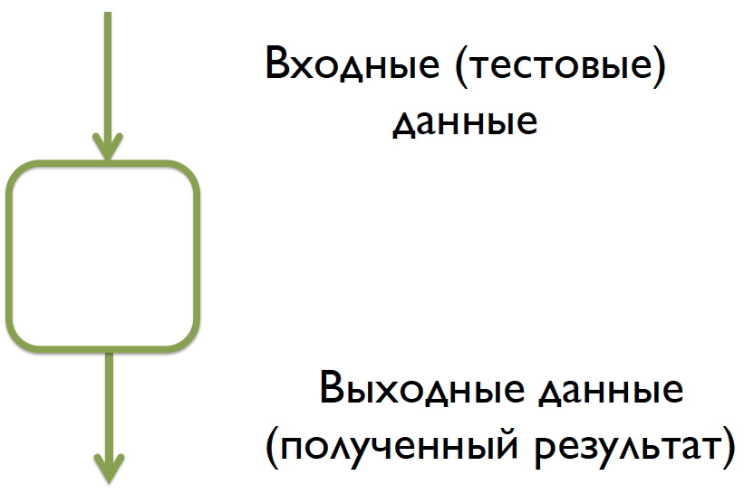
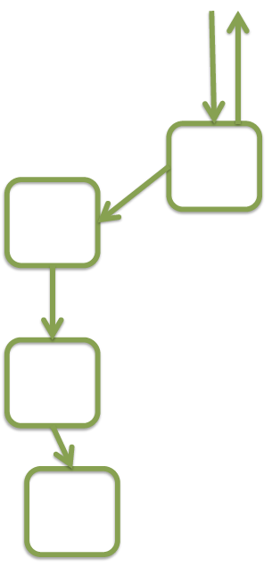
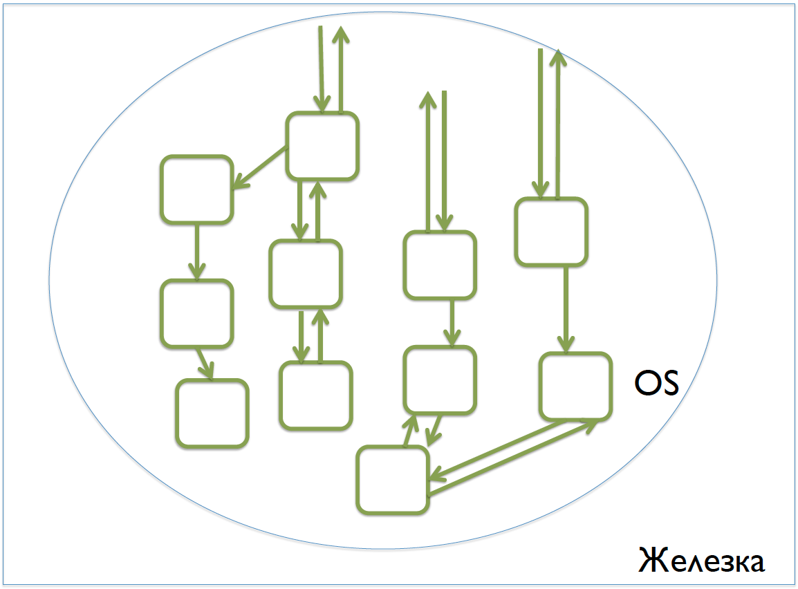
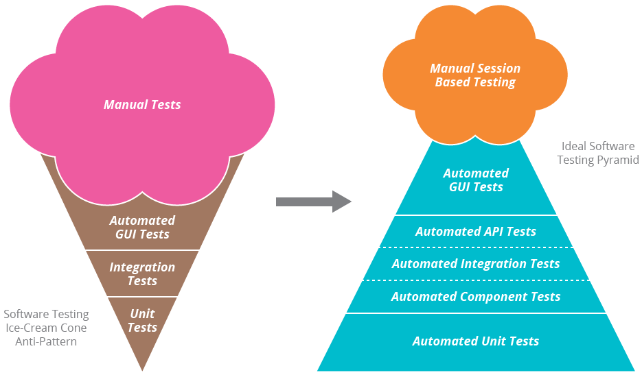

# Виды тестирования

- [Описание](#описание)
- [Уровни тестирования](#уровни-тестирования)
- [Виды тестирования](#виды-тестирования)
- [Способы тестирования](#способы-тестирования)
- [Инструменты для тестирования](#инструменты-для-тестирования)
- [Полезные ссылки](#полезные-ссылки)

## Описание

**Тестирование** — процесс сравнения ожидаемых результатов с полученными.

**Тестирование** — набор инженерных практик, нацеленных на раннее обнаружение дефектов.

**Тестирование** — способ предоставления и получения обратной связи: как технологической, так и продуктовой.

## Уровни тестирования

### Модульные тесты

**Модульные тесты (Unit Tests)** — тесты, проверяющие корректность работы отдельных модулей программы.

**Unit** (модуль/объект/функция) — атомарная, независимая часть кода. Вместо внешних вызовов должны быть использованы заглушки.

Для каждого модуля пишется нужное количество тестов, покрывающих логику его работы.

**Плюсы:**

- Можно запустить сразу после внесения изменений в код – позволяют найти дефект сразу после его «создания»
- Могут служить документацией к коду
- Упрощают процесс рефакторинга

**Минусы:**

- Их надо писать
- Их надо уметь писать
- Их надо поддерживать

### Интеграционные тесты

*Даже если все компоненты по отдельности работают правильно, то это еще ничего не значит.*

**Интеграционные тесты (Integration Tests)** — тесты, проверяющие корректность взаимодействия отдельных модулей друг с другом.

**Плюсы:**

- Находят баги, которые не могут быть обнаружены unit-тестами
- Запускаются после сборки проекта и позволяют быстро обнаружить проблемы взаимодействия

**Минусы:**

- Их надо писать
- Их надо уметь писать
- Их надо поддерживать

### Приемочные тесты

*Даже если все компоненты по отдельности работают правильно и корректно взаимодействуют друг с другом – это еще ничего не значит.*

**Приемочные тесты (Acceptance Tests)** — тесты, проверяющие работоспособность системы целиком. В реальном окружении, с реальными данными, на реальных сценариях.

**Плюсы:**

- Находят баги, которые не могут быть обнаружены модульными и интеграционными тестами
- Позволяют оценить работоспособность продукта целиком
- На этом уровне с продуктом могут ознакомиться будущие пользователи

**Минусы:**

- Самые высокоуровневые – сложнее локализовать проблему
- Занимают больше времени
- Обнаруживают проблемы с некоторой задержкой

## Виды тестирования

- **Функциональное тестирование** (*АААА! Ничего не работает*) — проверка работы кода/продукта на соответствие требованиям. Проверка логики работы
- **Конфигурационное тестирование на клиенте** (*Не работает у части пользователей*) — проверка работоспособности на различных конфигурациях. Для веб-сайтов – в разных браузерах
- **Конфигурационное тестирование сервер-сайда** (*Мы это выкатили, и оно перестало работать!*) — проверка работоспособности в окружении, максимально идентичном продакшену (железка, OS, утилиты, библиотеки, конфиги, версии)
- **Нагрузочное тестирование** (*Все сломалось, когда туда пришли пользователи*) — проверка работоспособности под нагрузкой (одновременная обработка большого потока запросов)
- **Тестирование производительности** (*Работает, но страшно тормозит*) — проверка скорости работы системы. Причем:
	- Необходимо измерить длительность полного цикла «запрос-ответ». Оценить общее время, обратить внимание на отдельные этапы
	- То же самое – под нагрузкой
	- В пользовательских условиях (сетевые условия)
- **Тестирование безопасности** (*Все было хорошо, пока не пришли злые китайские хакеры*)
- **Тестирование юзабилити** (*А как этим пользоваться?*) — тестирование удобства использования
- **Тестирование стабильности** (*Оно работало, а потом вдруг упало*) — тестирование стабильности работы под нагрузкой, длительное время
- **Volume тестирование**
- **Stress/Recovery тестирование**
- **Spike тестирование**
- **Localization тестирование**
- **Compatibility тестирование**

## Способы тестирования

### Ручное тестирование

**Ручное тестирование** — выполнение тестов вручную или с помощью скриптов. Ручной анализ результатов.

**Плюсы:**

- Более информативно — замечаются дефекты рядом

**Минусы:**

- Долго
- Дорого

### Автоматическое тестирование
 
**Автоматическое тестирование** — выполнение с помощью скриптов или инструментов. Оценка результатов проводится автоматически.

**Плюсы:**

- Удобно и неутомительно

**Минусы:**

- Тесты нужно писать и поддерживать
- Тесты выполняются «в лоб»
- Сами тесты/скрипты/инструменты могут содержать баги и порождать ложные результаты

## Инструменты для тестирования

- [Selenium](https://www.seleniumhq.org/) — автоматизации действий веб-браузера
- Python
	- [unittest](https://docs.python.org/3/library/unittest.html)
	- [pytest](https://doc.pytest.org/)
- JavaScript
	- [Jest](https://jestjs.io/#use)
	- [Mocha](https://mochajs.org/)
	- [Jasmine](https://jasmine.github.io/)
	- [Chai](https://www.chaijs.com/) — библиотеки для assertions
	- [Enzyme](https://github.com/airbnb/enzyme) — набор утилит для тестирования для React.js

## Полезные ссылки

- [Оригинал статьи](https://events.yandex.ru/lib/talks/1326/)